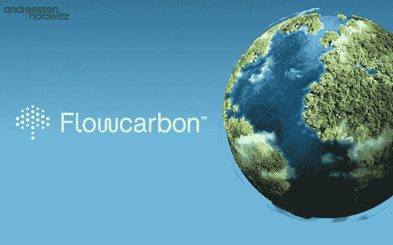

# 猜猜谁带着全新的表演回来了？

> 原文：<https://medium.com/coinmonks/guess-whos-back-with-a-brand-new-act-b8a783901d88?source=collection_archive---------39----------------------->

An entrepreneur will always be building, raising and hustling.

亚当·诺伊曼！

他是臭名昭著的 WeWork 创始人，刚刚为他的新 Web3 创业公司筹集了 7000 万美元！

不管你是恨他还是爱他，这些年来他经历了很多。

从像《没有明天》一样烧钱，与孙正义的传奇故事，疯狂的赤脚走在纽约街头，许多自我交易的阴谋，私人飞机上的奢侈派对，吸大麻的滑稽动作和最终的首次公开募股，亚当目睹了这一切。

见鬼，他甚至在苹果电视上推出了一部由杰瑞德·莱托饰演的电影《我们崩溃了》，由安妮·海瑟薇和丽贝卡·诺依曼联袂主演。

很少有人能像亚当那样真正说自己拥有一切。

在 WeWork 之后，他获得了 4.45 亿美元的离职补偿(2.45 亿美元股票和 2 亿美元现金)。

他开始专注于他的家族办公室 166 2nd Financial Services(管理着 7 亿美元)并进行投资。

特别是在可持续性和气候领域。

值得注意的是，他是 KlimaDAO 的坚定支持者，KLIMA Dao 是一个分散化的开放碳市场，在那里他们出售债券并向 KLIMA 持有人发放奖励。

不要让我详细解释它是怎么工作的，我不会。

可能没人能做到。

它的分散式 web3 区块链碳信用债券 thingamajig。

接受现实吧。

也许这激发了他的新创事业:

区块链的碳信用交易平台 Flowcarbon 是他的最新作品。

“随着世界向低碳经济转型以应对气候变化，该公司旨在进入不断增长的碳信用市场，公司购买碳信用以抵消其温室气体排放。”

Flowcarbon 从 a16z、General Catalyst 和三星 Next 融资 3200 万美元。

另外 3800 万美元是通过出售他们的信物——自然女神信物(GNT)筹集的。

别嘲笑这个名字了。

在 cryptoland，有 GayCoin、StopTrumpCoin、Scamcoin、Groincoin、used 和 LuckyCoin 等硬币。

每一个 GNT 都“由过去五年中基于自然的项目所产生的一系列认证碳信用额支持”。

对于一家成立仅几个月的初创公司来说，总共筹集了 7000 万美元。

我喜欢亚当深入可持续发展和 web3 的交集。

我的问题是，你能重新信任一个做了错误决定、据称过去做过很多可疑事情的创始人吗？

这可能是在过去，人们确实犯了错误和错误的决定，但在这种荒谬的程度和所有的后果，它确实提出了一些问题不是吗？

他确实造成了一些严重的损害，员工的生活被毁了。

无风不起浪。

我们会原谅和忘记吗？

是否应该客观一点，忽略创始人的过去？

如果我们真的追究他们的责任，这一切会在哪里结束？

不管是什么，我仍然感到惊讶的是，投资者在经历了所有这一切之后仍然能够鼓起勇气信任他。

亚当是一个了不起的耍蛇人，他筹集资金的能力是很少有人拥有的超能力。

嘿，如果有钱可赚，你肯定会有人去赚的。

-

你会投资亚当的新公司 Flowcarbon 吗？

-

# startups # business # startupx # growth # success # social media # culture # entrepreneur # strategy # eth # bit coin # adamneumann # branding # we work # flow carbon # VC # web 3

> 加入 Coinmonks [电报频道](https://t.me/coincodecap)和 [Youtube 频道](https://www.youtube.com/c/coinmonks/videos)了解加密交易和投资

# 另外，阅读

*   [3 商业评论](/coinmonks/3commas-review-an-excellent-crypto-trading-bot-2020-1313a58bec92) | [Pionex 评论](https://coincodecap.com/pionex-review-exchange-with-crypto-trading-bot) | [Coinrule 评论](/coinmonks/coinrule-review-2021-a-beginner-friendly-crypto-trading-bot-daf0504848ba)
*   [莱杰 vs n rave](/coinmonks/ledger-vs-ngrave-zero-7e40f0c1d694)|[莱杰 nano s vs x](/coinmonks/ledger-nano-s-vs-x-battery-hardware-price-storage-59a6663fe3b0) | [币安评论](/coinmonks/binance-review-ee10d3bf3b6e)
*   [Bybit Exchange 审查](/coinmonks/bybit-exchange-review-dbd570019b71) | [Bityard 审查](https://coincodecap.com/bityard-reivew) | [Jet-Bot 审查](https://coincodecap.com/jet-bot-review)
*   [3 commas vs crypto hopper](/coinmonks/3commas-vs-pionex-vs-cryptohopper-best-crypto-bot-6a98d2baa203)|[赚取加密利息](/coinmonks/earn-crypto-interest-b10b810fdda3)
*   最好的比特币[硬件钱包](/coinmonks/hardware-wallets-dfa1211730c6) | [BitBox02 回顾](/coinmonks/bitbox02-review-your-swiss-bitcoin-hardware-wallet-c36c88fff29)
*   [BlockFi vs 摄氏度](/coinmonks/blockfi-vs-celsius-vs-hodlnaut-8a1cc8c26630) | [Hodlnaut 审核](/coinmonks/hodlnaut-review-best-way-to-hodl-is-to-earn-interest-on-your-bitcoin-6658a8c19edf) | [KuCoin 审核](https://coincodecap.com/kucoin-review)