# 宇宙生态系统指南

> 原文：<https://medium.com/coinmonks/guide-to-cosmos-ecosystem-7e45a9e18241?source=collection_archive---------16----------------------->

## 渗透教程，标桩，项目

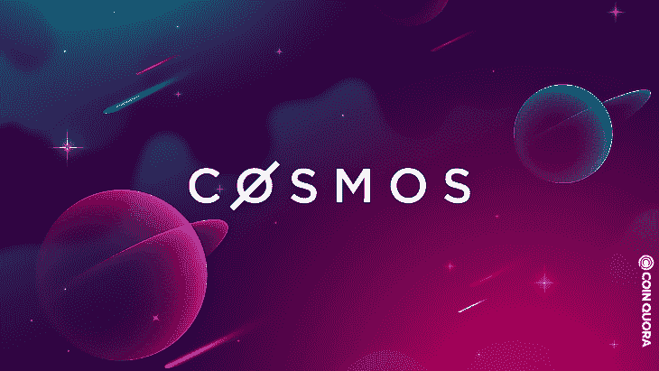

我玩 Cosmos 已经有一段时间了，我想我应该分享一些关于它的东西，因为我已经很喜欢它了。不是财务建议。为了公开起见，我目前有$ATOM 和$OSMO 作为我投资组合的一部分。

宇宙生态系统的总市值为 1400 亿美元，是仅次于以太坊的第二大生态系统。这里有一个为什么宇宙是一个值得关注的分析。

# 什么是宇宙

Cosmos 由总部位于美国的软件公司 Tendermint Inc .建造，Cosmos 的开发由瑞士非营利组织 [interchain foundation](https://interchain.io/) 协调。2017 年，Cosmos 通过 3 笔代币销售筹集了 1800 万美元，cosmos mainet 于 2019 年初上线。

创始团队认为宇宙是“区块链的互联网”。目的是创建一个由开源工具联合起来的加密网络网络，以简化它们之间的交易。正是这种对可定制性和互操作性的关注使 Cosmos 从其他项目中脱颖而出。

# 宇宙区块链

宇宙区块链使用一种被称为 [Tendermint](https://tendermint.com/) 的利害关系证明共识算法。它是由项目创始人发明的，使 Cosmos 每秒钟可以处理多达 10，000 笔交易，同时仍然保持安全。

# 交易

分散化。因为 Cosmos 只有 150 个验证器。与其他 PoS 区块链相比，宇宙区块链不支持智能合约。

## 宇宙 SDK

与智能合同不同， [Cosmos SDK](https://tendermint.com/sdk) 是一个开发者工具包，它允许人们从头开始构建特定于应用的区块链。

Cosmos 的创造者相信，随着应用的继续，每个去中心化的应用最终都需要自己的区块链。想想以太坊高昂的汽油费，那是不可持续的。

到目前为止，区块链创造了超过 50 个宇宙。其中包括:币安硬币，Terra，Crypto.com 的 Cronos 和 Thorchain。

# IBC 区块链间通信协议

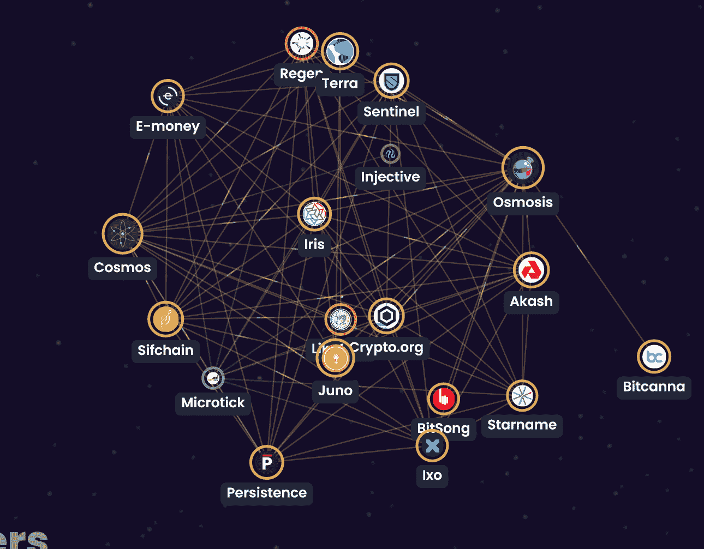

IBC 是一种互操作性标准，可以添加到任何股权证明区块链中，允许在任何其他区块链之间进行廉价而安全的资产转移，从而创建跨链体验。因此，宇宙 IBC 将允许水平缩放。这是一件非常大的事情，因为链现在可以无限扩展，并且仍然可以在不降低网络速度的情况下相互连接。再加上与其他连锁店相比费用较低，区块链的生态系统基本上是经得起未来考验的。此外，该网络是未经许可和分散的。

# 如何探索宇宙

## Keplr 钱包

Keplr 钱包是区块链国际生态系统的钱包。Keplr 为所有基于 Cosmos-SDK 的区块链提供最灵活、最通用的账户管理功能。

他们目前支持宇宙中心，渗透，秘密网络和更多的。

# 创建您的 Keplr 钱包

1.  去 Keplr 的[扩展下载](https://chrome.google.com/webstore/detail/keplr/dmkamcknogkgcdfhhbddcghachkejeap?hl=en)chrome。点击[添加到 Chrome]

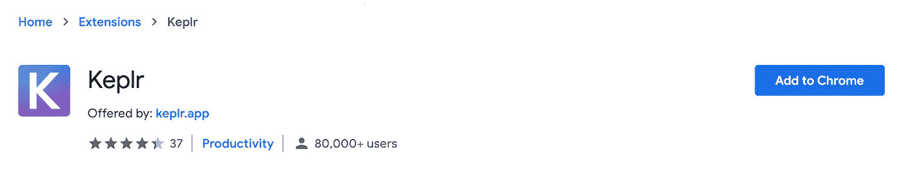

*来源:* [*Keplr*](https://chrome.google.com/webstore/detail/keplr/dmkamcknogkgcdfhhbddcghachkejeap?hl=en)

2.点击【添加扩展】，它会自动添加到你的 Chrome 浏览器中。

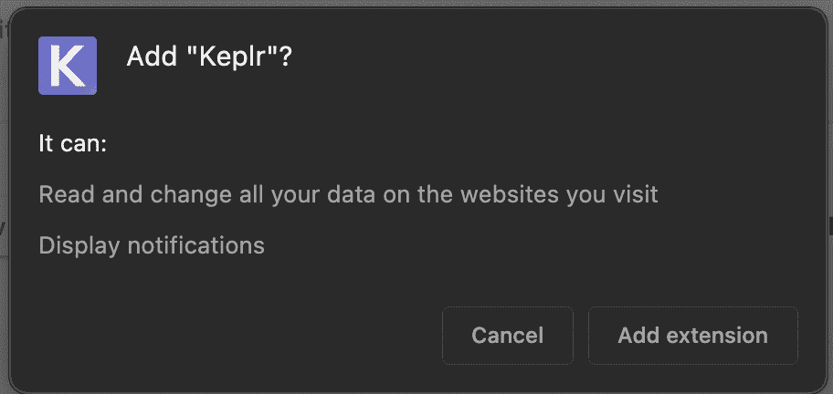

*来源:* [*Keplr*](https://chrome.google.com/webstore/detail/keplr/dmkamcknogkgcdfhhbddcghachkejeap?hl=en)

# 用你的钱包下注

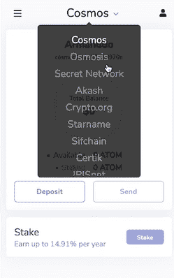

使用 Keplr 钱夹进行赌注登记非常简单。只需登录您的钱包，直接从扩展工具申领您的赌注奖励。

点击钱夹顶部的下拉框，选择你想加入的网络。

点击“赌注”后，您将进入此页面，在此页面上，您会看到一个验证器列表，您可以用它来委托您的赌注奖励代币。

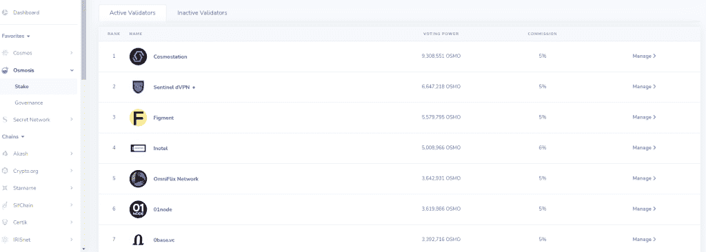

*来源:*[*wallet . keplr*](https://wallet.keplr.app/#/osmosis/stake)

就我个人而言，我选择的验证不超过 5%的佣金，任何更多的几乎是白天抢劫。同样，为了有助于权力下放，你不必选择前 25 名。

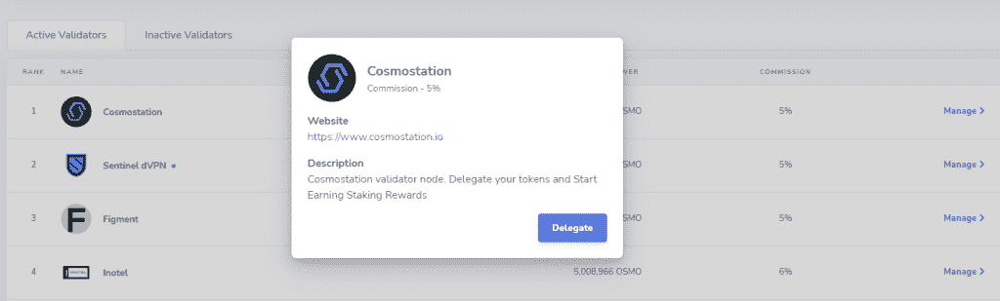

*来源:*[*wallet . keplr*](https://wallet.keplr.app/#/osmosis/stake)

有关各种授权者的更多信息，请单击“管理”，您将能够授权您的令牌或访问验证者的网站。

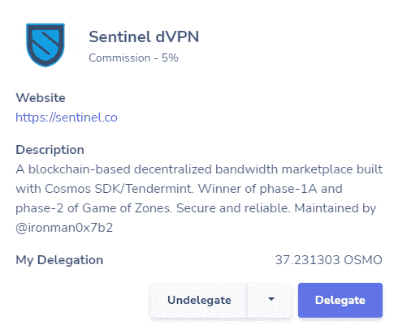

*来源:*[*wallet . keplr*](https://wallet.keplr.app/#/osmosis/stake)

您可以委托您的资金，赌注金额以及您的赌注奖励可以在 Keplr Wallet extension 上申请。

# 渗透农业

我喜欢这个用户界面。TheOsmosis 网络是超级用户友好的一个干净和易于理解的界面。

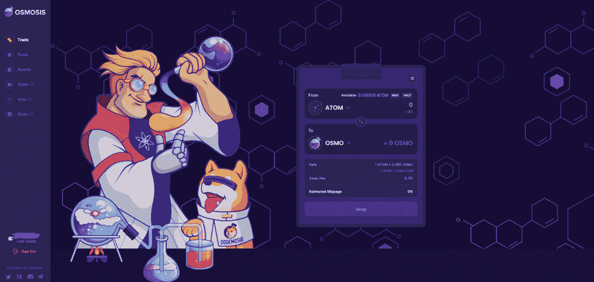

*来源:* [*渗透*](https://app.osmosis.zone/?from=ATOM&to=OSMO)

就像任何其他指数一样，期望交易/交换代币，找到池，并查看您的资产。

# 贸易

在交易中，你可以交换宇宙生态系统中的代币。著名的代币包括$ATOM，$LUNA，$SCRT，$UST 等等。交换费通常占交易的 0-0.3%。

# 泳池

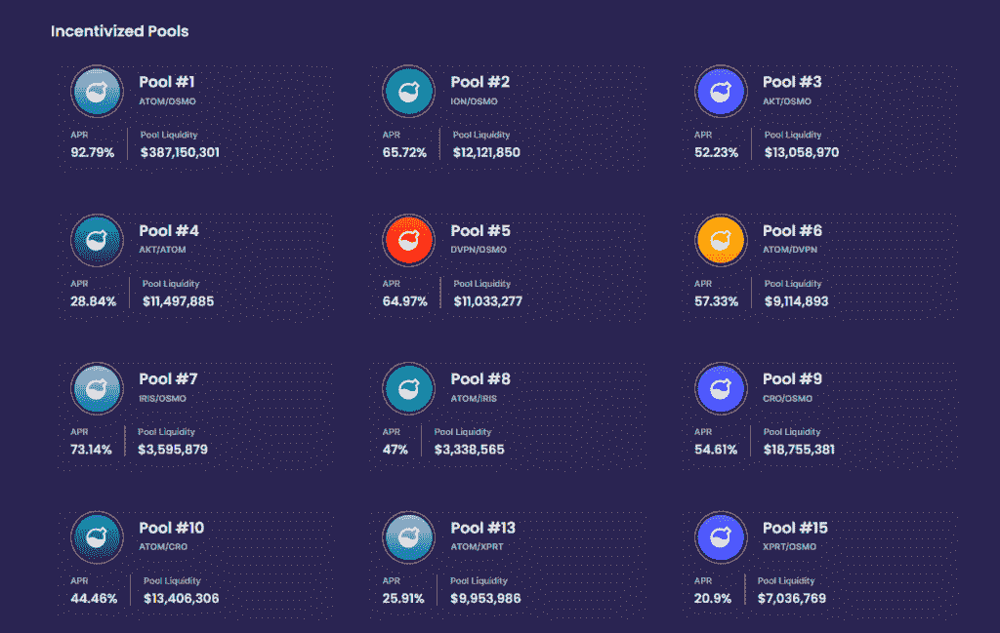

*来源:* [*潜移默化*](https://app.osmosis.zone/?from=ATOM&to=OSMO)

有数百个游泳池，你可以参加。这些资金池中的大多数提供不错的 apy，并且还会在资金池流动性中显示其 TVL。

当寻找一个游泳池参与，我会找到一个体面的回报以及大量的 TVL。通常，池流动性的价值越高，LP 就越安全。

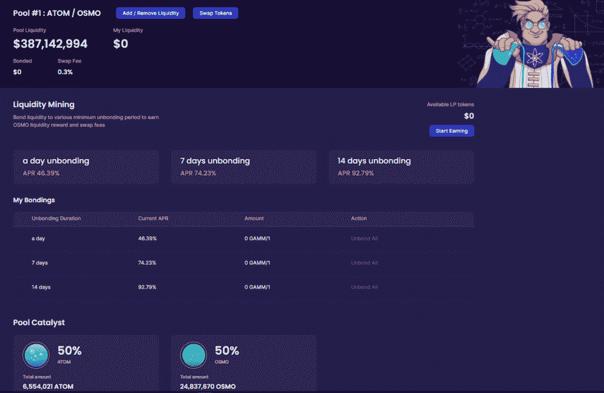

*来源:* [*渗透*](https://app.osmosis.zone/?from=ATOM&to=OSMO)

渗透也提供了一个结合期，你可以根据结合期的持续时间获得 APRs。您决定购买 LP 代币的时间越长，您获得的回报就越高。

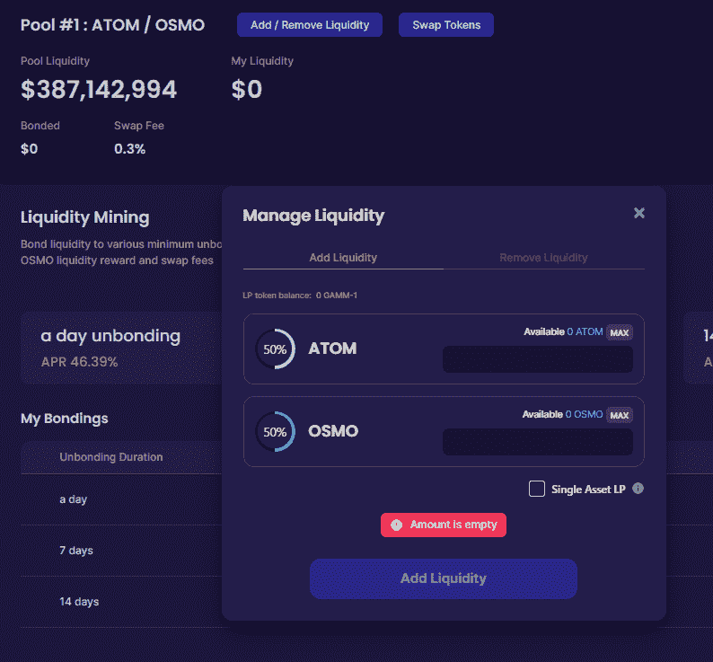

*来源:* [*渗透*](https://app.osmosis.zone/?from=ATOM&to=OSMO)

要添加流动性，点击顶部的按钮，并相应地添加它们。请注意，您需要连接您的钱包，并确保您有正确的代币进行委托。否则，请返回“交易”标签，将它们兑换成您需要的代币。

# 沉积

除了 OSMO 令牌，你的 Keplr 钱包中的所有其他令牌都必须存入渗透网络。

为此，前往左边的“资产”标签，你会看到渗透网络上的所有令牌。

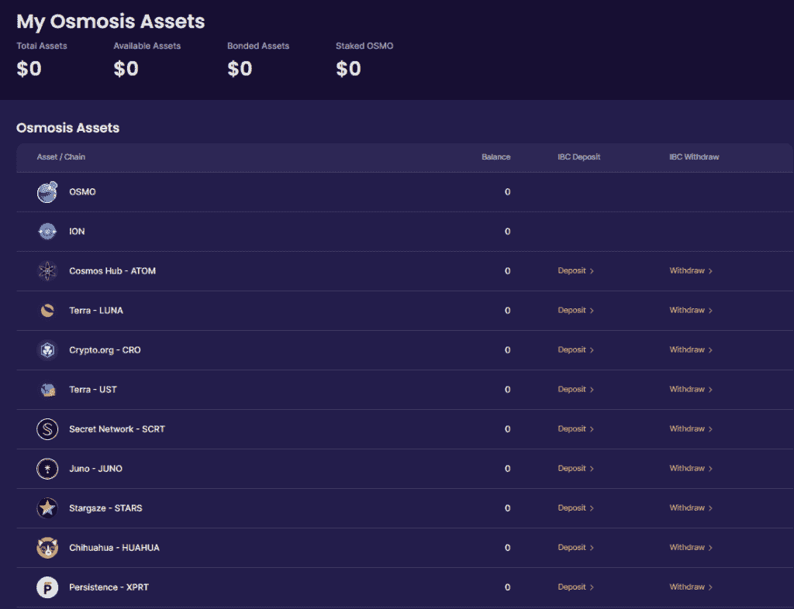

*来源:* [*潜移默化*](https://app.osmosis.zone/?from=ATOM&to=OSMO)

要将代币存入渗透网络，请点击您想要的代币的存款。从那里你可以看到渗透网络上出现的资金。

# 顶级宇宙项目

**EVMOS**

Evmos 是一个以开发者为中心的、可互操作的和可扩展的区块链，建立在 Cosmos SDK、IBC 和 Tendermint 之上

**坚持不懈**

持久性让我们有可能铸造一个标记化的标记原子表示，可以自由交易为其他加密货币或用于赚取收益。

阿卡什

Akash 网络是世界上第一个抗审查、无许可、自主的开源云——所以想想 AWS 吧。

# 我的策略

完全公开，我很看好宇宙生态系统，并将持续监控它。

现在，如果你读过我以前的文章，你就会知道我非常喜欢赌注。因此，我的$ATOM 和$OSMO 代币的很大一部分都押在了 keplr 钱包上。

投资的回报将用于 ATOM-OSMO LP 池，以实现回报最大化。这降低了遭受短暂损失的风险，我的代币被押在 keplr 钱包里也更安全。

我认为我的方法相当保守。对于核心企业 degens，你可以考虑投资 JUNO 和 SCRT，参与他们的流动性池。

听起来很棒，但必须指出的是，渗透仍然是一个 AMM 实验室。随着时间的推移，我们将更清楚地了解令牌模型需要如何发展以最好地支持项目的需求。

通过将有限合伙人和投资人的回报合二为一，用户可以两全其美。此外，通过使用超流技术，用户还可以获得额外的回报。

我会密切关注“潜移默化”现象，并尽可能快地更新所有信息。但没有承诺。

感谢阅读并记得取悦 DYOR。Ape 安全的朋友们！

> 加入 Coinmonks [电报频道](https://t.me/coincodecap)和 [Youtube 频道](https://www.youtube.com/c/coinmonks/videos)了解加密交易和投资

# 此外，请阅读

*   [bookmark Review](https://coincodecap.com/bookmap-review-2021-best-trading-software)|[美国 5 家最佳加密货币交易所](https://coincodecap.com/crypto-exchange-usa)
*   最佳加密[硬件钱包](/coinmonks/hardware-wallets-dfa1211730c6) | [Bitbns 点评](/coinmonks/bitbns-review-38256a07e161)
*   [新加坡 10 家最佳加密货币交易所](https://coincodecap.com/crypto-exchange-in-singapore) | [买入 AXS](https://coincodecap.com/buy-axs-token)
*   [红狗赌场点评](https://coincodecap.com/red-dog-casino-review) | [Swyftx 点评](https://coincodecap.com/swyftx-review) | [CoinGate 点评](https://coincodecap.com/coingate-review)
*   [投资印度的最佳加密货币](https://coincodecap.com/best-crypto-to-invest-in-india-in-2021)|[WazirX P2P](https://coincodecap.com/wazirx-p2p)|[Hi Dollar Review](https://coincodecap.com/hi-dollar-review)