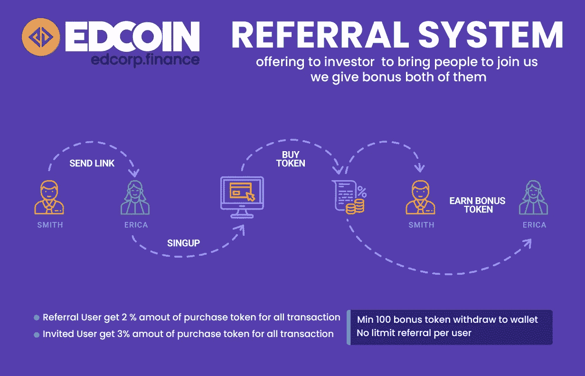
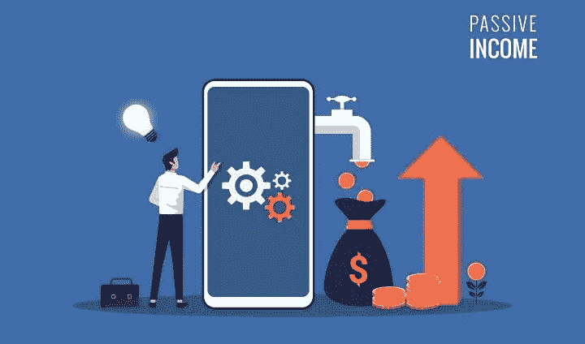

# 用密码赚取被动收入指南

> 原文：<https://medium.com/coinmonks/guide-to-earning-passive-income-with-crypto-be470010c9db?source=collection_archive---------29----------------------->

# 被动收入的定义是什么？

在区块链市场赚钱的一个方法是交易或投资项目。然而，这通常需要广泛的研究和大量的时间投入，而且仍然不能保证稳定的收入来源。

即使是最好的投资者也可能长期亏损，拥有替代收入来源是他们生存的方式。

除了交易和投资，还有其他方式来建立您的加密货币持有量。它们可以像利息一样提供经常性收入，但启动和管理起来很简单。

通过这种方式，你可以有多种收入来源，当这些收入来源结合在一起时，可以增加一大笔钱。

这篇文章将通过一些方法，你可以用加密赚取被动收入

**挖矿**
挖矿是利用计算能力保护网络以换取报酬的过程。这是比特币领域产生被动收入的最古老手段，尽管它并不需要持有加密货币。

在比特币早期，在标准中央处理器(CPU)上挖掘是一个现实的选择。随着网络哈希速率的增长，大多数矿工都转向了更强大的图形处理单元(GPU)。随着竞争的加剧，它几乎完全变成了一场专用集成电路(ASICs)的游戏——这种设备使用专为此目的设计的采矿芯片。

ASIC 行业竞争激烈，由拥有大量研发预算的公司主导。当这些芯片到达零售市场时，它们几乎肯定会过时，从开采时间来看，它们需要很长时间才能达到收支平衡。

因此，比特币挖矿在很大程度上已成为企业的一项业务，而不是普通人被动收入的一个可行来源。

另一方面，挖掘较低散列率的工作证明硬币对一些人来说仍然是有利可图的。在这些网络上使用 GPU 仍然是可能的。挖掘未知硬币有更大的潜在回报，但也有更高的风险。开采出来的硬币可能会在一夜之间变得一文不值，流动性低，出现故障，或者受到各种其他问题的阻碍。

值得一提的是，设置和维护采矿设备需要大量的前期投资和一些技术知识。

**打桩**
打桩本质上是一种资源节约型的采矿方式。为了获得赌注的好处，通常需要在适当的钱包中保存现金，并完成不同的网络服务(如验证交易)。通过所有权，股份(即令牌持有)激励网络的安全性得到维护。

赌注证明是赌注网络使用的共识算法。委托股权证明和租赁股权证明是另外两种变体。

赌注通常需要创建一个赌注钱包和简单地持有硬币。在某些情况下，需要向赌注池添加或委托资金。这是一些交易所会为你处理的事情。你所要做的就是把你的代币留在交易所里，其余的会为你处理好的。

下注是一种快速增加加密货币持有量的好方法，而且不费吹灰之力。另一方面，一些赌注项目使用技术来人为夸大预期赌注回报率。研究代币经济学模型是至关重要的，因为它们可以有效地减轻有前途的赌注回报预测。

**借贷**
借贷是一种从加密货币投资中赚取利息的被动方式。许多点对点(P2P)贷款平台允许你锁定你的资金一段时间，以便以后收到利息。利率可以是固定的(由平台决定)或可变的(由您根据当前市场利率决定)。

该功能在一些提供保证金交易的交易所的平台上是天生可用的。

这种方法非常适合希望以最小的努力增加投资组合的长期投资者。值得注意的是，在智能合约中保护资金本身就有风险。

**闪电节点在行动**
闪电网络是建立在区块链之上的第二层协议，比如比特币的区块链。这是一个离线小额支付网络，这意味着它可以用于不需要立即发送到底层区块链的快速交易。

在比特币网络上，大多数交易都是单向的，这意味着如果爱丽丝向鲍勃发送一枚比特币，鲍勃将无法通过相同的支付渠道将同一枚比特币发回给爱丽丝。另一方面，闪电网络采用双向渠道，这需要双方事先就交易条款达成一致。

通过将比特币锁定在支付渠道中，闪电节点提供了流动性，并扩大了闪电网络的容量。然后，通过他们的渠道支付的费用被收取。

对于非技术比特币用户来说，运行 Lightning node 可能很困难，回报在很大程度上取决于 Lightning 网络的整体采用情况。

**加盟计划**

一些加密货币公司会因为你把更多的人带到他们的平台上而补偿你。会员链接、推荐或其他类型的折扣都是这样的例子。

如果你有大量的社交媒体追随者，联盟计划是增加你收入的好方法。为了避免传播关于低质量项目的消息，对服务做一些初步研究总是一个好主意。

[https://edc.edcorp.finance/sale/public/user/referral?转诊](https://edc.edcorp.finance/sale/public/user/referral?referral)

**主节点**

简单地说，主节点是一个运行在分散网络中的服务器，具有网络上其他节点所没有的功能。
令牌项目更有可能授予对网络稳定性有强烈兴趣的参与者特权。要建立一个 masternode，你需要大量的前期投资和大量的技术知识。

然而，对于一些主节点，令牌持有要求可能会很高，以至于股份实际上变得缺乏流动性。Masternode 项目有夸大预期回报率的趋势，因此在投资之前做自己的研究(DYOR)总是一个好主意。

**空投和叉子**

对于投资者来说，利用硬分叉是一个相对简单的策略。就像把分叉的硬币保留在硬叉的日期上一样简单(通常由块高决定)。分叉后，如果有两条或更多的竞争链，持有者将在每条链上有一个代币余额。
空投和叉子一样，只要求空投时拥有钱包地址。有些交易所会给用户提供空投。值得注意的是，接收空投将永远不会需要交换私钥，这是一个骗局的迹象。

ed coin Airdrop:[https://edc.edcorp.finance/airdrop](https://edc.edcorp.finance/airdrop/)

**在区块链创建内容的平台**
分布式账本技术的引入为一系列新的内容平台铺平了道路。这些使内容创作者能够以各种方式将他们的作品货币化，而无需使用侵入性广告。

内容创作者在这样的系统中保留其作品的所有权，注意力通常以某种方式货币化。一开始这可能会很耗时，但是一旦你积累了大量的内容，它就能提供一个可靠的收入来源。

**最终想法**

区块链行业赚取被动收入的方式越来越多。其中一些方法已被区块链企业采用，这些企业提供被称为广义采矿的服务。

随着产品变得更加可靠和安全，它们可能很快就会成为一个稳定收入来源的可行选择。

购买 EDCoin 预售:[https://edc.edcorp.finance/sale/public](https://l.facebook.com/l.php?u=https%3A%2F%2Fedc.edcorp.finance%2Fsale%2Fpublic%3Ffbclid%3DIwAR2VLo9kbVPzRtxvTAJ4J3vB3FCauGFisK0OUMJgS0ylPUwhlUFIgsmmxUc&h=AT34YTxg5278J-j65uvi5m4gXQN_hFkQzvhDQ3nHr3yyjemf8_ajgyiolA2c0EFDuQbZkvpyUuwp69Y_yA8x_ZI-f3cIlpzp2STgK8N5_STTNCPSHXvfvrnS6dsEECBgdh6b4HX2LsBRE_ZIQNs4&__tn__=-UK-R&c[0]=AT09POhTmKl9PRcVggdQQhdt3Lz0fNN2MCdK2xc4JhWbFKJBYdHswJcRSK2jaOA5cA7xWaVxwGc-fp1F2rqi6cxRZAIdn6xjfaAJTaMbiGNvHR0D0X-dFhVCLzYXmqL1SsM3lklLyGOXh71CiEIwJkCTp-aq7Pe1zfrwSArqSEXlxqHtc8xoP_flNRgyLmAGHLc3)

**跟随 EDCoin，*未来储值令牌***

网址:[https://EDC . ed corp . finance](https://edc.edcorp.finance/)

推特:[https://twitter.com/edcorp_finance](https://twitter.com/edcorp_finance)

https://www.facebook.com/edcorp.finance 脸书

电报:[https://t.me/edcoinofficials](https://t.me/edcoinofficials)

https://www.instagram.com/edcoin.finance

*本文仅为教育目的而写。这不是以任何方式邀请投资。*