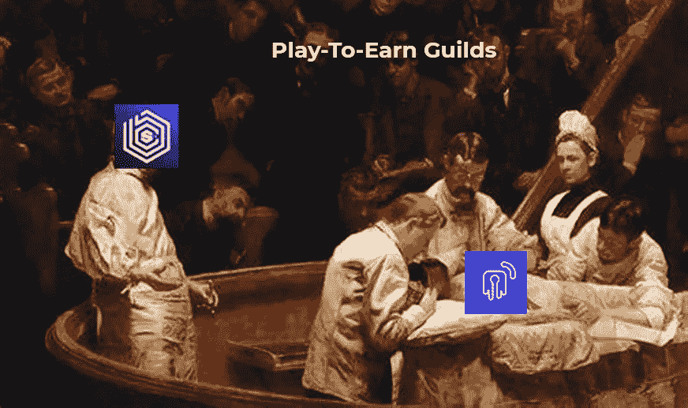

# 公会即将发现下一个 P2E 产业突破:数据+债务。

> 原文：<https://medium.com/coinmonks/guilds-are-about-to-discover-the-next-p2e-industry-breakout-data-debt-ab4c0a09baa0?source=collection_archive---------20----------------------->

Unlockd x BlockchainSpace: Providing the tools and financing Play-To-Earn guilds need to maximize their earnings, increase the number of players and accelerate growth.

# **TL；博士**

*   为公会构建软件和基础设施是一个巨大的机会。公会即服务是行业的未来。
*   绩效跟踪和自动化对于提高收益和财务绩效控制至关重要。
*   BlockchainSpace 的一站式解决方案是一个游戏改变者，允许公会所有者专注于提高投资回报率。
*   Unlockd 将成为第一个为玩赚公会和 NFT 融资的解决方案，将贷款解决方案集成到 BlockchainSpace 工具套件中。
*   Unlockd x BlockchainSpace 合作伙伴关系将为成千上万的公会和数百万玩家带来融资机会。
*   加入解锁生态系统的公会将从独一无二的增长机会中受益。

# 玩赚取公会:从休闲玩家到十亿美元的公会。

区块链游戏经历了令人难以置信的转变，从 2017 年开始销售、繁殖和玩 CryptoKitties 的休闲玩家小社区，到拥有数千万玩家和数十亿美元机构的成熟产业。

随着行业的发展，一些最优秀的游戏玩家开始涌向这些游戏，更好的公会开始开发和建立专业组织，一层又一层的经理和工具作为一种业务来竞争这个行业。

所有迹象表明，元宇宙将成为数字社会的主要经济引擎之一，有必要为全世界的 web3 本地人创造机会；奖励游戏玩家和社区，并允许人们通过参与该行业获得额外收入。

但这种情况正在迅速改变。

Scholar management for high- performing guilds

# 更多的数据，更多的资本，更好的性能。

管理跨不同游戏和链的游戏内资产是很困难的，尤其是在管理有多个经理和学者的大型公会时。

BlockchainSpace 是游戏赚取公会的领先数据、协作和金融中心。他们开创了不同的工具和服务来推动正确的基于数据的决策，最近推出了 Kaizen Dashboard，这是所有公会相关活动的首选工具。但还有更多——block chain space 已经为世界上的 GameFi 公会收集和管理了最大和最深入的数据集。

> 交易新手？试试[密码交易机器人](/coinmonks/crypto-trading-bot-c2ffce8acb2a)或者[复制交易](/coinmonks/top-10-crypto-copy-trading-platforms-for-beginners-d0c37c7d698c)

从人力资源管理和支出自动化到绩效分析或收益预测，数据使行会能够优化其流程并最大化投资回报率。

Global Guild Insights Dashboard ([https://www.blockchainspace.asia/global-guild-insights](https://www.blockchainspace.asia/global-guild-insights))

P2E 公会中流行的一种商业模式(奖学金模式)专注于以 NFT 的形式出借游戏内资产，招募希望通过这些 NFT 玩游戏赚钱的玩家。对所有活动有一个总体的了解对于管理他们的运作和确保一个顺畅的公会-学者关系是至关重要的。

随着市场的成熟，公会正在成为跨越多种加密资产类别(NFT、GameFi 资产、代币投资)的金融强国，从精明的投资和资金管理中赚取的钱超过了玩家从其奖学金模型中获得的收入百分比。所以，要遵循的方向是明确的，不是吗？资产。效率。债务。

Unlockd 就是往那个方向走。解锁贷款解决方案允许公会接受 NFT 支持的贷款，保持资产的效用，同时获得额外的预算来资助他们的运营。

最终的贷款价值比取决于收藏和特定的 NFT。Unlockd 使用基于不同合作伙伴协议的风险评估模型来确定资产的价值。这种混合评估整合了基于算法和博弈论的评估，允许用户根据资产类型获得高达 95%的贷款。

非锁定解决方案以非稀释性资金支持协议运营，这将有助于公会发展并最大限度地减少其闲置资源。我们相信，NFT 支持的贷款可以推动金融包容性，让学者们在他们的协会和经理的支持下，提高他们的收入和获得信贷的机会。

因此，在 BlockchainSpace 的解决方案、工具和关键行业参与者的生态系统中，不能缺少 Unlockd。

这种整合具有巨大的潜力，因为 BlockchainSpace 的软件允许轻松支付和支出，这为开创性的用例打开了大门，例如允许学者通过解锁借款，甚至在未来获得工资贷款。

公会、玩家、学者、Dao……做好准备，因为 **NFT 支持的债务结合正确的数据来安全有效地运营是游戏赚钱行业的未来。**

Comparison between crypto and non-crypto debt markets

# **解锁 x 区块链空间:**整合工具，帮助数千个公会和数百万玩家。

BlockchainSpace 和 Unlockd 有着共同的愿景，即开发工具，在成长和成功的旅程中为游戏赚取公会和游戏玩家提供支持。

此外，由于行业的增长，我们看到了大量的投资者和 NFT 收藏家加入市场，甚至投资道和机构完全专注于收购和处理元宇宙资产。

这为公会和学者创造了一个巨大的机会，BlockchainSpace 将通过他们的“公会即服务”(GaaS)功能来解决这个问题。有了 GaaS，投资者无需动一根手指，就可以连接到行会管理者，建立自己的 P2E 行会。

因此，完整的区块链空间工具套件为新兴和世界级公会提供了高效的财务规划，但缺少的关键是实际的流动性提取，以优化闲置资源。

这将通过 Unlockd 提供的**基于资产的非稀释贷款**来实现。

利用最佳区块链空间数据，对于决定何时获得无锁定的 NFT 支持贷款、购买新藏品或加倍投资定罪项目至关重要。

解锁 x 区块链空间合作伙伴关系将帮助用户、分散的组织、创作者和所有市场参与者通过更好的数据和额外的流动性更有效地管理 NFT 投资组合。

# **这是什么意思？文贝塔？**

通过这种合作关系，我们将使所有区块链空间的用户——公会和玩家——在测试阶段利用解锁工具，成为 NFT 公会支持的新融资模式的早期采用者。

除了一起测试未锁定的功能并携手开发解决方案来解决行业中的一些主要问题，我们还将提供额外的激励来共同开发一个生态系统。折扣贷款、交叉营销、社区发展、代币奖励和限量版 NFT 是成为非锁定核心用户的一些好处。

我们正在经历一个风雨飘摇的市场，在这种情况下只有一种生存方式:获得流动性和适当优化流动性所需的数据。

解锁 NFT 支持的贷款解决方案打开了必要资本的大门，BlockchainSpace 集成了管理资本的工具。

**公会、玩家和用户——听好了。**

无论市场的这个阶段出现什么情况，我们都将为您服务。

你有资产。放开流动性基础设施。区块链空间，工具。

让我们一起忍受这个**。**

**回头见。**

**-解锁的实验室**

# **TL；速度三角形定位法(dead reckoning)**

*   **为公会构建软件和基础设施是一个巨大的机会。公会即服务是行业的未来。**
*   **绩效跟踪和自动化对于提高收益和财务绩效控制至关重要。**
*   **BlockchainSpace 的一站式解决方案是一个游戏改变者，允许公会所有者专注于提高投资回报率。**
*   **Unlockd 将成为第一个为玩赚公会和 NFT 融资的解决方案，将贷款解决方案集成到 BlockchainSpace 工具套件中。**
*   **Unlockd x BlockchainSpace 合作伙伴关系将为成千上万的公会和数百万玩家带来融资机会。**
*   **加入解锁生态系统的公会将从独一无二的增长机会中受益。**
*   **Unlockd 和 BlockchainSpace 在世界协调时 7 月 1 日上午 9:00 在 https://twitter.com/i/spaces/1YqJDqebayoxV?s=20 联合举办了一场 AMA 会议**

****关于解锁****

**Unlockd 是一个分散的跨链协议，为 Art、DeFi、元宇宙、Real World 和 Gaming 提供民主化的 NFT 流动性和实用性。**

**Unlockd 提供即时贷款，并支持无缝的跨链借贷，Unlockd 借款人可以用 NFT 支持的贷款组合他们的财富，同时保持 100%的所有权特权。**

**[**网站**](https://unlockd.finance/) **|** [**推特**T9**|**T12**不和**T15**|**T18**电报**](https://twitter.com/Unlockd_Finance)**|**T24**博客********

****关于块链接空间****

**block 链球空间($GUILD)使 PlayToEarn 行会能够在元宇宙扩展，block 链球空间的数字工具可以帮助行会轻松扩展和管理他们的玩家。**

**Bank 链球空间是游戏赚钱社区的行会中枢，拥有包括 CRM、行会数据分析和行会金融银行在内的端到端解决方案**

**[**网站**](https://www.blockchainspace.asia/) **|** [**推特**](https://twitter.com/Blockchain_SPC) **|** [**不和**](http://discord.gg/2qUWECyaqP)**|**|[**电报**|**|**](http://bit.ly/BSPC_TG)[博客](https://blockchain-space.medium.com/)**