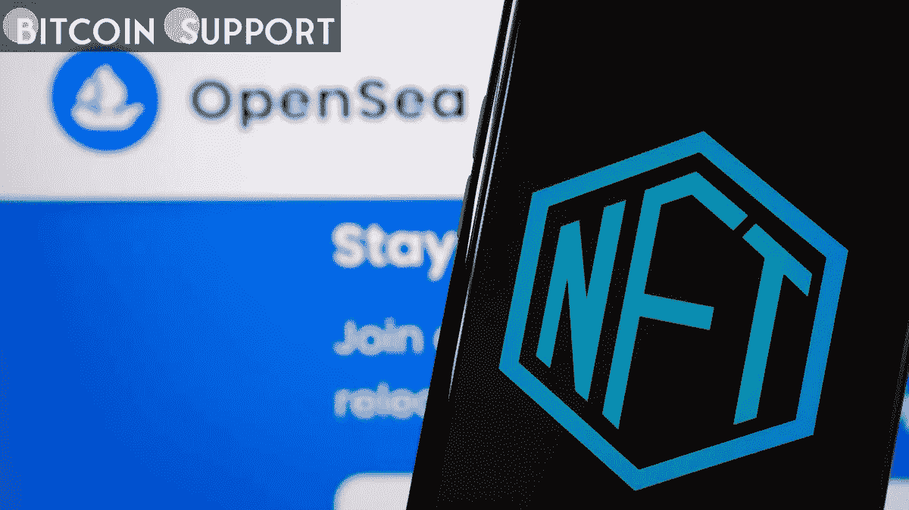

# 黑客瞄准 OpenSea Discord，警告会员网络钓鱼诈骗

> 原文：<https://medium.com/coinmonks/hacker-targets-opensea-discord-warning-members-of-phishing-scams-7d43102b74e9?source=collection_archive---------55----------------------->

**For full blog visit:-**[**https://bitcoinsupports.com/hacker-targets-opensea-discord-warning-members-of-phishing-scams/**](https://bitcoinsupports.com/hacker-targets-opensea-discord-warning-members-of-phishing-scams/)

黑客发布在公告频道的最初消息称，OpenSea 已经“与 YouTube 合作，将他们的社区带入 NFT 空间。”不可伪造代币(NFT)市场 OpenSea 的主要 Discord 频道遭遇服务器入侵，黑客上传虚假的“YouTube 协作”公告。

周五发布的一张截图描绘了虚假的合作新闻，并附有一个钓鱼网站的链接。周五早上，OpenSea 支持 Twitter 账户声明市场的 Discord 服务器已经被入侵，并警告客户不要使用该渠道。

[https://Twitter . com/opensea _ support/status/1522521912341008384](https://twitter.com/opensea_support/status/1522521912341008384)

黑客在公告频道发布的最初消息称，OpenSea 已经“与 YouTube 合作，将他们的社区带入 NFT 空间。”此外，据说 OpenSea 将与他们一起发布一个 mint 通行证，允许持有者免费铸造他们的项目。

看来攻击者能够在服务器上停留很长一段时间，直到 OpenSea 员工重新获得控制权。为了在受害者中引起“害怕失去”,黑客成功地重新发布了最初虚假声明的后续内容，重申了虚假的链接，并声明 70%的供应已经被开采。这位骗子还试图通过声明 YouTube 将向那些申请 NFTs 的人提供“疯狂的工具”来吸引 OpenSea 用户。欺诈者通常声称该要约是排他性的，不会有额外的参与机会。

[https://twitter.com/doodles/status/1497669611017359363](https://twitter.com/doodles/status/1497669611017359363)

连锁数据显示，截至本文撰写之时，已有 13 个钱包被劫持，其中价值约 3.33 ETH 或 8982.58 美元的创始人通行证是 NFT 被劫最贵的。

初步调查显示，黑客通过 webhooks 访问服务器控件。Webhooks 是允许其他应用程序获取实时数据的服务器插件。Webhooks 被网络罪犯广泛用作攻击媒介，因为它们允许从官方服务器帐户发送消息。OpenSea Discord 服务器并不是唯一一个被 webhooks 利用的服务器。几个受欢迎的 NFT 收藏频道，包括 Bored Ape Yacht Club、Doodles 和 KaijuKings，在 4 月初受到了威胁，原因是存在一个漏洞，使得黑客能够使用官方服务器凭据发送钓鱼链接。

**完整博客访问:-**[**https://bitcoinsupports . com/hacker-targets-opensea-discord-warning-members-of-phishing-scams/**](https://bitcoinsupports.com/hacker-targets-opensea-discord-warning-members-of-phishing-scams/)

**免责声明:以上为作者观点，不应视为投资建议。读者应该自己做研究。**

> 加入 Coinmonks [电报频道](https://t.me/coincodecap)和 [Youtube 频道](https://www.youtube.com/c/coinmonks/videos)了解加密交易和投资

# 另外，阅读

*   [ProfitFarmers 回顾](https://coincodecap.com/profitfarmers-review) | [如何使用 Cornix 交易机器人](https://coincodecap.com/cornix-trading-bot)
*   [如何匿名购买比特币](https://coincodecap.com/buy-bitcoin-anonymously) | [比特币现金钱包](https://coincodecap.com/bitcoin-cash-wallets)
*   [瓦济里克斯 NFT 评论](https://coincodecap.com/wazirx-nft-review)|[Bitsgap vs Pionex](https://coincodecap.com/bitsgap-vs-pionex)|[Tangem 评论](https://coincodecap.com/tangem-wallet-review)
*   [如何使用 Solidity 在以太坊上创建 DApp？](https://coincodecap.com/create-a-dapp-on-ethereum-using-solidity)
*   [币安 vs FTX](https://coincodecap.com/binance-vs-ftx) | [最佳(索尔)索拉纳钱包](https://coincodecap.com/solana-wallets)