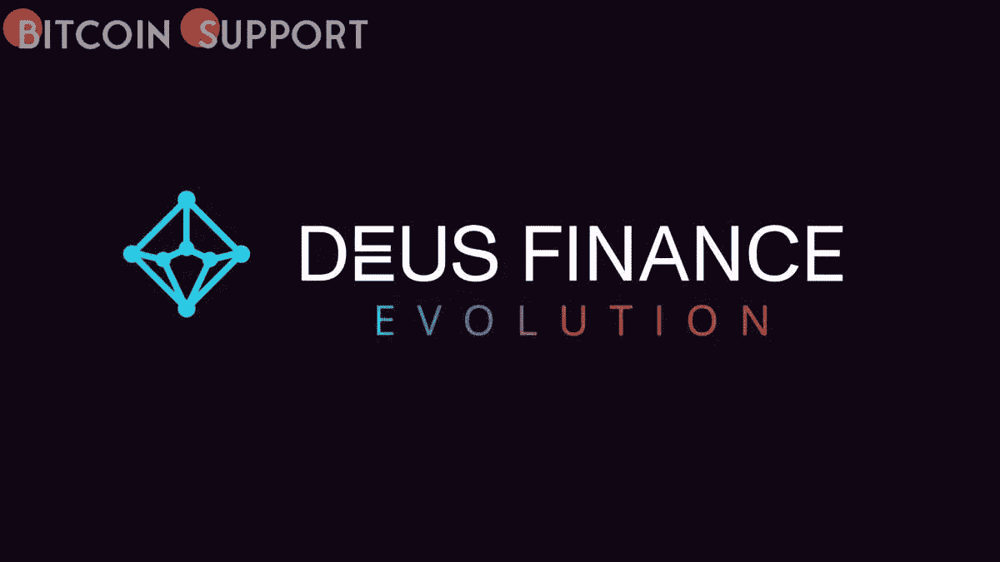
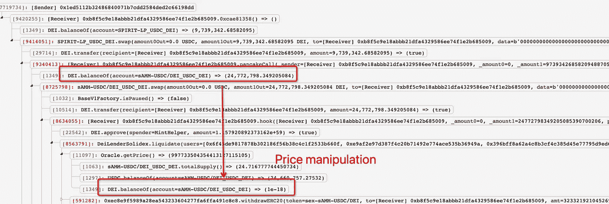
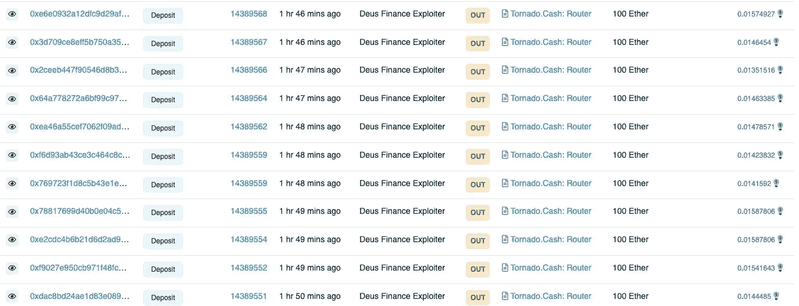

# 黑客带走了戴和乙醚中的 300 万美元，原因是的一次金融黑客攻击

> 原文：<https://medium.com/coinmonks/hackers-got-away-with-3-million-in-dai-and-ether-because-to-a-deus-finance-hack-b3a494800e33?source=collection_archive---------37----------------------->

**Visit our website:-** [**https://bitcoinsupports.com/**](https://bitcoinsupports.com/)

德乌斯金融公司已经承认违反了贷款合同，该公司的首席执行官急于制定一个补偿方案。多令牌去中心化金融(DeFi)市场——德乌斯金融，成为导致 DAI 和 ETH 损失近 300 万美元的漏洞攻击的最新受害者。

一家 DeFi 分析公司 PeckShield 来到 Twitter 上解释情况以及资金是如何使用的。攻击者能够利用和操纵闪电贷款的 oracle 价格，导致用户的资金资不抵债。

[https://twitter.com/peckshield/status/1503632734299701250](https://twitter.com/peckshield/status/1503632734299701250) 
一对 StableV1 AMM — USDC/DEI 的价格被黑客修改，协议利用这对 StableV1 来确定甲骨文对其闪贷的价格。

**Visit our website:-** [**https://bitcoinsupports.com/**](https://bitcoinsupports.com/)

据 PeckShield 称，黑客窃取了 200，000 DAI 和 1101.8 ETH，被盗现金总额可能高于最初估计的 300 万美元。

被盗资金随后被幕后黑客利用多链协议通过 Tornado cash coin mixer 工具转移(以前称为 AnySwap)。

**Visit our website:-** [**https://bitcoinsupports.com/**](https://bitcoinsupports.com/)

德乌斯金融公司承认了其贷款过程中的缺陷，并表示其$DEI 贷款合同已经结束。根据 DeFi 协议，$DEUS 和$DEI 都不会受到攻击的影响。

https://twitter.com/DeusDao/status/1503652836978143242

德乌斯金融公司提供 DeFi 基础设施，帮助其他公司创建金融工具，如合成股票交易平台、期权和期货交易。德乌斯协议的首席执行官 Lafayette Tabor 在推特上向公众发布了还款计划。他表示，开发商将起草一份新的合同，允许受影响的用户退还贷款。他详细阐述道:

“我们将构建一个契约，在这个契约上你将能够清偿你的债务并接收你已经清算的 sAMM，以及一个允许你用 DEI 换取一点μ介子配额的特性。”(从我团队的预算中支付)“

**访问我们的网站:-**[**https://bitcoinsupports.com/**](https://bitcoinsupports.com/)

**免责声明:以上为作者观点，不应视为投资建议。读者应该自己做研究。**

> 加入 Coinmonks [电报频道](https://t.me/coincodecap)和 [Youtube 频道](https://www.youtube.com/c/coinmonks/videos)了解加密交易和投资

# 另外，阅读

*   [密码本交易平台](/coinmonks/top-10-crypto-copy-trading-platforms-for-beginners-d0c37c7d698c) | [Coinmama 审核](/coinmonks/coinmama-review-ace5641bde6e)
*   [印度加密交易所](/coinmonks/bitcoin-exchange-in-india-7f1fe79715c9) | [比特币储蓄账户](/coinmonks/bitcoin-savings-account-e65b13f92451)
*   [OKEx vs KuCoin](https://coincodecap.com/okex-kucoin) | [摄氏替代品](https://coincodecap.com/celsius-alternatives) | [如何购买 VeChain](https://coincodecap.com/buy-vechain)
*   [币安期货交易](https://coincodecap.com/binance-futures-trading)|[3 comas vs Mudrex vs eToro](https://coincodecap.com/mudrex-3commas-etoro)
*   [如何购买 Monero](https://coincodecap.com/buy-monero) | [IDEX 评论](https://coincodecap.com/idex-review) | [BitKan 交易机器人](https://coincodecap.com/bitkan-trading-bot)
*   [CoinDCX 评论](/coinmonks/coindcx-review-8444db3621a2) | [加密保证金交易交易所](https://coincodecap.com/crypto-margin-trading-exchanges)