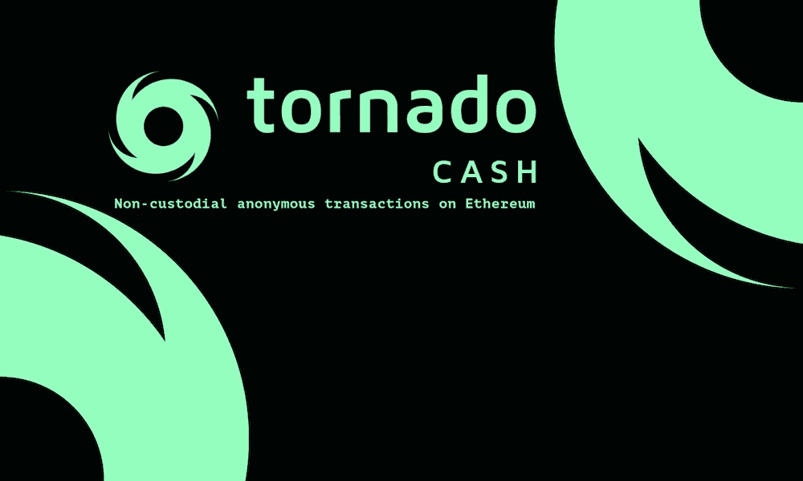
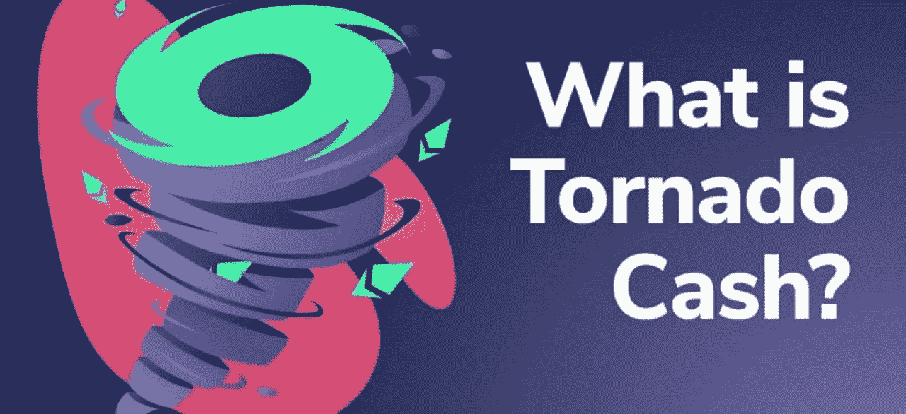
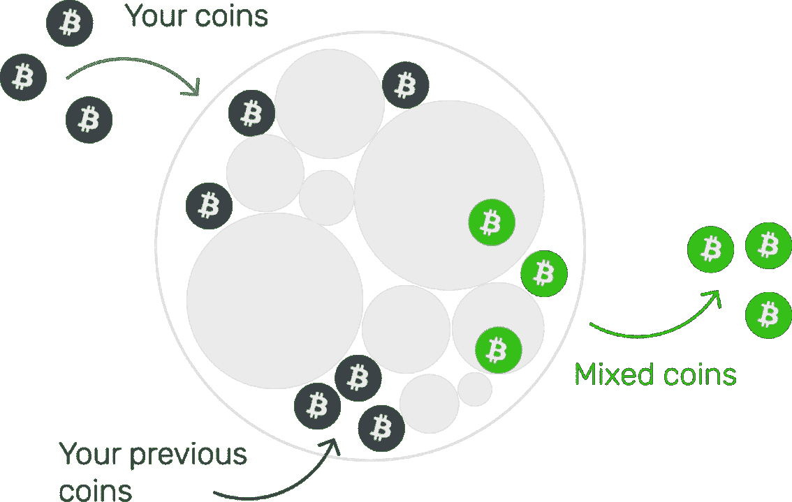
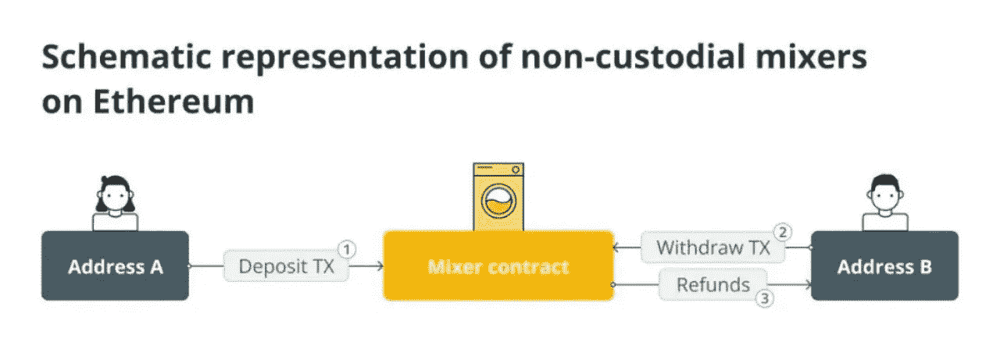
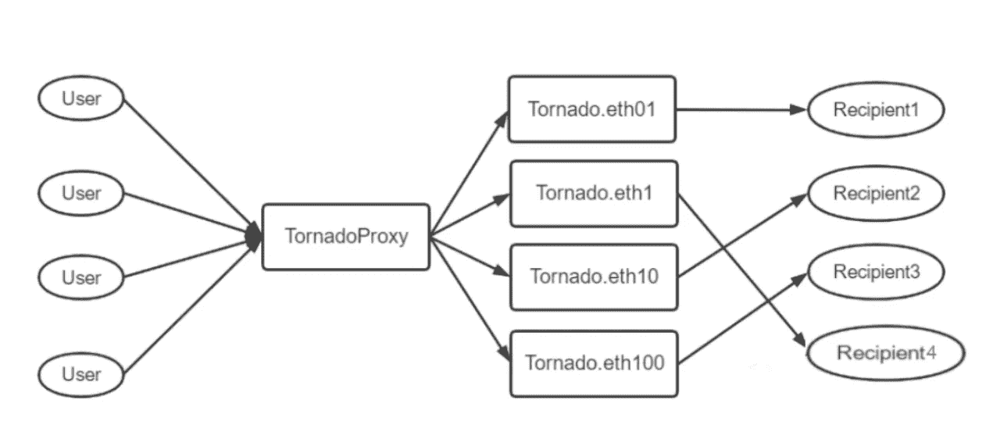

# 如何快速追踪黑客天堂-龙卷风现金洗钱的资产？Beosin 可以帮助你

> 原文：<https://medium.com/coinmonks/hackers-paradise-how-to-quickly-track-assets-laundered-by-tornado-cash-a83cb3d508a7?source=collection_archive---------8----------------------->

根据 Beosin EagleEye 监测的数据，2022 年第一季度，攻击型安全事件造成的损失高达约 12 亿美元，比去年同期的 1.3 亿美元增长了约 9 倍。加密货币黑客事件接连发生。*(*[*beos in Q1 区块链安全生态系统概述 2022 年:安全事件损失达 1 2 亿美元左右*](/@Beosin_com/q1-2022-blockchain-security-ecosystem-overview-losses-from-security-incidents-reach-around-1-2-776e03180208) *)*

在所有被黑的安全事件中，“**龙卷风现金**这个名字经常被公众看到:

☛豆茎农场被盗的 8000 万美元通过龙卷风现金进行洗钱。

☛在 OpenSea 电子邮件钓鱼事件中的黑客出售了攻击中的一些 NFT，然后使用 Tornado cash(以太坊隐私混合器协议)完成了 1100 美元 ETH 的洗钱。

☛库币交易所超 2.7 亿美元的资金安全事件，黑客大量使用龙卷风现金洗钱。

☛在三月份的安全事件中，超过 6 亿美元从区块链桥浪人网络被盗，黑客通过龙卷风现金转移了价值数千万美元的以太坊。

龙卷风现金是什么，在几起黑客事件中起到了重要的洗钱作用？黑客为什么爱龙卷风现金？龙卷风现金洗钱的加密货币还能追查到吗？怎么才能追查到？

# 1.什么是混币？

**隐蔽(洗钱)的私人(金钱)交易催生了混币技术。**

加密货币的交易信息在链上是公开的。只要知道一个人的加密货币地址，他在链条上的所有操作都清晰可见，有迹可循。在这种情况下，为了解决隐私和匿名的问题，混合器技术诞生了。

硬币混合是一种分散的隐私功能，允许用户快速有效地与其他用户的资金混合，在硬币混合后，在现有用户帐户和新帐户之间创建随机映射关系，从而实现完全匿名。

硬币混合的作用是将若干不相关的人和不相关的交易整合成一笔交易。此时，从外部不知道哪个输入事务应该对应于哪个输出事务。通过这种方式，它可以混淆交易，从而实现真正的匿名。举个例子，假设很多人往慈善箱里投钱，规定只能放一美元的同年硬币。那么当人们把钱放进去的时候，我们就可以知道哪个人在什么时间捐了多少钱。但是当慈善箱被打开进行核算时，就没办法知道哪个硬币是哪个人放进去的了。

# 2.硬币混合的实现方式有哪些？

有两种类型的搅拌机:集中式搅拌机和分散式搅拌机。

集中式混合器:所有交易都在混合器站点的数据库中处理。混合器匹配不同的钱包地址和不同的金额，并向该地址发送随机金额的加密货币，直到在指定的地址达到发送者请求的总金额。

分散式混音器:分散式混音器使用 CoinJoin 之类的协议，使用完全协调或对等(P2P)方法来混淆事务。本质上，该协议允许一大群用户聚合一定数量的加密货币，然后进行再分配，这使得每个人都可以收到一定数量的加密货币。然而，没有人知道谁收到了什么或从哪里来的。

# 3.硬币混合服务有哪些类型？

有两种类型的虚拟货币硬币洗牌服务，管理和非管理。

**保管硬币混合服务**

当用户向可信的第三方提交“脏”货币并在超时后返回“干净”货币时，该过程被称为托管混合。但是，有可能服务提供商可能会带着钱消失。

**非保管硬币混合服务**

用可公开验证的透明智能合同或安全多方计算替换可信混合器是非托管硬币混合器中的常见方法。

非保管硬币混合的操作过程如下:

用户首先将来自地址 A 的相同数量的 ETH 或其他令牌存入混合器的合同中。然后，在用户定义的时间间隔之后，他们可以通过取款交易将他们存入的硬币提取到地址 B。

# 4.黑客为什么爱龙卷风现金？

**什么是龙卷风现金？**

Tornado Cash 是一个分散的、非托管的隐私解决方案，用于以太网和其他支持智能合同的区块链，基于 ZK-斯纳克(也称为零知识简洁非交互式知识论证)技术。

它可以通过断开源地址(存款人)和目标地址(取款人)之间的链上连接来提高交易的私密性。

Tornado Cash 使用智能合约从一个地址接收象征性存款。然后用一个全新的地址提取资金。旧版本的协议适用于以太坊、BNB 链、多边形、灵知链、雪崩、乐观和仲裁。目前，它仅支持六种令牌的固定金额池:ETH、DAI、cDAI、USDC、USDT 和 wBTC。

**80%的黑客在洗钱过程中使用龙卷风现金？**

当 Tornado Cash 的用户想要匿名转移资产或混合硬币时，他需要首先将资产转移到 Tornado Cash 的智能合约。然后，龙卷风现金给他一个随机生成的私钥作为凭证。这个私钥证明你已经执行了存款，但没有透露原始地址。

取款时，用户只需向龙卷风现金提交系统给出的随机密钥，用户提交新地址后，智能合约将资产转移到新地址，完成资产的“混币”，使交易无法追溯。这是大多数黑客选择龙卷风现金的原因。

据相关数据显示，自推出以来，Tornado Cash 现已拥有 156，000 ETH 以及 1.65 亿美元的 mixer 资产池，拥有区块链最大的隐私资产池。旧协议已经看到超过 12，000 个唯一地址执行了大约 48，000 个对协议的存款，接收了超过 59 亿美元的存款，并且超过 17，000 个唯一地址退出了协议，向中继服务支付了总计超过 200 万美元的中继费用。

# 5.如何从龙卷风现金混合硬币被追踪？

硬币混合技术的应用增强了链上交易的匿名性和隐私性，但也被滥用于洗钱等犯罪。硬币混合技术增加了在线追踪犯罪资产的难度。为了帮助打击虚拟货币犯罪，Beosin 长期以来一直在进行硬币混合技术和硬币混合资产跟踪的研究，并将研究成果应用于我们的虚拟货币链上跟踪服务。

在最近的一次客户技术服务中，我们成功地帮助我们的客户在通过 Tornado Cash 混合硬币后跟踪了资产的流动。

如果您需要任何区块链安全服务，请联系我们:

[**网站**](https://beosin.com/) [**邮箱**](http://contact@beosin.com/) [**官方推特**](https://twitter.com/Beosin_com) [**预警**](https://twitter.com/BeosinAlert) [**电报**](https://t.me/beosin)**[**LinkedIn**](https://www.linkedin.com/company/beosin)**

> **加入 Coinmonks [电报频道](https://t.me/coincodecap)和 [Youtube 频道](https://www.youtube.com/c/coinmonks/videos)了解加密交易和投资**

# **另外，阅读**

*   **[CoinDCX 评论](/coinmonks/coindcx-review-8444db3621a2) | [加密保证金交易交易所](https://coincodecap.com/crypto-margin-trading-exchanges)**
*   **[红狗赌场评论](https://coincodecap.com/red-dog-casino-review) | [Swyftx 评论](https://coincodecap.com/swyftx-review) | [CoinGate 评论](https://coincodecap.com/coingate-review)**
*   **[Bookmap 评论](https://coincodecap.com/bookmap-review-2021-best-trading-software) | [美国 5 大最佳加密交易所](https://coincodecap.com/crypto-exchange-usa)**
*   **[如何在 FTX 交易所交易期货](https://coincodecap.com/ftx-futures-trading) | [OKEx vs 币安](https://coincodecap.com/okex-vs-binance)**
*   **[CoinLoan 评论](https://coincodecap.com/coinloan-review) | [YouHodler 评论](/coinmonks/youhodler-4-easy-ways-to-make-money-98969b9689f2) | [BlockFi 评论](https://coincodecap.com/blockfi-review)**