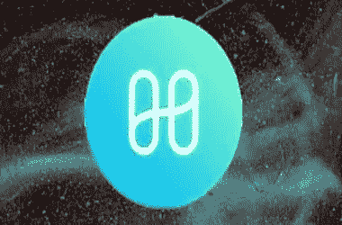

# 黑客从和谐地平线桥盗走 1 亿美元，价值 7800 万美元的 AAG 代币将被追回

> 原文：<https://medium.com/coinmonks/hackers-stole-100m-from-harmony-horizon-bridge-78m-aag-token-set-to-be-recovered-a25a199a87f5?source=collection_archive---------12----------------------->

harmony

在最近发生在 Harmony 身上的价值 1 亿美元的黑客攻击中，元宇宙软件公司 AGG 拥有 8400 万美元的 AAG 代币，这些代币价值 705931 美元，是黑客窃取的 1 亿美元中的一部分。

Horizon Bridge 是黑客攻击的目标，它为 Harmony 和以太坊网络、币安链和比特币之间的令牌转移提供便利。他们进行了 11 次交易，抽取了各种替代硬币。

然后，令牌被发送到不同的钱包，在 Uniswap 分散式交换机(DEX)上交换以太网(ETH)。价值约 1 亿美元的资金通过替代硬币被盗，如 Frax (FRAX)、Wrapped Ether (wETH)、Aave (AAVE)、SushiSwap(寿司)、Frax Share (FXS)、AAG (AAG)、币安 USD (BUSD)、戴(Dai)、Tether (USDT)、Wrapped BTC (wBTC)和 USD Coin (USDC)。

这座桥已经暂时关闭，以防止进一步的损失。该项目的开发商也指出，这个问题并不影响 BTC 大桥。

Harmony 公布了攻击者的以太坊地址，并透露不可信的 BTC 大桥没有受到影响。在另一条推特中，他们呼吁共同努力建造更多不可信的桥梁，以提供更高的安全性。

**团队披露初始信息**

该小组还确定了钱包，这是负责交换被盗令牌的 ETH，并在 Twitter 上公布了地址。他们还宣布，已采取必要行动，通过通知交易所和暂停 Horizon bridge 来防止进一步的交易。最后，该团队还宣布，它正在与国家当局和法医专家密切合作，以确定黑客背后的罪犯，并将很快公布验尸报告。

这是影响加密空间的一系列攻击中最新的一次。其中包括 Axie Infinity drain 和 Solana 虫洞漏洞。黑客们还修补了一个被称为恶魔攻击的漏洞，以免造成任何损害。

由于攻击的性质，已通知各交易所，并派遣法医专家协助确认攻击者。然而，找到攻击者的身份可能非常具有挑战性，这取决于他位于何处。

# AAG 如何着手挽回损失

AAG 发了一条[推特](https://twitter.com/aag_ventures/status/1540213678380924928?t=Mok37zwuuRDFaK7LKA8gvQ&s=19)说无损 DeFi 来拯救他们了。

无损 DeFi 几天前在 Harmony 上推出了它的协议，帮助 AAG 冻结了通过黑客窃取的 8400 万美元 AAG 令牌中的 7800 万美元。在撰写本文时，AAG 代币的价值为 0.0084 美元。

# 提前发出警报

有人对地平线在以太坊上的多签名钱包的可靠性表示担忧。它只需要四个签字人中的两个就可以转移资金。专注于加密货币的风险投资公司 Chainstride Capital 的创始人在 Twitter 上指出，该桥的签名人数很少，这将允许另一次 9 位数的黑客攻击。

此外，Polygon 的安全研究员和 CISO Mudit Gupta 透露，Horizon Bridge 正在使用多重签名机制来达成共识。在 5 个签名中，如果有 2 个同意交易，交易就会通过。剥削者损害了两个签名，并能够抽走 1 亿美元。

根据开发商 Ape Dev 的预测，该桥的资产下降了 1 亿美元。他不是唯一一个担心加密货币安全性的人。今年 1 月，知名开发人员 Vitalik Buterin 在 Reddit 帖子中讨论了令牌桥的问题。

他指出，利用桥梁可能威胁到各种链条的流动性。随着桥梁数量的不断增加，他警告说，一条链上 51%的攻击可能性可能会增加。

自从他的预测以来，令牌桥、Axie Inifinity 的浪人桥和虫洞桥已经被成功开发超过 10 亿美元。

由于多重签名的性质，它被认为是一个安全问题，黑客可以在攻击中加以利用。在 Ronin Bridge 的案例中，只需要 9 个签名者中的 5 个来验证交易。攻击者窃取了超过 6 亿美元的资产。

目前还不清楚攻击者是从 Dev 那里得到这个想法，还是他能够独立地得出相同的结论。然而，考虑到攻击前几个月的警告，Harmony 平台的开发者应该有时间保护他们的系统。

由于对加密货币的网络攻击越来越多，第三方对区块链平台安全标准的审查可能会变得更加频繁。

# 结果

正如拥有“硬币局频道”的热门加密 YouTuber“盖伊”去年预测，2022 年将有更多关于加密黑客的报告。

加密黑客攻击的速度令人担忧，如果没有解决方案来隔离黑客，这可能只是加密黑客攻击的开始。

> 加入 Coinmonks [电报频道](https://t.me/coincodecap)和 [Youtube 频道](https://www.youtube.com/c/coinmonks/videos)了解加密交易和投资

# 另外，阅读

*   [WazirX vs coin dcx vs bit bns](/coinmonks/wazirx-vs-coindcx-vs-bitbns-149f4f19a2f1)|[block fi vs coin loan vs Nexo](/coinmonks/blockfi-vs-coinloan-vs-nexo-cb624635230d)
*   [本地比特币审核](/coinmonks/localbitcoins-review-6cc001c6ed56) | [加密货币储蓄账户](https://coincodecap.com/cryptocurrency-savings-accounts)
*   [什么是融资融券交易](https://coincodecap.com/margin-trading) | [成本平均法](https://coincodecap.com/dca)
*   [支持卡审核](https://coincodecap.com/uphold-card-review) | [信任钱包 vs 元掩码](https://coincodecap.com/trust-wallet-vs-metamask)
*   [Exness 回顾](https://coincodecap.com/exness-review)|[moon xbt Vs bit get Vs Bingbon](https://coincodecap.com/bingbon-vs-bitget-vs-moonxbt)
*   [如何开始用加密贷款赚取被动收入](https://coincodecap.com/passive-income-crypto-lending)