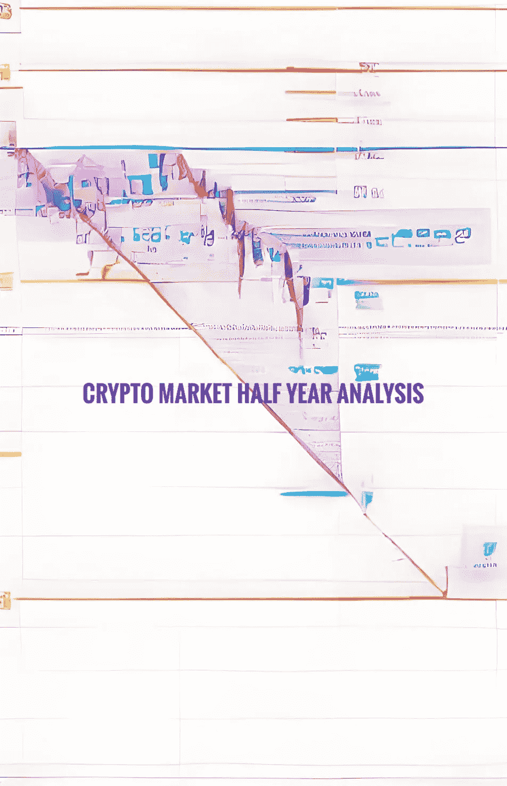
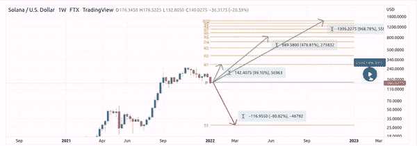
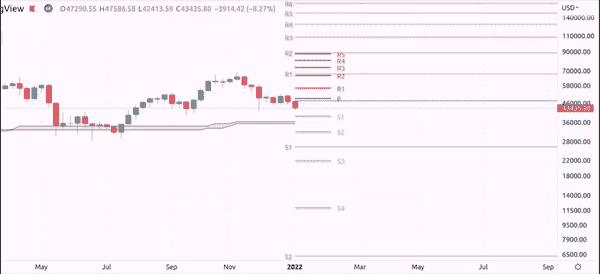
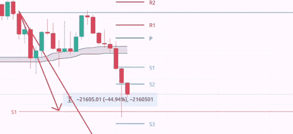
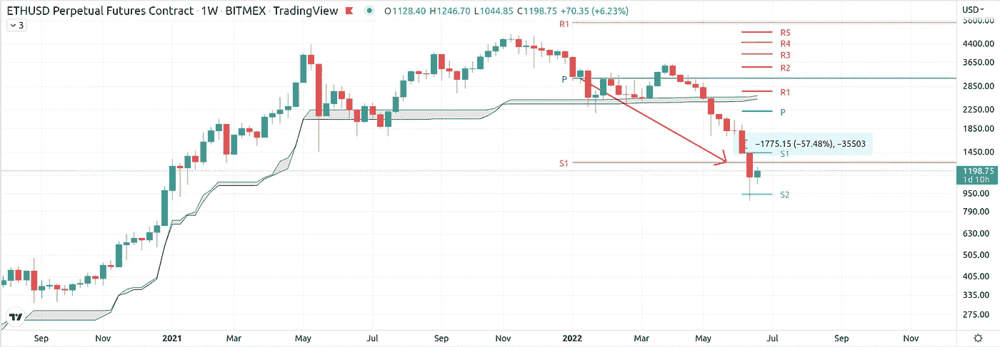

# 密码市场半年度中枢分析

> 原文：<https://medium.com/coinmonks/half-yearly-pivot-analysis-for-the-crypto-market-a06d6169d823?source=collection_archive---------14----------------------->

# 早在 2022 年初，我就敢于根据基于支点的技术分析预测加密市场的目标。成功了吗？

让我先说:“我是一个不太关心基本面的技术图表分析师”。好吧，让我换个说法:我确实关心基本面，但我把它们视为背景噪音，被图表放大了，而不是相反。如果你问我，也看看我的推特账户，很多时候你可以看到基本面在现实中咆哮之前在 TA 中逼近。所以这就是我所关心的:图表，它们的支点和其他一些完全普通的 TA 东西，比如价格行为和 S/R 水平。如果你仍然不知道什么是支点，请随意阅读我过去的一个故事，或者去[看一个视频](https://youtu.be/g8bOxYINOjA)，在那里我会解释一下它们。出于某种原因，支点被认为是一个古老的交易系统/指标，几乎没有人再看它们了——这是一个严重的错误，正如我在过去的每次市场分析中所证明的那样，并且将再次证明，当它们在 2022 年结束半年的价格行动时发挥其魔力。

> 交易新手？试试[密码交易机器人](/coinmonks/crypto-trading-bot-c2ffce8acb2a)或[复制交易](/coinmonks/top-10-crypto-copy-trading-platforms-for-beginners-d0c37c7d698c)

让我们先看看索拉纳的完美交易，作为一个很好的例子。下面的周线图(这里显示的所有图表都是周线图)显示了我对$SOL 从年初到 2022 年上半年末的情景预测。新年伊始，在最初的抛售之前会有一些犹豫，随后是数周的踮起脚来建立阻力支撑。这是一个完美的空头交易的完美入口:转向 S1。喜悦& 81%的利润。一年一度的 S1 也是买入的高概率区域。你有吗？

所以你有它-一个完美的交易。其他人呢？这是我最初列出的 15 项资产的链接，这些资产仍然与[年初的年度分析](/coinmonks/daring-to-predict-crypto-assets-prices-using-yearly-pivots-unseen-ones-e969fe1dcb3d)非常相关:

> [比特币](https://www.tradingview.com/chart/BTCUSD/5c0GZBXy-Pivot-Yearly-predictions-for-BTC-using-hidden-pivots/)走势图、[以太坊](https://www.tradingview.com/chart/ETHUSD/xOBYHAKW-Pivot-Yearly-predictions-for-ETH-using-hidden-pivots/)走势图、[圆点](https://www.tradingview.com/chart/DOTUSD/7uceMYRP-Pivot-Yearly-predictions-for-DOT-using-hidden-pivots/)走势图、 [KSM](https://www.tradingview.com/chart/KSMUSDT/ftlJJyWF-Pivot-Yearly-predictions-for-KSM-using-hidden-pivots/) 走势图、 [Link](https://www.tradingview.com/chart/LINKUSD/8KNCfYlA-Pivot-Yearly-predictions-for-LINK-using-hidden-pivots/) 走势图、 [CHR](https://www.tradingview.com/chart/CHRUSDT/ziaz3Tr8-Pivot-Yearly-predictions-for-CHR-using-hidden-pivots/) 走势图、[寿司](https://www.tradingview.com/chart/SUSHIPERP/vJxTpIRl-Pivot-Yearly-predictions-for-Sushi-using-hidden-pivots/)走势图、 [SOL](https://www.tradingview.com/chart/SOLUSD/fiCV40OV-Pivot-Yearly-predictions-for-SOL-using-hidden-pivots/) 走势图、[露娜](https://www.tradingview.com/chart/LUNAUSD/5gDGfPtx-Pivot-Yearly-predictions-for-Luna-using-hidden-pivots/)走势图、 [XRP](https://www.tradingview.com/chart/XRPUSD/3S9SIvj8-Pivot-Yearly-predictions-for-XRP-using-hidden-pivots/) 走势图、[阿达](https://www.tradingview.com/chart/ADAUSD/DkSuQIrX-Pivot-Yearly-predictions-for-ADA-using-hidden-pivots/)走势图、 [Matic](https://www.tradingview.com/chart/MATICUSD/eIOrUkGr-Pivot-Yearly-predictions-for-Mativc-using-hidden-pivots/) 走势图

在这 15 项资产中。八个已经完成了他们的支点，当我写这些线的时候，一些已经超过了最初的目标，可能正在向第二目标前进。比如比特币(见下文)。其他人“还”没有达到预期的目标，但处于一个有趣的水平支撑位置，可能试图告诉我们一些关于整个市场的信息。让我们先来看看比特币和其他一些确实达到最初年度目标的资产。我想借此机会提醒你，即使市场继续高于或低于某个目标，在该目标获利也是完全可以的。这也是一个有效的策略，根据你的风险磷灰石，在一个设定的目标上至少拿走一部分利润，在我们的例子中是每年的 S1。同样重要的是要记住，我这里所指的时间框架和交易类型是我们所说的“头寸交易”,它将持续几周到几个月的时间。对于有耐心的人来说，这是一种交易，它提供了巨大的优势，比如相对大量的空闲时间来做其他事情，以及巨大的利润潜力和平衡的风险/回报。在未来的某个时候，我会写一些关于这种类型的交易的深度，但现在这里是比特币:

新年伊始，红色的周线收盘低于年度中枢，预示着未来的事情。在最初的抛售之后，一些价格行动犹豫不决，导致价格在年度支点上完美的空头入场。从那以后，主要是坐着不动。等待那个目标——每年的 S1——45%的交易。是的，价格确实进一步下跌，但目标是目标，利润是利润，正如我已经提到的，这取决于你的个人风险磷灰石和立场管理。

如果你是那种放任自流的人，至少是部分放任自流的人(我不是，是部分放任自流的人)，那么这一年仍未结束，如果遗留市场的巨熊从数十年的沉睡中醒来，在达到次要目标时，情况可能会变得非常糟糕。

# S1 家族和红雀队

因此，你可以看到索拉纳和比特币在上半年表现相似。但你可能知道，整个市场都在某种程度上追随比特币。以下是其他一些资产，它们确实达到了 S1 的年度目标，而且大多继续下跌。Fantom、Avax、Matic、Cosmos 和 Ethereum 都达到了年度 S1 最初目标，并进一步模仿比特币:

所有精彩的交易都有 60%-80%的回报。你可以看到，大多数人在追随比特币的同时，继续寻找自己的基本支持。第二个资产组也是如此，它没有达到 S1 目标，只是因为它的位置“太低”(我们知道这样的事情并不真正存在，对吗？卢娜证明了这一点)，或者干脆没有阴谋每年 S1。

这些交易到各自的基本 S/R 水平，给出了 70%-85%的回报，可能是我之前提到的高风险磷灰石交易，只是让它们运行到这些支撑位。

仔细观察它们和整个市场，可以很有把握地认为，这些都是临界水平，下方是深渊。正如我多次提到的，这个市场主要是由一种资产推动的——比特币。这种资产现在已经触及其过去的炒作周期峰值，即 2017 年 12 月井喷后的 18-2 万美元水平。如果它不能设法保护这些水平，即使面对强大的遗留市场下跌，它是很有可能的海事组织，我们将看到它达到每年的 S2 在 6k 美元区。就 PA 概率而言，在这一点上，我更倾向于这个市场的上行而不是下行，但在这一点上，我的倾向是短期到中期。

这篇文章之后不久将会有一个新的基于季度支点的预测，新的预测将在第三季度初发布。当这种情况发生时，我们将更好地了解未来三个月市场可能会有什么。