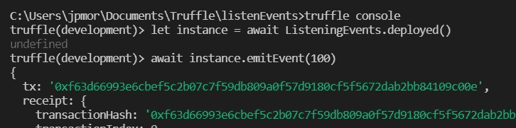
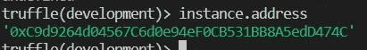
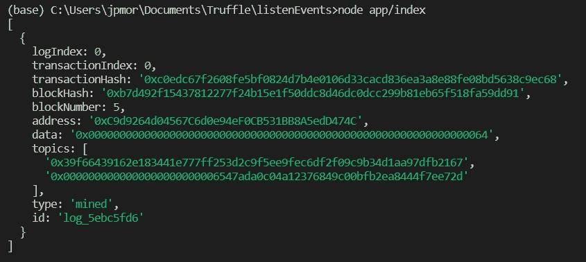
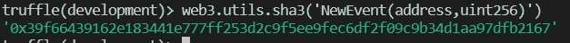
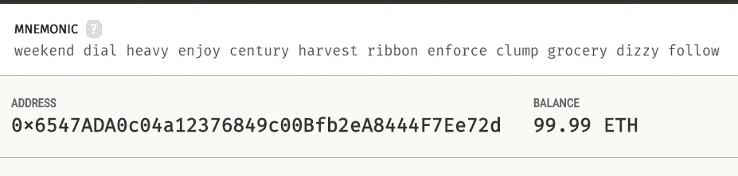
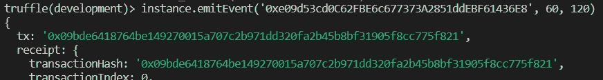
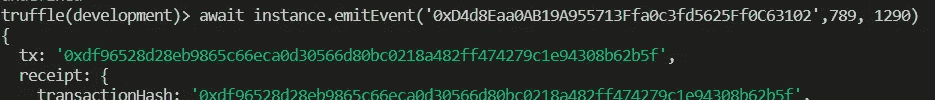
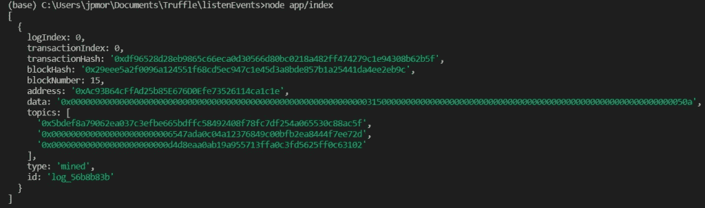

# 处理智能合约的事件第 1/2 部分

> 原文：<https://medium.com/coinmonks/handling-events-of-a-smart-contract-part-1-2-b086eb6696cf?source=collection_archive---------3----------------------->


Photo by [AltumCode](https://unsplash.com/@altumcode?utm_source=unsplash&utm_medium=referral&utm_content=creditCopyText) on [Unsplash](https://unsplash.com/s/photos/programming?utm_source=unsplash&utm_medium=referral&utm_content=creditCopyText)

处理智能合约事件似乎给开发新手带来了一些困惑。在这个由两部分组成的教程中，我们将展示如何编写一个简单的应用程序来检索和监视发出的事件。

让我们从创建智能合同开始。你可以用混音和林克比这样的测试区块链来做，但我会用松露和加纳切来做。要启动一个新的 Truffle 项目，创建一个新的目录并键入

```
> truffle init
```

在 contracts 文件夹中，我们编写了以下代码:

```
pragma solidity ^0.8.11; contract ListeningEvents {      

   event NewEvent(address indexed newAddress, uint notIndexed);      

   function emitEvent(uint value) public {          
      emit NewEvent(msg.sender, value);      
   }  
}
```

这是一个简单的契约，其唯一目的是发出一个事件。本教程的目的是学习如何通过应用程序处理契约发出的事件。

要迁移(部署)合同，在 Migrations 文件夹中创建一个名为 *2_deploy.js* 的新文件，其代码与 *1_initial_migration.js* 中的代码相同，但将“Migrations”替换为“ListeningEvents”。之后，使用下面的命令部署契约。

```
> truffle migrate
```

如果你对这些程序有任何疑问，可以咨询帖子“[使用 Truffle 和 Ganache](/coinmonks/creating-and-deploying-smart-contracts-using-truffle-and-ganache-ffe927fa70ae) 创建和部署智能合约”。

# 发射事件

发出一个事件非常简单。一旦执行了函数 emitEvent(…)，就会发出一个事件。事件的工作方式类似于存储在区块链上而不是存储上的日志。记录一个事件比在存储器中记录一个变量花费更少的汽油，因此是一种更便宜的存储区块链信息的方式。

请注意事件是如何定义的:

```
event NewEvent(address indexed newAddress, uint notIndexed);
```

其中一个参数被定义为索引。这意味着更容易搜索它，我们将解释。每个事件最多可以索引三个参数。事件的每个索引参数称为一个**主题**。

要发出事件，请打开 truffle 控制台

```
> truffle console
```

创建 ListeningEvents 协定的(抽象)实例，如下所示

```
> let instance = await ListeningEvents.deployed()
```

并执行该功能

```
> await instance.emitEvent(100)
```

所有这些都可以在下图中看到:



我们要做的第一件事是使用 **web3.js** 库检索这个事件。不过，在此之前，让我们得到合同地址，以防你没有写下来。只是打字

```
> instance.address
```

请参见下图:



# 检索事件

让我们在 node.js 应用程序中检索事件，但是您在这里学到的内容也可以在前端使用。我在项目的根目录下创建了一个名为 app 的文件夹，在里面，我启动了一个新的节点项目。

```
> npm init -y
```

在 app 文件夹中，我创建了一个名为 index.js 的文件，这将是我在这个项目中唯一的文件，除了 web3 依赖项之外。要安装 web3.js，只需键入:

```
> npm install web3
```

现在让我们使用 **web3.eth** 模块的 **web3.eth.getPastLogs** 方法来检索事件。还有其他检索事件的方法，但这是最通用的方法。它最多需要四个参数:

1.  一个地址
2.  主题列表
3.  初始块
4.  最后一块

这些参数起过滤器的作用。该方法的返回是一个承诺，带有一个符合过滤器的发出事件列表。

原则上，所有参数都是可选的，但这取决于您要连接的节点。某些节点需要指定一些参数，以避免无限制的搜索。

让我们从不带参数的搜索开始，在第 2 部分我们将看到如何使用参数作为过滤器。这种搜索将只返回一个事件，原因是初始块和最终块的缺省值都是链中的最新块。

在一个 app 文件夹中，我创建了一个 *index.js* 文件，内容如下:

```
const Web3 = require("web3");

async function run() {      
   const web3 = await new Web3("HTTP://127.0.0.1:8545");
   let response = await web3.eth.getPastLogs({ });
   console.log(response);  
} run();
```

运行上面的文件，我们得到作为响应发出的事件。请参见下图(确保事件是在最后一个块中发出的):



让我们仔细分析一下上述事件。它有几个参数，我们将突出显示*地址*、*主题*和*数据*。

地址是合同地址。主题有两个:第一个是对发出的事件的引用。更具体地说，它是某个事件接口的散列，如下图所示:



第二个主题涉及我们索引的第一个参数。让我们记住，在我们的事件中，索引的第一个参数是一个地址。主题 0x 00000000000000000000000006547 ada 0 c 04 a 12376849 c 00 bfb 2 ea 8444 f 7 ee 72d 是该地址的 32 字节表示(地址长 20 字节)。为了检查，地址是调用事务的地址。在下图中，我们在 Ganache 中验证了这一点。



This address is the same of the first topic

注意，上面的地址和第二个主题是同一个地址，只是改变了表示方式。一个是 20 字节长，而另一个是 32 字节长。

最后，我们有日期字段。该字段包含事件的其他参数，即未编入索引的参数。在我们的示例中，只有一个参数 uint256，我们向它传递了值 100。与日期字段的值进行比较:它是正确的。我们只需要注意日期字段中的值是十六进制的(十六进制的 64 对应于十进制的 100)。

在本文的第 2 部分，我们将使用过滤器和 WebSockets。对于本文第 1 部分的剩余部分，我们将发出一个带有更多参数的事件。

# 更完整的事件

让我们稍微改变一下以前的合同。新契约看起来会有些不同，如下面的代码所示:

```
pragma solidity ^0.8.11; contract ListeningEvents {         event AnotherEvent(address indexed firstAddres, address indexed secondAddress, uint firstValue, uint secondValue);         function emitEvent(address _address, uint _value1, uint _value2) public {          
    emit AnotherEvent(msg.sender, _address, _value1, _value2);     
    }    
}
```

你不需要创建一个新的块菌项目。若要强制迁移此新协定，请使用

```
> truffle migrate --reset
```

重复上述相同的过程，我调用了新契约的函数 **emitEvent(…)** 两次，如下图所示:



再次执行上一节中相同的 *index.js* ，我们得到下图的结果:



注意，我们现在有三个主题:第一个是事件散列，在本例中，是字符串“AnotherEvent(address，address，uint256，uint256)”的散列。我邀请你不要相信我，用[https://emn178.github.io/online-tools/keccak_256.html](https://emn178.github.io/online-tools/keccak_256.html)自己检查一下。

另外两个主题对应于两个索引地址。

数据字段是最后两个参数的一种串联(实际上是一种序列化)，这两个参数没有索引。为了看到这一点，让我们来看看它的值:0x 00000000000000000000000000000000000000000000000000000031500000000000000000000000000000000000000000000000。

请注意，它的长度为 62 字节，因为它对应于两个各为 32 字节的参数:

```
0000000000000000000000000000000000000000000000000000000000000315 000000000000000000000000000000000000000000000000000000000000050a
```

从十六进制转换到十进制，我们有传递给事件的参数:789 和 1290。

# 对第一部分的评论

我想提请注意我们可以从文章的第一部分得出的一些考虑。主题是索引参数，每个主题的长度总是 32 字节。因此，不可能对动态类型进行索引，动态类型可以超过该值。例如，索引一个字符串是没有意义的。

非索引参数在序列化时不能用作筛选器。注意，在处理两个非索引参数时，它们被放在同一个字段 data 中。因此，如果您想在日志中搜索一个参数，您需要索引这个参数。

在本文的下一部分，我们将更多地讨论 web3.eth.getPastLogs 方法以及如何使用 WebSockets 来监控事件。

**感谢阅读！**

> 加入 Coinmonks [电报频道](https://t.me/coincodecap)和 [Youtube 频道](https://www.youtube.com/c/coinmonks/videos)了解加密交易和投资

# 另外，阅读

*   [3 商业评论](/coinmonks/3commas-review-an-excellent-crypto-trading-bot-2020-1313a58bec92) | [Pionex 评论](https://coincodecap.com/pionex-review-exchange-with-crypto-trading-bot) | [Coinrule 评论](/coinmonks/coinrule-review-2021-a-beginner-friendly-crypto-trading-bot-daf0504848ba)
*   [莱杰 vs n rave](/coinmonks/ledger-vs-ngrave-zero-7e40f0c1d694)|[莱杰 nano s vs x](/coinmonks/ledger-nano-s-vs-x-battery-hardware-price-storage-59a6663fe3b0) | [币安评论](/coinmonks/binance-review-ee10d3bf3b6e)
*   [Bybit 交易所评论](/coinmonks/bybit-exchange-review-dbd570019b71) | [Bityard 评论](https://coincodecap.com/bityard-reivew) | [Jet-Bot 评论](https://coincodecap.com/jet-bot-review)
*   [3 commas vs crypto hopper](/coinmonks/3commas-vs-pionex-vs-cryptohopper-best-crypto-bot-6a98d2baa203)|[赚取加密利息](/coinmonks/earn-crypto-interest-b10b810fdda3)
*   最好的比特币[硬件钱包](/coinmonks/hardware-wallets-dfa1211730c6) | [BitBox02 回顾](/coinmonks/bitbox02-review-your-swiss-bitcoin-hardware-wallet-c36c88fff29)