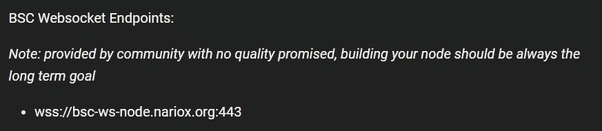

# 处理智能合约的事件第 2/2 部分

> 原文：<https://medium.com/coinmonks/handling-events-of-a-smart-contract-part-2-2-81d22c995eba?source=collection_archive---------13----------------------->


Photo by [Juanjo Jaramillo](https://unsplash.com/@juanjodev02?utm_source=unsplash&utm_medium=referral&utm_content=creditCopyText) on [Unsplash](https://unsplash.com/s/photos/programming?utm_source=unsplash&utm_medium=referral&utm_content=creditCopyText)

在本文中，我们将继续研究如何检索智能合约发出的事件。我们的第一个目标是了解如何使用过滤器按主题搜索事件。为此，我们将离开第一部分的测试环境，我们将连接一个真实的区块链。

我将使用我用于测试目的的帐户(0x27e 0155021 e 63842 AFB 79 f 99 da 8 b 9592 f 429 f 614)并获取币安智能链测试网络上记录的事件。作为一个节点，我将使用官方文档中指明的一个公共节点，它可以在[docs.binance.org/smart-chain/developer/rpc.html](http://docs.binance.org/smart-chain/developer/rpc.html)找到。

提醒一下，我们使用的是 **web3.js** 库，更具体地说是方法 **web3.eth.getPastLogs()** 。下面的列表中列出了检索一些事件的 javascript 代码:

```
const Web3 = require("web3"); async function run() {     const web3 = await new Web3("https://data-seed-prebsc-1-s1.binance.org:8545/")         
   let response = await web3.eth.getPastLogs({
      fromBlock:15519519,       
      topics:  [,'0x00000000000000000000000027e0155021e63842afb79f99da8b9592f429f614']    
   }) console.log(response);  
} run()
```

在您测试这段代码之前，我应该警告您它将返回一个错误。脚本本身不包含错误，但是每个端点通常会限制用于搜索事件的过滤器。目的可能是为了避免在区块链进行深入搜查。例如，当试图运行上面的代码时，我得到错误:


请注意，该错误表明端点将事件搜索限制为 5，000 个数据块。在上面的例程中，我试图搜索在块 15，519，519 和当前块 18，628，131 之间发出的事件。这远远超过 5000 个街区。

很可能其他端点有其他限制。我尝试了 Moralis 端点，限制甚至更低，2000 个块。更改上面的代码以适应允许的限制，我们有:

```
...
fromBlock:16576824,    
toBlock:16576925,
...
```

这次我得到一个回报，如下图所示:


现在让我们简单了解一下话题的问题。事件的第一个主题总是事件的散列。在我们的例子中，这是一个 ERC20 令牌的*传输*事件。事件哈希是 0x ddf 252 ad 1 be 2c 89 b 69 C2 b 068 fc 378 DAA 952 ba 7 f 163 C4 a 11628 f 55 a4 df 523 B3 ef，如下图所示:


你可以在 emn178.github.io/online-tools/keccak_256.html 亲自检查一下。现在检查我在方法**web 3 . eth . getpastlogs():**中使用的过滤器

```
let response = await web3.eth.getPastLogs({    
   fromBlock:16576824,    
   toBlock:16576925,    
   topics:[,'0x00000000000000000000000027e0155021e63842afb79f99da8b9592f429f614'] 
})
```

我只搜索了一个话题，第二个话题，用了一个地址:0x 27e 0155021 e 63842 AFB 79 f 99 da 8 b 9592 f 429 f 614。因为主题有 32 个字节，地址有 20 个字节，所以有必要将地址转换成 32 个字节。我想，我也可以搜索第一个主题(发出的事件)，或者第三个主题(在本例中，是传输事件的 _to 字段)。

主题的顺序很重要，它们需要被排序。例如，让我们尝试下面的代码:

```
let response = await web3.eth.getPastLogs({    
   fromBlock:16576824,    
   toBlock:16576925,    
   topics:[,,'0x00000000000000000000000027e0155021e63842afb79f99da8b9592f429f614'] 
})
```

它返回一个空数组。注意我现在搜索的是第三个话题(我们从[，

]到[，，])，结果自然会和我在第二个话题搜索我的地址时不一样。必须注意题目的顺序。

我们可以在过滤器中使用的另一个字段是发出事件的智能协定的地址。我将修改搜索以包含地址，并从搜索中删除主题。您可以尝试以下代码:

```
const web3 = await new Web3("https://bsc-dataseed.binance.org/") let response = await web3.eth.getPastLogs({    
   fromBlock:17124122,    
   toBlock: 17124922,    
   address: '0xaf44400a99a9693bf3c2e89b02652babacc5cdb9' 
}) console.log(response.length);
```

现在，我正在币安智能链上搜索 NFT 项目智能合同的事件。我只记录返回数组的大小。它返回 148 项，如下图所示:


您可以使用这些过滤器的任意组合:地址、主题和阻止范围，来检索您想要的事件。在下一节中，我们将了解如何订阅来实时监控事件的发射。

# 订阅事件

我们还可以实时监控事件的发射。为此，我们使用 websockets 连接到一个节点并订阅事件。让我们继续使用 node 和 web3.js。这个过程非常简单，在 web3.js 文档页面上有很好的记录。

```
var subscription = web3.eth.subscribe('logs', {     
   address: '0x123456..',     
   topics: ['0x12345...'] 
}, function(error, result){     
   if (!error) console.log(result); 
})
```

我们已经知道如何使用过滤器来过滤事件，所以在这个例子中，我将只使用合同地址作为过滤器。唯一相关的细节是通过 websockets 连接，所以你保持连接。最初，我尝试了币安智能链页面上的 websocket 端点。请参见下面的端点地址:



然而，仅仅一分钟不活动之后，我就被自动断开了。在第二次尝试中，我使用了一个由 Moralis 帐户提供的 websocket(参见 moralis.io/)，如下图所示:


这一次，事件开始一个接一个地出现在提示符中。使用方法 **web3.eth.subscribe()** 和 websockets，订阅接收事件非常容易。如果您想按主题订阅事件，只需像我们之前所做的那样更改过滤器。

**免责声明:**我与道德或任何其他公司没有任何关系。我鼓励您尝试提供相同服务的其他公司的终端。

**感谢您的阅读！**

> 加入 Coinmonks [电报频道](https://t.me/coincodecap)和 [Youtube 频道](https://www.youtube.com/c/coinmonks/videos)了解加密交易和投资

# 另外，阅读

*   [有哪些交易信号？](https://coincodecap.com/trading-signal) | [比特斯坦普 vs 比特币基地](https://coincodecap.com/bitstamp-coinbase)
*   [10 本关于加密的最佳书籍](https://coincodecap.com/best-crypto-books) | [英国 5 个最佳加密机器人](https://coincodecap.com/uk-trading-bots)
*   [Koinly 点评](https://coincodecap.com/koinly-review) | [Binaryx 点评](https://coincodecap.com/binaryx-review) | [Hodlnaut vs CakeDefi](https://coincodecap.com/hodlnaut-vs-cakedefi-vs-celsius)
*   [40 个最佳电报频道](https://coincodecap.com/best-telegram-channels) | [1xBit 回顾](https://coincodecap.com/1xbit-review) | [Keevo 钱包回顾](https://coincodecap.com/keevo-wallet-review)
*   [如何在印度购买以太坊？](https://coincodecap.com/buy-ethereum-in-india) | [如何在币安购买比特币](https://coincodecap.com/buy-bitcoin-binance)