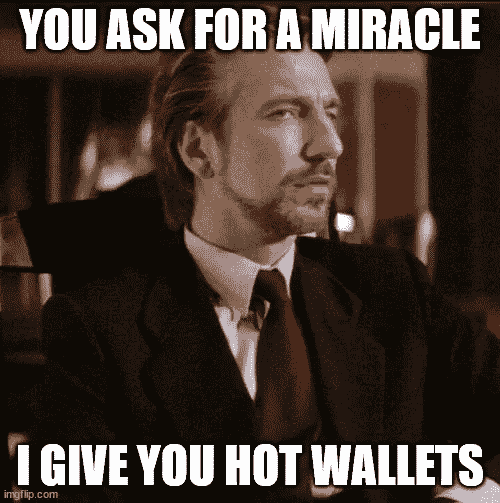

# 汉斯·格鲁伯会喜欢 Web3 的

> 原文：<https://medium.com/coinmonks/hans-gruber-would-have-loved-web3-c23db1f9cd2f?source=collection_archive---------11----------------------->

每个假期，数以百万计的人与他们所爱的人和劫持中富广场人质的最时髦的恶棍——汉斯·格鲁伯共享时光。直到你能引用经典电影《虎胆龙威》中的每一句台词，这真的是假期吗？这真的是汉斯·格鲁伯从中富广场摔下的季节吗？还有什么比第 27 次看《T2 虎胆龙威》时想起——等等，布鲁斯·威利斯以前有头发更令人欣慰的吗？！

然而，汉斯·格鲁伯不仅仅是他的风格、魅力和谈判技巧。《虎胆龙威》是独一无二的——不是因为它是一部伪装成行动抢劫的节日电影——而是因为汉斯渴望的对象。为什么汉斯会组织一队训练有素的恐怖分子接管平安夜的中富广场？装满黄金的保险箱？珍贵的钻石？银行账户的使用权？赎回人质？现金吗？

没有。一个都没有。那么是什么藏在中富广场的保险箱里，让汉斯·格鲁伯如此冷静，以至于你以为他整个下午都在和汤米·钟鬼混呢？无记名债券。没有比盗窃无记名债券更性感的了——哦，等等，我想我弄错了——一部关于无记名债券的抢劫电影是有史以来最不性感的想法？？？但是如果有人能让它看起来很酷，汉斯做到了。

但是等等，什么是无记名债券？先说债券。债券很像贷款，你向公司、组织、政府等支付 X 金额。他们同意在未来的某一天付给你一定的金额。这个未来日期就是债券“到期”的时间。y 通常(但不总是)大于 X，这意味着债券的所有者(实际上是贷款人)将在债券完全到期时获利。由于回报率是固定的，债券是风险较低的投资，但没有 rugpulls 那样的潜在高回报。

无记名债券只是一种有一点小小警告的债券——它没有所有者。无记名债券将以实物证书的形式存在(一张实际的纸，可能有一些花哨的印章和签名)，持有债券的人，即实际拥有债券的人，**是所有者**。如果你手里握着无记名债券，你就是它的所有者，没有任何疑问。就像《圆场》里的泰迪·克格勃会说的，“把钱给他！”

你可能会想，为什么我从来没听说过无记名债券？首先，1982 年的税收公平和财政责任法案基本上消除了美国的无记名债券。2010 年，更多美国立法从本质上解除了银行和机构赎回无记名债券的责任。为什么？嗯……无记名债券实际上只有一个用途——洗钱。由于无记名债券没有所有者，因此没有所有权或占有权的记录，所以你如何获得无记名债券并不重要，包括在枪口下的盗窃——如果你实际拥有它，它理所当然地属于你。

如果你来这里是为了获得 DAOs 的链接，关于 NFT 系列的传言，还有德杰尼里将军——你能走到这一步真好！因为现在，所有这些对 Web3 都很重要！是啊！我知道！汉斯格鲁伯会很兴奋地得知你的刀和你的未经核实的智能合同，部署您的 NFT 收集！只是不要像高木先生一样告诉他你的私人钥匙…

加密钱包使用加密技术创建公钥/私钥对，生成钱包(或合同)地址。如果您拥有与公钥匹配的私钥，您就是该钱包或合同的合法所有者。你的身份和你的钱包没有任何联系。您可能有一个密码短语，但该短语与您的身份无关。任何拥有给定地址**的私有和公共密钥的人都是**的所有者。不问任何问题。毕竟这是一个不可信的系统——还记得吗？你的数字资产与无记名债券没有什么不同——除了你实际上知道无记名债券的回报率是多少。

所有权的法律定义各不相同，但有两个组成部分是相当普遍的——占有权和占有权。附身很容易理解。占有的**权利**要求将拥有该**权利**的个人与相关资产联系起来。对于数字资产来说，它与身份没有联系，这是一个不可信的系统。因此，在你的加密钱包中拥有一项数字资产是否符合合法所有权的门槛？我不是律师，也不知道有直接针对这种情况的法律；但是，我怀疑这个问题的答案是**不**。

所有权也很重要。如果你从未拥有过一项资产，有人能偷走它吗？你拥有它，现在他们拥有它。这有错吗？违法？在一个不可信的系统中，系统并不关心——它只是耸耸肩。公钥/私钥对**的拥有者是**“所有者”。就像无记名债券一样。我不喜欢成为一个末日预言者，但这是对当前 Web3 世界的现实评估。如果你是一名开发人员，这些是我们非常想帮助你考虑的场景。如果你不拥有你的合同或资产，如果有人偷了它们会怎么样？你对那些依靠公司生存来支付账单的员工怎么说？你怎么告诉你的顾客*信任*(有趣的是“信任”这个词，不是吗？)他们的资产不会在没有追索权的情况下丢失？人际关系建立在信任的基础上。Web3 也必须如此。

> 加入 Coinmonks [电报频道](https://t.me/coincodecap)和 [Youtube 频道](https://www.youtube.com/c/coinmonks/videos)了解加密交易和投资

# 另外，阅读

*   [投资印度的最佳加密软件](https://coincodecap.com/best-crypto-to-invest-in-india-in-2021) | [WazirX P2P](https://coincodecap.com/wazirx-p2p)
*   [7 个最佳零费用加密交易平台](https://coincodecap.com/zero-fee-crypto-exchanges)
*   [最佳网上赌场](https://coincodecap.com/best-online-casinos) | [期货交易机器人](/coinmonks/futures-trading-bots-5a282ccee3f5)
*   [分散交易所](https://coincodecap.com/what-are-decentralized-exchanges) | [比特 FIP](https://coincodecap.com/bitbns-fip) | [宾邦评论](https://coincodecap.com/bingbon-review)
*   [用信用卡购买密码的 10 个最佳地点](https://coincodecap.com/buy-crypto-with-credit-card)
*   [加拿大最佳加密交易机器人](https://coincodecap.com/5-best-crypto-trading-bots-in-canada) | [Bybit vs 币安](https://coincodecap.com/bybit-binance-moonxbt)