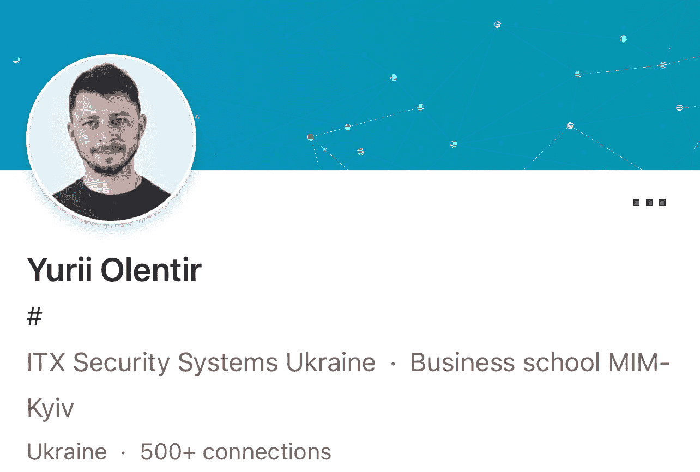

# 哈比神协议-确保 DeFi 上的资金安全💸

> 原文：<https://medium.com/coinmonks/hapi-protocol-keeping-your-funds-on-defi-safe-b5d0508a441b?source=collection_archive---------15----------------------->

在我之前的无损协议项目之后，我现在将把重点放在哈比神协议上。哈比神的目标是改变整个网络安全游戏。# CoinDCXpathbreaker

A new age DeFi saviour

**项目**:哈比神议定书

**项目代号** : $HAPI

**直接引用白皮书:**

> “HAPI 是一套嵌入到 DeFI 产品中的跨链智能合约，使其能够达到新的安全级别。此外，HAPI 的 Oraclizing 和 DAO 系统在 DeFi 环境中提供 SaaS，防止黑客攻击。”

**项目网络可用性:**

*   **以太坊—合同地址:**0x d 9 C2 d 319 CD 7 e 6177336 b 0 a9 c 93 c 21 CB 48d 84 FB 54
*   **BNB 智能链—合同地址:**0x d 9 C2 d 319 CD 7 e 6177336 b 0 a9 c 93 c 21 CB 48d 84 FB 54
*   **Solana —合同地址:**6 vnkqgz 9 hk 7 zrshtfdg 5 ankfkwzucojzwakzxsh 3 bnum
*   **多边形—合同地址:**0x be 276 E3 d 5060 b0e 770 Fe 0260 bb 6 be 94 AC 19 B4 b 19
*   **近合同地址:**9c2d 319 cd7e 6177336 b 0 a9 c 93 c 21 CB 48d 84 FB 54

## 哈比神议定书项目审计报告:

哈比神已经由[Hacken](https://medium.com/u/4d859cb30dcc?source=post_page-----b5d0508a441b--------------------------------)进行了安全审计，他们的调查结果如下:

Audit Report Details

Executive Summary

Protocol issues (if any)

**Hacken 将该项目评为“安全可靠”**

## 《哈比神议定书》的独特卖点

*   多交叉链解决方案
*   Oracle(通过 API 整理来自多个离线服务的数据)
*   SaaS(安全即服务)
*   NFT 安全
*   Hacken Foundation(一个在网络安全领域为所有人谋福利的组织的集合)的成员

Hapi Protocol details on Hacken

*   **经过验证的使用案例:成功阻止了试图违反俄罗斯制裁的交易**
*   博卡奇卡·哈皮斯发射台启动在 NEAR 和 Solana 建造的项目。这将很快被卸载，因为 launchpad 将有自己的开发团队来推进它

## 协议警报和通知系统

哈比神协议在黑客企图或执行欺诈交易的情况下部署以下保护措施:

*   防止敌对攻击
*   防止洗钱
*   阻止黑客攻击
*   抑制被盗资金的水平
*   防止被盗资金转移
*   部署可能追回部分或全部被盗资金的措施

## 哈比神礼宾团队和顾问:

这个队已经完全被打败了。

## **核心团队**

首席技术官:安德烈·阿森宁

CMO:迪米特里·阿福宁

**BD 领导和首席运营官:Vadym Prykhodko**

**产品负责人:Eugen Pshenychkin**

战略顾问:尤里·奥兰蒂尔

如果你想访问他们的 LinkedIn 个人资料，tge 团队位于乌克兰。尽管最近他们的国家面临着麻烦的地缘政治局势，这个团队仍然在工作&交付产品。巨大的尊重。

## 哈比神议定书合作伙伴:

最近几个月,《哈比神议定书》与一些优秀的战略伙伴建立了联系。他们都提供服务，改善这个项目的概念和交付。

## 哈比神议定书路线图:

Roadmap 2022

看到上面这样一个精心设计的路线图，真的让我很兴奋。您研究的任何项目，如果它们的路线图是可靠的&而不仅仅是充满模糊的术语，这意味着团队对项目的长期内在价值有一个可靠的愿景。这些都是能给投资者注入信心的项目。

## 哈比神协议令牌组学:

*   $HAPI 是该项目的本地标志。用于支付费用和奖励。
*   最多供应 100 万代币
*   根据 CoinmarketCap 的数据，最大供应量的 67%目前正在流通

## $HAPI 公用事业包括:

*   **数据提交费**
*   **治理**
*   **甲骨文奖励**
*   **DeFi 项目审计报告提交**

## $HAPI 代币解锁时间表

上图是令牌解锁时间表。根据解锁计划，令牌将每 10 个月解锁一次

$HAPI 总共进行了 3 轮象征性销售:

**海轮:**

*   这是专为哈肯社区保留的
*   240，000 代币，每枚代币 5 美元

**私人回合:**

*   这是为战略合作伙伴举办的
*   19 万美元 HAPI 代币，每枚代币 7.5 美元

## 公共回合

*   3 万美元 HAPI 代币，每枚 10 美元

Token Distribution breakup

## 相关项目链接:

*   **推特**:[https://twitter.com/i_am_hapi_one](https://twitter.com/i_am_hapi_one)
*   **电报**:[https://t.me/hapiHF](https://t.me/hapiHF)
*   **不和**:[https://discord.gg/HdGXqF32Jc](https://discord.gg/HdGXqF32Jc)
*   **Reddit**:[https://www.reddit.com/r/HAPI_Token/](https://www.reddit.com/r/HAPI_Token/)
*   **中等**:[https://medium.com/i-am-hapi](https://medium.com/i-am-hapi)
*   **领英**:[https://www.linkedin.com/company/hapi-protocol/](https://www.linkedin.com/company/hapi-protocol/)
*   **Github**:[https://github.com/HAPIprotoco](https://github.com/HAPIprotocol)l
*   **【CMC】**:【https://coinmarketcap.com/currencies/hapi-one/ 
*   【https://hapi.one/】网站 : [网站](https://hapi.one/)

## 要点:

哈比神协议确实与无损有一些相似之处，但哈比神协议的最大优势是它们的跨链能力。这使得他们的安全协议能够集成到更加智能的契约中。此外，这提供了 NFT 安全性，即使在我写报告时，无损没有任何这样的功能。

由于整个数字艺术领域绝对疯狂的底价，NFT 艺术目前正成为黑客们的主要关注点。在我看来,《哈比神议定书》在直接竞争中拥有如此重要的优势是一个巨大的胜利！

用 CoinDCX 开始您的交易之旅，只需几个简单的步骤:

*   用您的姓名、电子邮件和手机号码注册
*   接受 CoinDCX 的服务条款
*   完成您的 KYC 验证并添加您的银行帐户详细信息
*   一旦批准，存款菲亚特通过您批准的银行帐户或转移加密从您的其他加密钱包，你就完成了。

*非常感谢 CoinDCX 给我这个机会撰写如此详细的报告，并成为#****coindcxpathbaker****计划的一部分，使我能够与加密领域的每个人分享这些知识。*

> 加入 Coinmonks [电报频道](https://t.me/coincodecap)和 [Youtube 频道](https://www.youtube.com/c/coinmonks/videos)了解加密交易和投资

# 另外，阅读

*   [CBET 评论](https://coincodecap.com/cbet-casino-review) | [库库恩 vs 比特币基地](https://coincodecap.com/kucoin-vs-coinbase) | [拜比特 vs 比特币基地](https://coincodecap.com/bybit-vs-coinbase)
*   [折叠 App 回顾](https://coincodecap.com/fold-app-review) | [LocalBitcoins 回顾](/coinmonks/localbitcoins-review-6cc001c6ed56) | [Bybit vs 币安](https://coincodecap.com/bybit-binance-moonxbt)
*   [加密保证金交易交易所](/coinmonks/crypto-margin-trading-exchanges-428b1f7ad108) | [赚取比特币](/coinmonks/earn-bitcoin-6e8bd3c592d9) | [Mudrex 投资](https://coincodecap.com/mudrex-invest-review-the-best-way-to-invest-in-crypto)
*   [WazirX vs coin dcx vs bit bns](/coinmonks/wazirx-vs-coindcx-vs-bitbns-149f4f19a2f1)|[block fi vs coin loan vs Nexo](/coinmonks/blockfi-vs-coinloan-vs-nexo-cb624635230d)
*   [比斯勒评论](https://coincodecap.com/bitsler-review)|[WazirX vs coin switch vs coin dcx](https://coincodecap.com/wazirx-vs-coinswitch-vs-coindcx)
*   [7 大副本交易平台](https://coincodecap.com/copy-trading-platforms) | [BuyCoins 点评](https://coincodecap.com/buycoins-review)