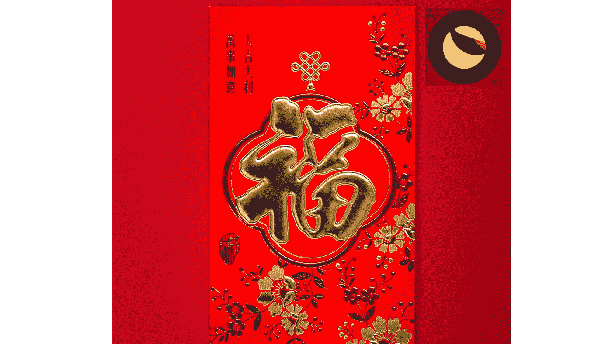

# 2022 年月球(Terra)新年快乐！

> 原文：<https://medium.com/coinmonks/happy-luna-terra-new-year-2022-cea6a5472169?source=collection_archive---------4----------------------->

## 支持“咆哮”的地球生态系统的 8 个理由

[https://unsplash.com/photos/hPmwHHfizsk](https://unsplash.com/photos/hPmwHHfizsk)

农历新年(有时被称为中国新年)即将在 2022 年 2 月 1 日到来。写一篇关于月神令牌的文章，并提出八点说明为什么这个令牌会飞向月球，这是很合适的。我特意选择了 8，因为在中国文化中这被认为是一个幸运数字。比如说…