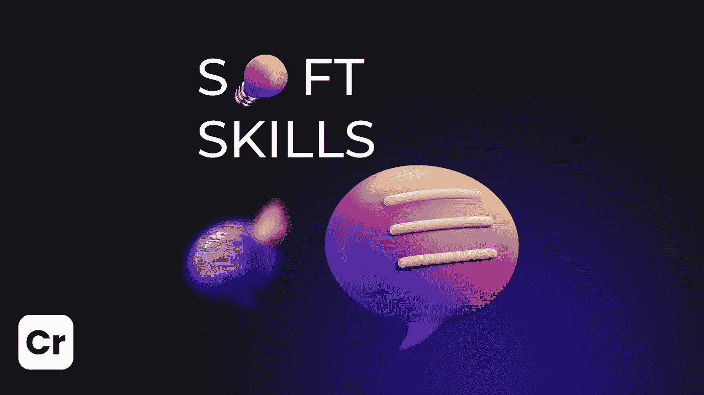

# 硬技能和软技能哪个更重要？

> 原文：<https://medium.com/coinmonks/hard-or-soft-skills-what-is-more-important-50269fadd5ea?source=collection_archive---------38----------------------->

我们说过我们在 [Crypton 学院](https://academy.crypton.studio)教授硬技能。也就是说，智能合同开发者的实习:坚固与生锈。此外，我们还提供软技能。这是什么意思？

通过加入我们的学院，你成为了 [Crypton Studio](https://crypton.studio) 团队的一员，我们的人力资源与你一起入职。如下所述，作为一名开发人员，人力资源帮助您构建个人发展轨迹。该计划包括:团队合作指导、与客户面谈和沟通建议、强化英语以及你在个人谈话中发现的一切。

> 如果你有一个问题:“当我能写好代码的时候，为什么我能和客户交谈？”。那么我们有双赢的答案:

**——沟通技巧**将帮助你与其他人谈判，在团队中工作，并论证你的立场。

发展的领导素质和情商会让你有能力理解他人的感受并控制自己的感受。在团队中工作时，讨论顾客的纠正*、*和发展职业的愿望非常重要。

因此，我们将帮助您成为一名真正的开发人员，既能编写优秀的代码，又能与客户沟通。

赶快申请[*Crypton Academy*](https://academy.crypton.studio)！

> 加入 Coinmonks [电报频道](https://t.me/coincodecap)和 [Youtube 频道](https://www.youtube.com/c/coinmonks/videos)了解加密交易和投资

# 另外，阅读

*   [Bookmap 评论](https://coincodecap.com/bookmap-review-2021-best-trading-software) | [美国 5 大最佳加密交易所](https://coincodecap.com/crypto-exchange-usa)
*   最佳加密[硬件钱包](/coinmonks/hardware-wallets-dfa1211730c6) | [Bitbns 评论](/coinmonks/bitbns-review-38256a07e161)
*   [新加坡十大最佳加密交易所](https://coincodecap.com/crypto-exchange-in-singapore) | [购买 AXS](https://coincodecap.com/buy-axs-token)
*   [红狗赌场评论](https://coincodecap.com/red-dog-casino-review) | [Swyftx 评论](https://coincodecap.com/swyftx-review) | [造币厂评论](https://coincodecap.com/coingate-review)
*   [投资印度的最佳密码](https://coincodecap.com/best-crypto-to-invest-in-india-in-2021)|[WazirX P2P](https://coincodecap.com/wazirx-p2p)|[Hi Dollar Review](https://coincodecap.com/hi-dollar-review)