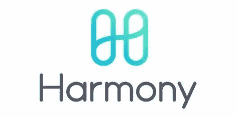

# 和谐一价格预测

> 原文：<https://medium.com/coinmonks/harmony-price-prediction-bc308facebe5?source=collection_archive---------17----------------------->

Source photo [harmony crypto — Bing images](https://www.bing.com/images/search?view=detailV2&ccid=kc3oGCJm&id=5505F2297578813BD5B567503433411D2A3BB358&thid=OIP.kc3oGCJmkNbPYAPGPMdvnQHaDq&mediaurl=https%3a%2f%2fqph.fs.quoracdn.net%2fmain-qimg-91cde818226690d6cf6003c63cc76f9d&cdnurl=https%3a%2f%2fth.bing.com%2fth%2fid%2fR.91cde818226690d6cf6003c63cc76f9d%3frik%3dWLM7Kh1BMzRQZw%26pid%3dImgRaw%26r%3d0%26sres%3d1%26sresct%3d1%26srh%3d643%26srw%3d1300&exph=298&expw=602&q=harmony+crypto&simid=608004676054821653&FORM=IRPRST&ck=8F1021F0B4D0228C0986278FD066C4E6&selectedIndex=5&ajaxhist=0&ajaxserp=0)

在过去的两年中，替代硬币有了很大的发展。为了满足区块链地区的需求，许多创新的加密技术正在进入市场。这可以通过调整现有的解决方案或破解未解决的难题来实现。一个这样的潜在倡议是“和谐”，它吹捧其本土资产“一”。