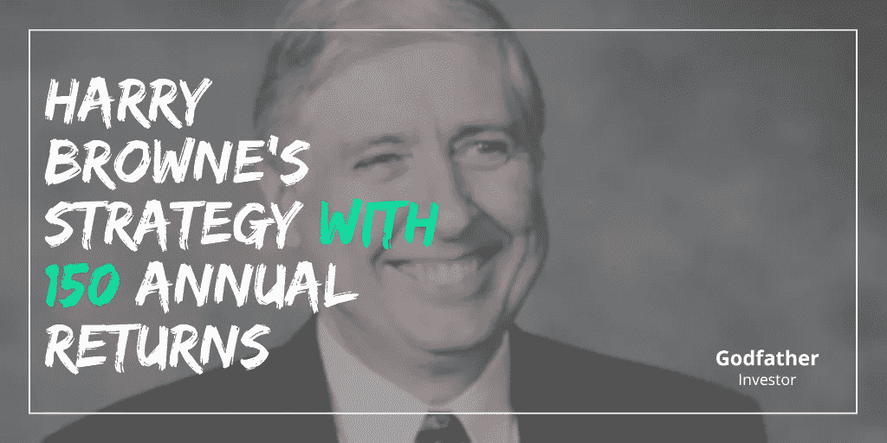

# 哈里·布朗的新投资策略，年回报率 150%

> 原文：<https://medium.com/coinmonks/harry-brownes-new-investment-strategy-with-150-annual-returns-78fd25442520?source=collection_archive---------1----------------------->

## 小行星的简单投资策略

Source: [Godfather Investor](https://godfatherinvestor.com/)

## 谁是哈里·布朗？

哈里·布朗是一名金融顾问，他在 20 世纪 70 年代通过写书和在金融市场投机赚了一大笔钱。但没过多久他就意识到自己的运气是有期限的，他把自己的…