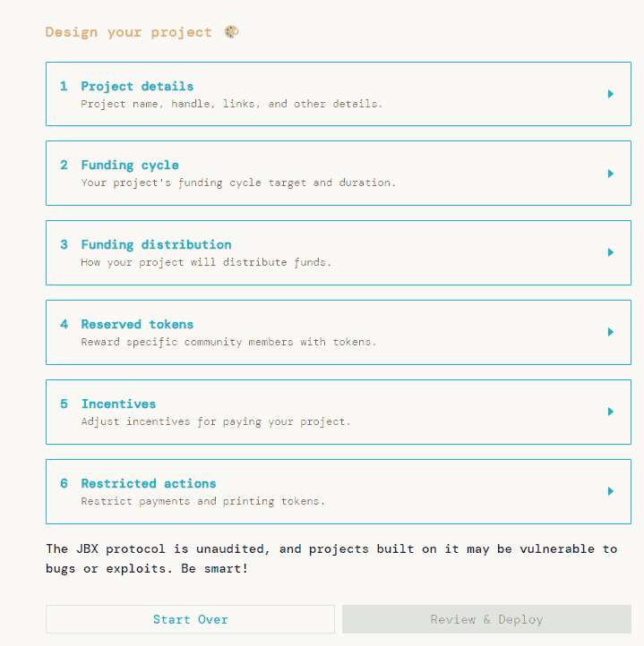
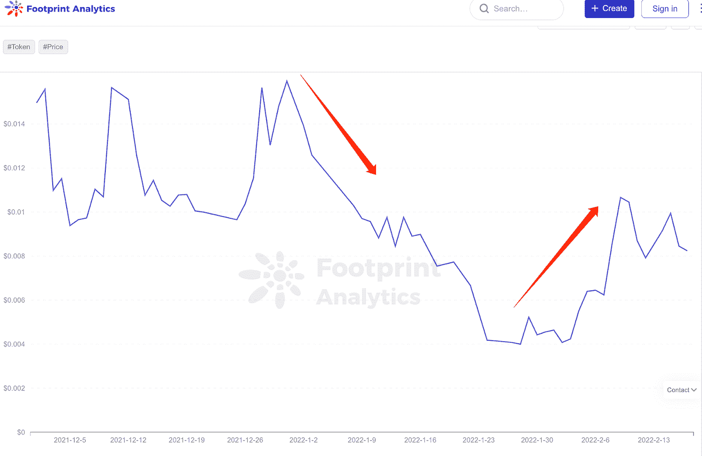
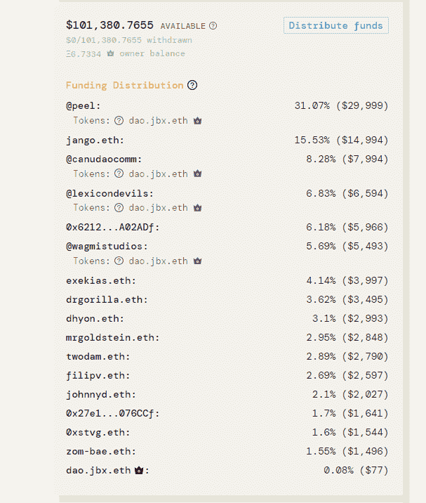
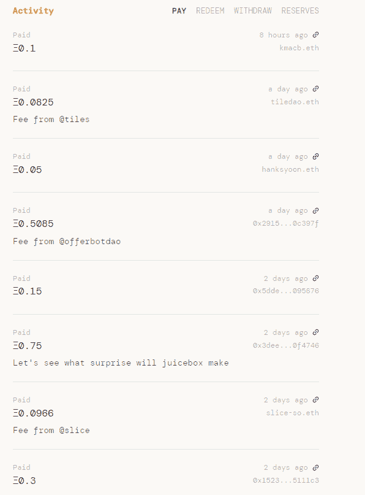
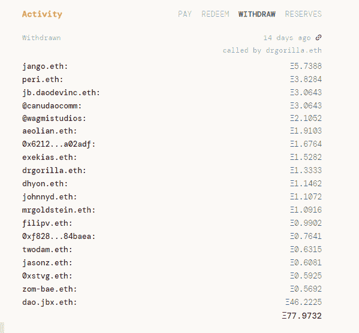

# 去中心化众筹终于有了 Juicebox？

> 原文：<https://medium.com/coinmonks/has-decentralized-crowdfunding-finally-arrived-with-juicebox-e3cc930c19a?source=collection_archive---------25----------------------->

Juicebox 可以让任何人开始一把刀，它的趋势很快

数据来源:Footprint.network

Kickstarter 和 GoFundMe 等众筹平台对争议并不陌生，当有争议的问题出现在它们的网站上时，它们发现自己被夹在政治分歧的不同一边、它们的用户甚至政府之间。

像社交媒体平台一样，当活动给他们的业务带来风险时，他们可以依靠他们的 ToS(服务条款)取消服务——即使是在筹款过程中。

难怪众筹成为被区块链颠覆的最新模式。

Juicebox 是一个众筹平台，在这里，捐赠、退款和支出的规则都是在链上编纂的。去中心化对于众筹将意味着什么，为什么 Juicebox 在 DAO 项目中成为趋势？

# 近距离观察 Juicebox

Juicebox 于去年 7 月推出，是一个面向以太坊项目的程序化资金管理协议。

与 Kickstarter 或 GoFundMe 不同，资金的部署由基于代码的规则来管理，而不是由平台的工作人员来决定。

是第一个由 [@me_jango](https://twitter.com/me_jango) 在 Discord 上遇到最早的 Juicebox 团队成员搭建的 Web3 项目。Juicebox 尚未接受任何风投的审计或资助。

除了改变传统的众筹模式，Juicebox 还旨在简化建立金库和向分散项目社区发放代币的过程，目前这是一个复杂的过程。换句话说，它使开始一个刀变得容易。

## Juicebox 是如何工作的？

任何人都可以使用 Juicebox 为任何项目配置和部署用于资金管理和令牌分发的智能合约。

[Juicebox: Design your project](https://juicebox.money/#/)

*   项目详情:显示项目名称、描述、网站和官方媒体(如 Twitter、Discord)
*   筹资周期:通过设定筹资目标和期限来管理资金。
*   分配:将每次提款的一部分存入其他以太坊钱包或 Juicebox 项目，以支付捐助者、慈善机构、其他项目或其他任何人。
*   保留令牌:设置社区贡献时奖励的令牌，以及保留的百分比。
*   激励和限制行动:设置额外的配置，如折扣率和其他限制。

作为个人投资者，想要支持一个项目，你可以捐出你的 ETH，以一定的汇率获得项目代币。比如为阿森格道捐 1 ETH 就可以得到 100 万的正义。

目前，有 372 个项目得到了 Juicebox 的支持，总共筹集了 44，195 ETH。排名第一的项目是[阿萨格道](https://coinrivet.com/footprint-analytics-assangedao-accusations-highlight-danger-of-mixing-activism-and-investing/)(17422 ETH)，其次是[宪法道](https://cryptoslate.com/constitutiondao-the-failed-project-that-shook-the-crypto-world/)(11613 ETH)。两者加在一起，占所有融资的 66%。

Juicebox 从所有基金中收取 5%的费用，以换取$JBX，这是 Juicebox 的治理标志。从 Footprint Analytics 中显示的$JBX 的价格趋势来看，它随着上述项目的受欢迎程度而波动。

[*Price Trend of $JBX*](https://www.footprint.network/guest/chart/token-price-trading-vol-of-jbx-juicebox-fp-32c4dfc2-f6c3-482b-84f0-0e739b03134b?channel=u-VjyXxW)

# 为什么 Juicebox 在 Dao 中流行？

尽管 Juicebox 没有得到任何风投的资助，但它已经筹集了 6，721 ETH(大约。1800 万美元)由其在 [JuiceboxDAO](https://juicebox.money/#/p/juicebox) 的社区通过 15 个资助周期(每个周期 14 天)资助。这样的资金规模在密码行业平均相当于 A 轮甚至 B 轮。

它的项目页面显示了每个接收地址的资金分配和当前持有量。这种透明性使它不同于大多数加密项目，后者通常在他们的白皮书的一个部分中显示这一点。

[*JuiceboxDAO Funding Distribution*](https://juicebox.money/#/p/juicebox)

因此，这是每一笔捐赠、赎回、提取和储备的透明度。

[*JuiceboxDAO Activities include Pay, Redeem, Withdraw and Reserves*](https://juicebox.money/#/p/juicebox)

Juicebox 让资金的来源和去向一目了然，并让社区来评估项目的价值和风险。

这符合道的要求。它也代表了 Web3 的精神，从社区到社区:去中心化，基于令牌的经济学。

# 关于分散众筹的思考

随着区块链技术的发展，社区电力已经从 ico 发展到 IDOs，再发展到这些 dex 中的联营体，例如 Curve CIPs(曲线改善建议)和工厂免许可联营体。

在整个区块链行业，任何人都可以提出一个项目，这导致了许多有趣的先进，但也有许多骗局。

在 Juicebox 上，每个人都可以开始自己的刀，它显示。

有一个月球岛，它的任务是把人送上月球。一个隐岛道提出要共同拥有巴哈马群岛的一个岛屿。显然，并不是每一把刀都是合理的。

在阿桑奇道，由于其象征正义的价格大幅下跌，在社区中引起了激烈的争议。有人问这是呼吁正义还是骗局？许多捐助者对该项目及其创始团队产生了怀疑。

Juicebox 是 Web3 的一个很好的例子，任何人都可以直接从社区筹集资金。然而，并不是每个个人投资者都有足够的理解来评估这些未经许可的项目或 Dao 的风险和收益。

**什么是足迹分析**

足迹分析是一个一体化的分析平台，用于可视化区块链数据和发现见解。它清理和整合链上数据，因此任何经验水平的用户都可以快速开始研究令牌，项目和协议。凭借一千多个仪表板模板和一个拖放界面，任何人都可以在几分钟内构建自己的定制图表。发掘区块链数据，利用足迹进行更明智的投资。

*足迹网址:*[*https://www . Footprint . network*](https://www.footprint.network/)

*不和:*[*https://discord.gg/3HYaR6USM7*](https://discord.gg/3HYaR6USM7)

*推特:*[*https://twitter.com/Footprint_DeFi*](https://twitter.com/Footprint_DeFi)

*电报:*[【https://t.me/joinchat/4-ocuURAr2thODFh】T21](https://t.me/joinchat/4-ocuURAr2thODFh)

*Youtube:*[*https://www.youtube.com/channel/UCKwZbKyuhWveetGhZcNtSTg*](https://www.youtube.com/channel/UCKwZbKyuhWveetGhZcNtSTg)

> 加入 Coinmonks [电报频道](https://t.me/coincodecap)和 [Youtube 频道](https://www.youtube.com/c/coinmonks/videos)了解加密交易和投资

## 也阅读

 [## 杠杆代币[多头代币]终极指南

### 杠杆化令牌是具有杠杆化风险敞口的 ERC20 令牌，不考虑保证金、要求、管理…

medium.com](/coinmonks/leveraged-token-3f5257808b22)  [## 最佳加密交易所| 2022 年十大加密货币交易所| CoinCodeCap

### 哪一个是最好的加密交换？在本文中，我们将根据多种加密货币列出 10 大加密货币交易所

coincodecap.com](https://coincodecap.com/crypto-exchange)  [## 2022 年最佳加密交换平台| CoinCodeCap

### 随着时间的推移，我们大多数人将转向 dex 以获得更好的安全性和隐私。因此。在这里，我们将讨论…

coincodecap.com](https://coincodecap.com/best-swap-platforms)  [## 2022 年最佳加密和比特币赌场(美国批准，存款奖励)

### 接收、支付和赚取加密货币| |有各种各样的最佳在线赌场可供选择，有可能…

coincodecap.com](https://coincodecap.com/best-online-casinos)  [## 2021 年最佳加密借贷平台| 6 大比特币借贷平台

### 获得比特币和其他加密货币的最佳贷款利率

medium.com](/coinmonks/top-5-crypto-lending-platforms-in-2020-that-you-need-to-know-a1b675cec3fa)  [## 2021 年 6 大最佳硬件钱包|顶级加密硬件钱包[更新]

### 最好的加密货币硬件钱包是绝对必要的。我们将在 NGRAVE、Ledger Nano X 和…

medium.com](/coinmonks/the-best-cryptocurrency-hardware-wallets-of-2020-e28b1c124069)  [## 加密交易机器人——19 款最佳免费加密交易机器人

### 2022 年币安、比特币基地、库币和其他密码交易所的最佳密码交易机器人。四进制，位间隙…

medium.com](/coinmonks/crypto-trading-bot-c2ffce8acb2a)  [## 最佳 4 个加密交易信号电报通道

### 这是乏味的找到正确的加密交易信号提供商。因此，在本文中，我们将讨论最好的…

medium.com](/coinmonks/best-crypto-signals-telegram-5785cdbc4b2b)