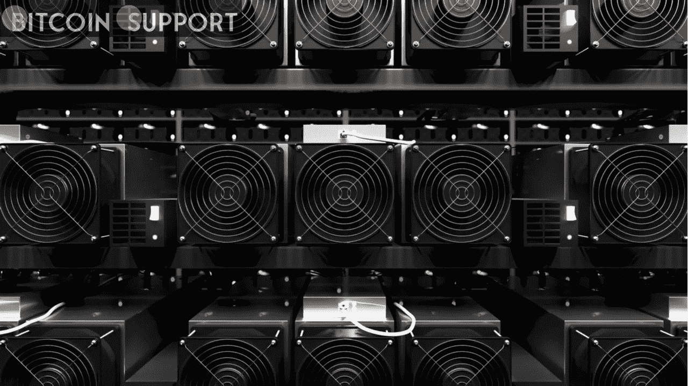
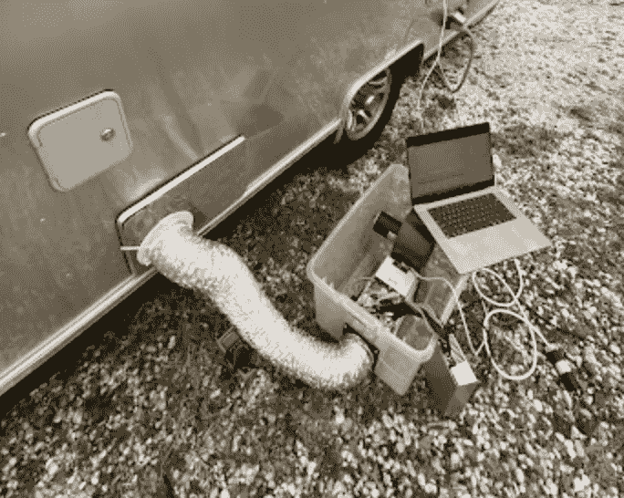
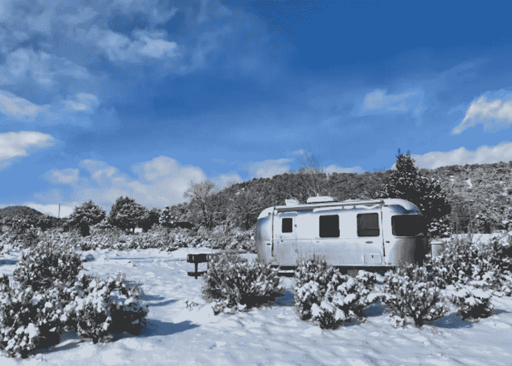
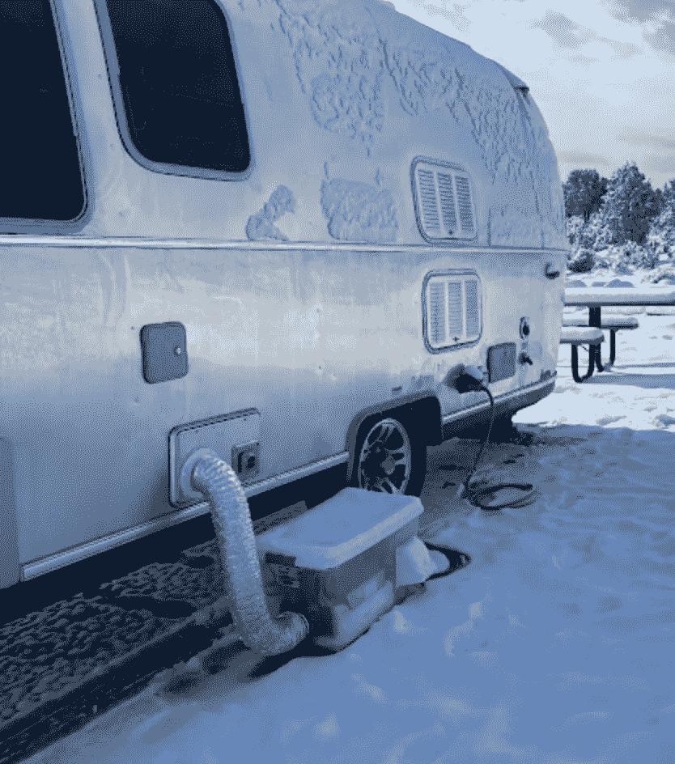

# 你的煤气加热器坏了吗？我会简单地使用比特币矿工加热我的拖车

> 原文：<https://medium.com/coinmonks/has-your-gas-heater-failed-ill-simply-use-a-bitcoin-miner-to-heat-my-trailer-abbd9a9a612d?source=collection_archive---------92----------------------->

**Visit our website:-** [**https://bitcoinsupports.com/**](https://bitcoinsupports.com/)

当一个丙烷气体加热器发生故障时，比特币采矿在科罗拉多州拯救了一个冻结的大篷车。

迈克尔·施密德 2013 年结识比特币(BTC)；他安装了比特币核心，开采了一些 BTC，然后从 MtGox 购买了一些。施密德告诉记者，在臭名昭著的 Mt. Gox 泄露事件发生后，他立即对比特币“失去了兴趣”,在那次事件中，他失去了自己的比特币。2020 年，施密德再次变得“非常投入”，因为对“无休止的印钞”的担忧让他感到不安。

“通过那件事，我发现我完全反对法定货币，觉得比特币应该作为世界储备货币和价值储存手段。”勤奋好学的施密德在七年前挖掘出的知识基础上，重新挖掘了 BTC 矿的兔子洞。在经历了一个灵光乍现的时刻之前，他开始熟悉“ASICs、蚂蚁矿工以及过去几年比特币采矿领域发生的一切”。

**“用比特币挖矿机取代电阻加热器(如空间加热器)更有意义，因为两者都将电能转化为热能，比特币挖矿机也将创造比特币。”施密德当时在办公室工作，他“从一个朋友那里买了一台 S9，用 S9 miner 而不是空间加热器给我的办公室供暖，效果非常好。”施密德偶然发现了一个成功的公式。**

**Visit our website:-** [**https://bitcoinsupports.com/**](https://bitcoinsupports.com/)

“通过这件事，我发现我完全反对法定货币，并认为比特币应该成为世界储备货币和价值储存手段。”勤奋好学的施密德在七年前挖掘出的知识基础上，重新挖掘了 BTC 煤矿的兔子洞。在经历了一个灵光乍现的时刻之前，他开始熟悉“ASICs、蚂蚁矿工以及过去几年比特币采矿领域发生的一切”。

**“用比特币挖矿机取代电阻加热器(如空间加热器)更有意义，因为两者都将电能转化为热能，比特币挖矿机也将创造比特币。”当施密德在办公室工作时，他“从一个朋友那里买了一台 S9，用 S9 miner 而不是空间加热器给我的办公室供暖，效果非常好。”施密德偶然发现了一个成功的公式。**

**Visit our website:-** [**https://bitcoinsupports.com/**](https://bitcoinsupports.com/)

正如他们所说，需要孕育创造力，施密德“开始考虑我如何设计这个系统。”在气流中，空间非常宝贵，如果 S9 安装在内部，“它很容易使气流过热。”“所以我设计了一个计划，把它放在一个盒子里，把温暖的空气引入气流中。”

**Visit our website:-** [**https://bitcoinsupports.com/**](https://bitcoinsupports.com/)

经过几次反复和几次轻微烧伤、短路，有一天当气流的环境温度达到斯堪的纳维亚桑拿浴室的温度时:“一天之内，当加热器运行时，气流的内部温度达到了 90 华氏度，”施密德破解了它。房车由屋顶上的太阳能电池板和免费的营地电力加热，避免了对丙烷气体的需求。施密德继续说，“我们有一个适度的气流(只有 22 英尺)，但更大的房车有更大的丙烷加热器系统，将支付更多的丙烷(尽管他们也可以运行更多的 S9)。”

然而，为什么有人会费心给一辆房车配备比特币矿工呢？为什么不尝试解决丙烷加热器的问题？

可以肯定的是，这是一个有趣的比特币副业项目。这不仅解决了零星的供暖问题，而且根据目前的估计，Schmid“节省了大约 50%的丙烷成本，大约每天 2.7 美元”，并“每天赚 0.00006259 BTC”。施密德和他的未婚夫联合起来，“在技术上免费加热气流”，同时也保护了比特币网络。

**施密德给任何一个想当矿工的人发了以下信息:**

“我强烈鼓励任何人尝试家庭采矿；我觉得比特币最重要的方面之一是货币和采矿基础设施的去中心化。”

他以一句鼓舞人心的话结束了讲话，“可用的家用采矿配置越多越好。”

**访问我们的网站:-**[**https://bitcoinsupports.com/**](https://bitcoinsupports.com/)

**免责声明:以上为作者观点，不应视为投资建议。读者应该自己做研究。**