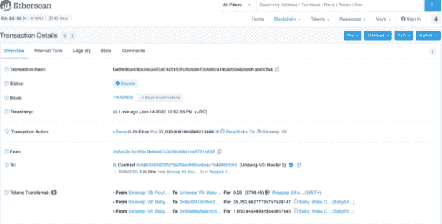
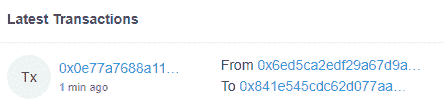
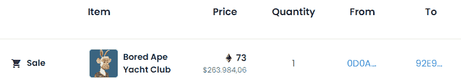
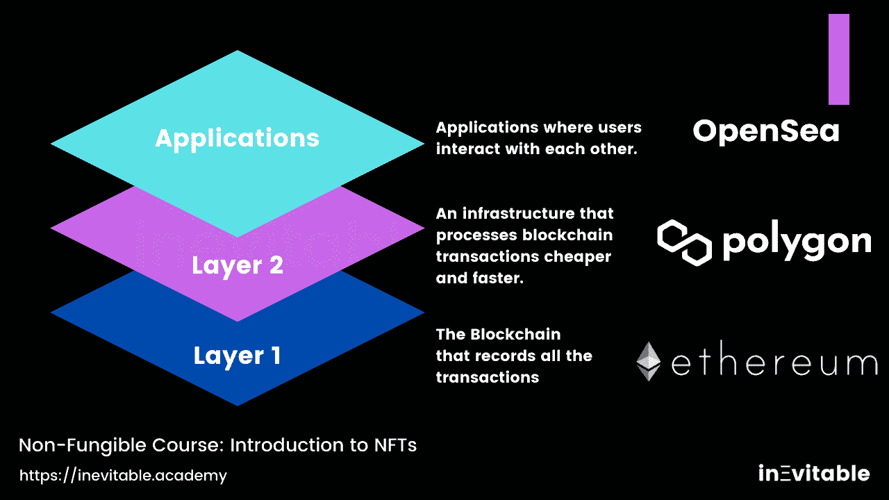
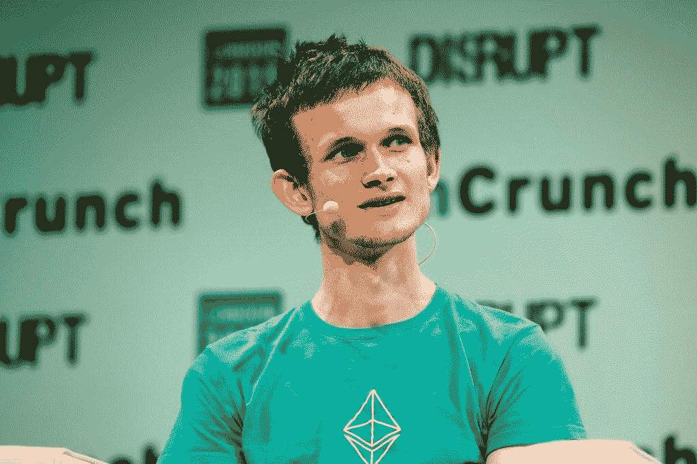
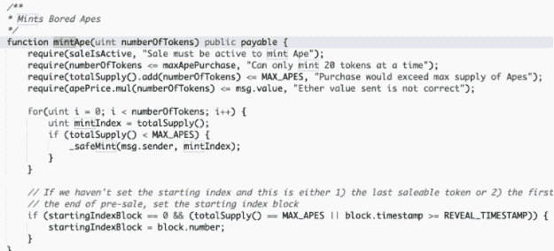

# 混杂

> 原文：<https://medium.com/coinmonks/hash-fef3f15d856a?source=collection_archive---------95----------------------->

散列是对某些消息运行散列函数的结果。这个散列函数的作用是根据您用作输入的消息生成一个字母和数字序列。

这里的关键点是，您在输入消息上更改的任何一个字母都会导致不同的散列。

假设你想知道两个不同版本的《哈利·波特与凤凰社》的内容是否完全相同。你不需要阅读每本书，比较每一个字母和字符，你只需要散列每本书的内容，看看散列值是否相同！

**2。区块链**

需要学习的最重要的概念之一。区块链是整个 NFTs 行业的支柱。

把区块链想象成一个巨大的交易记录。这些事务处理的组被分组到一个块中。

这就是为什么区块链是一项革命性的技术。就事务日志、安全性和许多其他方面而言，它只是一种远远优于所有前辈的技术。这就像把互联网和以前的交流方式相比较。

世界上最重要的区块链的特征:

-它们是分散的

-它们不依赖于集中的实体来工作，如亚马逊服务器或政府。使用区块链的计算背后的基础设施由独立的节点提供。挖掘 ETH 的过程正是如此。如果你把你的机器用于这些计算，你将得到运行它们的部分费用。

-它们是完全公开和可审计的

-你可以在 [https://etherscan.io](https://inevitable.lt.acemlna.com/Prod/link-tracker?redirectUrl=aHR0cHMlM0ElMkYlMkZldGhlcnNjYW4uaW8lM0Z1dG1fc291cmNlJTNEQWN0aXZlQ2FtcGFpZ24lMjZ1dG1fbWVkaXVtJTNEZW1haWwlMjZ1dG1fY29udGVudCUzRDJuZCUyQkxlc3NvbiUyNTNBJTJCMjYlMkJDb25jZXB0cyUyQllvdSUyQk5lZWQlMkJ0byUyQkxlYXJuJTI2dXRtX2NhbXBhaWduJTNERGF5JTJCMQ==&sig=5YrURCzacygAyuLfFEEBAt7MBP3YVJQPtxf9cDJMSqV8&iat=1647781689&a=%7C%7C611818266%7C%7C&account=inevitable%2Eactivehosted%2Ecom&email=uQLwTufj7Ml62fkqpgOfnUzkASpiHornD%2Fz2wZTd1jg%3D&s=eb97f19c1bb48dc2b6f82bf6a2ea5239&i=15A17A2A42) 上看到以太坊历史上的所有交易，例如，下面会有更多相关信息。所有的信息都在这里:交易号、涉及的地址、交易金额、在合同上调用的方法等等。

-他们几乎是廉洁的

-如果一个恶意的自以为是的家伙想改变他刚刚完成的交易怎么办？还记得我们说过区块链是一大串互相连接的石块吗？如果有人想注册欺诈交易，他们最终会得到与网络其余部分不同的块散列，那么欺诈块链将不得不用比网络其余部分更多的计算能力来执行，这是一项几乎不可能完成的任务。

在上面的交易示例中:

-事务哈希:代表该事务的唯一字符串

-事务操作:在该事务中采取的操作，在本例中，发送 0.25 ETH。

- From:发送交易的人的地址。

-收件人:接收事务处理的人员的地址。

*区块链技术不仅仅是一种更有效的证券结算方式——它将从根本上改变市场结构——甚至可能改变互联网本身的架构。*

*—阿比盖尔·约翰逊，富达投资公司首席执行官*

**3。加密货币**

第一个大的分散加密货币是比特币，我认为可以说比特币仍然是最重要的加密货币。自 2009 年(第一枚比特币诞生)以来，数千种加密货币已经被开发出来。

这是一种全新的货币形式、交换媒介和价值储存手段。

人们很容易争辩说，密码世界只是一个投机的环境，或者更糟的是，它们没有真正的用途。

说大多数有这种想法的人来自富裕国家并不疯狂，这些国家货币坚挺，腐败少，经济稳定。

但加密硬币已经成为尼日利亚、委内瑞拉和阿根廷等国家的一场革命，在这些国家，专制或鲁莽的政府没收公民的资产，并使本国货币贬值，降低了人们的购买力。

它们是一种分离任意政策决定对汇率影响的方式，这种决定总是伤害普通民众，而不是决策者。

这是唯一可能的，因为大多数密码运行在区块链上，这提供了一个安全的环境，防止武断的中央决策或审查企图。

津巴布韦的恶性通货膨胀如此严重，以至于政府创造了“十万亿美元”的钞票，但实际上这些钞票最终一文不值。

比特币会成为交换媒介吗？世界上最重要的密码是什么？没人知道。但是这个新世界的大门已经打开了。

加密货币是用数学和代码对政府针对本国民众的不负责任的灾难做出的精彩回应。

密码不可避免。

**4。网络**

正如我们提到的，有数千种不同的加密硬币。它们都可以在不同的网络上运行。比特币运行在自己的网络上，不同于以太坊、索拉纳、Flow 等等。

每个网络都是一个不同的区块链，它们是为不同的目的而创建的。

以太坊网络的目的是支持像 NFTs 这样的技术，这是它们最初实现的地方，也是为什么它们大多数都在以太网上定价的原因。后来，开发了其他网络来支持 NFTs，但更快更便宜，如 Polygon 或 Flow。

关于每个网络的利与弊有很多需要讨论的地方，但是我相信这堂课不是我们深入探讨这个主题的合适空间。这里重要的是要理解不同的网络、区块链和加密旨在不同的目的，尽管许多人经常将“加密货币”视为单一的基底。

**5。地址**

要开始使用这些新技术，您不需要像在传统金融系统中那样收集大量文档。像比特币和以太坊这样的网络关注的是隐私。我们不一定被我们的名字或社会安全号码所知，而是被称为地址的字母数字串所知。

在下面取自以太扫描的例子中，我们看到了以太坊区块链的一条交易记录。地址 0x 6 e D5 ca 2 EDF 29 a 67d 9 a 866954 ad 3d 8 bfc 1d 217 c 36 已发送 0.025 ETH 到地址 0x 841 e 545 CDC 62d 077 AAF 63 CEB 6 BC 02324 a9 DBF 884。任何人都可以在任何时间、任何地点对其进行审计，但是网络不会泄露地址背后的身份。

[(此处为该交易的链接)](https://inevitable.lt.acemlna.com/Prod/link-tracker?redirectUrl=aHR0cHMlM0ElMkYlMkZldGhlcnNjYW4uaW8lMkZ0eCUyRjB4MGU3N2E3Njg4YTExMGNiZTM1YjQ4NmU4M2E3YjJlZTViNmU3OWE2YjU0YTE0ZWRlZWYxMDVjMTIzMjdkYTVjMiUzRnV0bV9zb3VyY2UlM0RBY3RpdmVDYW1wYWlnbiUyNnV0bV9tZWRpdW0lM0RlbWFpbCUyNnV0bV9jb250ZW50JTNEMm5kJTJCTGVzc29uJTI1M0ElMkIyNiUyQkNvbmNlcHRzJTJCWW91JTJCTmVlZCUyQnRvJTJCTGVhcm4lMjZ1dG1fY2FtcGFpZ24lM0REYXklMkIx&sig=F158NE3JvPQwEptMK1DPsnkMaCULQaRFATpBCkt9oxAU&iat=1647781689&a=%7C%7C611818266%7C%7C&account=inevitable%2Eactivehosted%2Ecom&email=uQLwTufj7Ml62fkqpgOfnUzkASpiHornD%2Fz2wZTd1jg%3D&s=eb97f19c1bb48dc2b6f82bf6a2ea5239&i=15A17A2A43)

这是一个以 NFT 为中心的例子，来自于 OpenSea 市场:

用户 0x 0d 0 a 9 fc 9 f 33 a 7995 BC 2 b 810 e 477 ee 72 a 2272 AC 53 以 73 ETH(撰写本文时为 263，984.06 美元)的价格向用户 0x 92 e 3a 341 e 18858 b 8 ce 1e 2 ed 9 BC 96299638 F12 a 81 出售了一只 Bored Ape。这是注册在以太坊区块链，并将永远存在。

今天，有一些倡议使这个生态系统更加方便用户。其中最有趣的是[以太坊域名服务(ENS)](https://inevitable.lt.acemlna.com/Prod/link-tracker?redirectUrl=aHR0cHMlM0ElMkYlMkZlbnMuZG9tYWlucyUyRiUzRnV0bV9zb3VyY2UlM0RBY3RpdmVDYW1wYWlnbiUyNnV0bV9tZWRpdW0lM0RlbWFpbCUyNnV0bV9jb250ZW50JTNEMm5kJTJCTGVzc29uJTI1M0ElMkIyNiUyQkNvbmNlcHRzJTJCWW91JTJCTmVlZCUyQnRvJTJCTGVhcm4lMjZ1dG1fY2FtcGFpZ24lM0REYXklMkIx&sig=76Cna5EK5HrELDzFxB4qiKV6a91iL2tBuRuaXYarH7qz&iat=1647781689&a=%7C%7C611818266%7C%7C&account=inevitable%2Eactivehosted%2Ecom&email=uQLwTufj7Ml62fkqpgOfnUzkASpiHornD%2Fz2wZTd1jg%3D&s=eb97f19c1bb48dc2b6f82bf6a2ea5239&i=15A17A2A44) ，它将一个字母数字地址链接到一个以. eth 结尾的名称。想想互联网域名，比如 mcdonalds.com，但以. eth 结尾。以太网并在以太网内进行交易。

在下面的示例中，用户拥有地址 0x E4 aee 16 a 31 b 6 cef 1048 b7b 5605 c 96 a 376616 B7 a 1，而且还将该地址链接到其。eth 域:calvynjustus.eth。这样，当有人通过以太坊网络向 Calvyn 发送值时，他们不需要键入或复制整个字母数字序列，只需要 calvynjustus.eth 域。

有趣的事实:百威啤酒买下了 beer.eth 域名，甚至把它放到了他们的 Twitter 上。

**6。燃气费**

燃气费是网络用户在进行任何交易时支付的交易费。

这笔费用归区块链矿工所有，这些人提供计算能力，以便网络继续平稳安全地运行。

在 NFT 世界最受欢迎的区块链以太坊，汽油费是一个问题。到 2021 年，它们的平均价值从 5 美元到 70 美元，在许多情况下达到 150 美元到 500 美元。这就是推动前面提到的替代网络发展的可扩展性问题。

此外，高额的燃气费也导致了第二层的快速发展和采用，我们将在下面讨论。

抬价时间

我们在《不可避免》的使命是帮助数百万用户登陆 Web 3 和元宇宙，专注于高水平的内容和技术。如果你喜欢这堂课，记得点击这里邀请你的朋友和同事。

**7。图层**

在区块链生态系统中，我们可以将它们分为两层:

**第一层**

第 1 层是指区块链本身。比如以太坊，比特币，索拉纳，流量都是第一层技术。

**第二层**

第 2 层是指在底层区块链之上运行的网络或技术，目的是提高其可扩展性和效率。它是这样工作的:它将一部分事务负担从一个区块链转移到一个相邻的系统。该系统然后处理部分网络处理。之后，它将结果发送到主区块链。

因此，通过将大部分数据处理从主区块链转移出去，网络变得不那么拥挤，更具可扩展性。

这样，第 1 层变得不那么拥挤，更快，更便宜。

今天，以太坊区块链的两个最著名的第 2 层解决方案是多边形和不可变。

这种类型的技术已经帮助成千上万的人进入这个世界，因为 99%的人不愿意——或者根本不能——仅支付 50 美元的汽油费。例如，在 Polygon 的网络上，汽油费通常是一美分的零头。

**8。智能合同**

这是理解 NFTs 的另一个主干概念。还记得我们说过不同的网络和区块链可以有不同的目的吗？第一个大区块链是比特币，于 2008 年提出，2009 年推出。但比特币是有特定目的的:作为交易媒介和价值储存手段。

然后，在 2014 年，一位名叫 Vitalik Buterin 的俄裔加拿大程序员和其他开发者一起，提出了一个名为以太坊的新区块链。比特币和以太坊的主要区别在于它们的主要用途。比特币就像数字黄金。以太坊就像铁一样，人们可以用它来建造新的东西。

(维塔利克·布特林)。

智能合约是存储在区块链上的程序，运行可审计的逻辑，任何人都可以与之交互，并且不可修改(有点像，我们稍后会谈到)。如果满足某些条件，智能合约将独立于任何外部代理自动执行某些操作。

以太坊是一个开放的智能合约平台，这一事实使得全球成千上万的创新者开始使用这项技术来构建去中心化的应用，而无需建立自己的区块链。

每一个 NFT 系列都是基于一份巧妙的合同。例如，在无聊的猿类中，它们的智能契约生成功能会说(我在这里转述一下):

*   检查销售是否活跃
*   检查请求的 ape 数量是否在允许的范围内
*   检查是否有足够的供应来满足请求的数量
*   检查用户是否发送了足够的 ETH
*   薄荷每售出猿

我们将在下面更多地讨论薄荷/铸币。

智能合约的可能性实际上是无限的，我们刚刚开始设想它们真正能够做什么。预计在接下来的几年里，这一领域将会有很大的发展。

**9。令牌**

代币是代表生活在区块链的不同事物的可交易单位。所有的加密货币最终都是由代币组成的。就比特币和以太坊这两种可替代的代币而言，1 比特币的价值与其他任何比特币一样。1 乙醚和其他任何乙醚一样值钱。

在 NFT 的情况下，它们是不可替换的令牌，因此令牌不一定具有相同的值。例如，某些种类的无聊猿根据其属性比其他种类的价值高得多，尽管它们都来自同一个 NFT 收藏。下面我们会更多的讨论属性和集合！

还记得上节课我们讲过效用和社区吗？我们已经给出了一些集合的例子，这些集合为拥有 NFT 的人创建了封闭的社区和活动。令牌是其中必不可少的部分。如果你不记得了，这里有一张图片可以提醒你:

> 加入 Coinmonks [电报频道](https://t.me/coincodecap)和 [Youtube 频道](https://www.youtube.com/c/coinmonks/videos)了解加密交易和投资

# 另外，阅读

*   [如何在加拿大购买加密货币？](https://coincodecap.com/how-to-buy-cryptocurrency-in-canada)
*   [百无聊赖的猿游艇俱乐部(BAYC)评论](https://coincodecap.com/bored-ape-yacht-club-bayc-review)
*   [5 款最佳加密交易终端](https://coincodecap.com/crypto-trading-terminals) | [最佳 DeFi 应用](https://coincodecap.com/best-defi-apps)
*   [在美国如何使用 BitMEX？](https://coincodecap.com/use-bitmex-in-usa) | [BitMEX 回顾](https://coincodecap.com/bitmex-review)
*   [最佳期货交易信号](https://coincodecap.com/futures-trading-signals) | [流动性交易所评论](https://coincodecap.com/liquid-exchange-review)