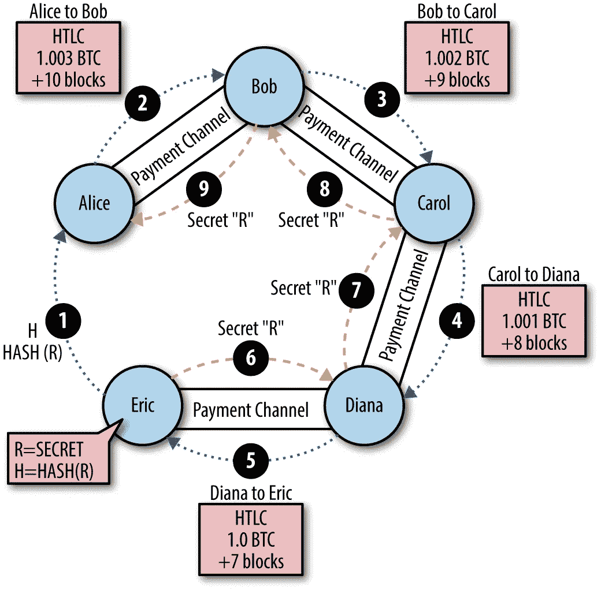

# 散列时间锁合同(HTLCs)

> 原文：<https://medium.com/coinmonks/hashed-timelock-contracts-htlcs-b3f0ba1eee02?source=collection_archive---------10----------------------->

**概述**
比特币网络保留了交易的公共账本。由于块的大小限制，第 1 层区块链本身无法处理大量的事务。闪电网络通过使用“支付通道”解决了这个可扩展性问题。

在双方之间建立支付通道，使得他们可以在通道容量(用于资助通道的 BTC 的值)内进行多次支付，而不会在区块链上被记录。只有融资和结算交易需要在链上记录。

因为支付通道在两方之间，所以对于一个用户来说，打开一个支付通道来与他们想要支付的每个不同的实体进行交易是不经济的。在这种情况下，我们可以利用这种能力，在 lightning 网络上沿着多个渠道可靠地路由支付，因为只需要找出一条连接节点(Lightning 网络中的其他参与者)的路径，就可以将支付路由到您的目的地。这允许断开的节点互相支付。

一个实际的例子是，爱丽丝想为她在埃里克店里买的比萨饼付款。Alice 没有 Eric 的支付通道，但有 Bob 的支付通道。鲍勃又有一个与卡罗尔的频道，卡罗尔又有一个与戴安娜的频道，戴安娜又有一个与埃里克的频道。
然后，Alice 可以通过 Bob、Carol 和 Diana 将付款转给 Eric。

为了可靠地路由支付，闪电网络使用散列时间锁合同(HTLCs)

**什么是 HTLCs？**

散列时间锁协定是一种既被散列锁定又被时间锁定的智能协定。hashlock 限制锁定到 hash 的资金的花费，直到提供密码证明，而 timelock 限制资金的花费，直到将来的某个时间或块高度。

> **“htlc 有两个基本条款:用*哈希锁*保护的支付条款和用*时间锁*保护的退款条款。要打开散列锁并要求付款，接收者需要揭示契约中编码的散列摘要的原像。要打开时间锁并获得退款，消费者需要等到合同中规定的特定时间之后。”**
> 
> — [**比特币 Optech**](https://bitcoinops.org/en/topics/htlc/)

HTLCs 用于不同的支付实施中，如原子掉期——加密货币的跨链交易，以及零知识或有支付，允许通过比特币网络和闪电网络等公平交换出售的商品和支付。
在这篇文章中，我将重点介绍它们在 Lightning 网络中的使用。

**雷电网络中的 htlc**

HTLCs 充当通过闪电网络进行支付的公平协议。在网络上进行支付的过程始于收款人生成发票并发送给汇款人。该发票包含相关信息，如支付散列、支付金额、路由提示等。
支付散列‘h’本质上是一个在发送给发送者之前已经被散列的大随机数。当发送方从他们的一个渠道收到所请求金额的报价时，他们将提供原像作为回报(该原像散列到支付散列),这既允许支付结算，又作为接收方已收到资金的证明，因为他们是唯一知道原像的人。

下面是执行此操作的比特币脚本:

该脚本有两种可能的支出路径。第一条路径是，如果 Bob 能够产生“r ”,则向 Bob 发送资金

```
OP IF
    OP HASH160 <Hash160 (R)> OP EQUALVERIFY 
```

如果该路径不满足，则第二路径在时间锁到期后向 Alice 赎回资金。

```
OP ELSE
    2 <Alice1> <Bob1> OP CHECKMULTISIG
OP ENDIF 1> <Bob1> OP CHECKMULTISIG
OP ENDIF
```

正如前面模拟的那样，HTLCs 可以帮助 Alice 向 Eric 支付 1BTC 购买比萨饼的费用，如下所示:



Payment routing using HTLCS. Image source — [Magomed Aliev](/softblocks/lightning-network-in-depth-part-2-htlc-and-payment-routing-db46aea445a8)

1.  Eric 生成一个秘密(` r `)，对该秘密进行哈希运算，然后将其发送给 Alice。这个秘密只有埃里克知道。
2.  Alice 的节点计算最短的路由路径，计算中间节点的费用(0.003BTC)以及 Eric 的付款(1BTC)，并创建一个 HTLC，如果 Bob 能够在接下来的 10 个街区内提供秘密(也称为 preimage)，则向 Bob 支付 1.03BTC，否则，资金将退还给 Alice。
3.  来自 Alice 的 HTLC 激励 Bob 创建一个 HTLC 来支付 Carol，如果她能够在接下来的 9 个街区内提供秘密(` r `),则 Carol 具有 1.02BTC 的支付渠道，否则，资金将退还给他。
4.  Carol 进而创建一个 HTLC，如果 Diana 能在接下来的 8 个街区内提供秘密(` r ` ),则支付 Diana 1.01BTC，否则，资金将退还给她。
5.  然后，Diana 创建一个 HTLC，如果她能在接下来的 7 个街区内提供秘密(` r `)，则支付给 Eric 1BTC，否则，资金将退还给她(Diana)。
6.  在接收 HTLC 时，作为最终目的地和接收者的 Eric 提供他生成的秘密(` r `)并解锁 HTLC 以获得 1BTC 付款。

因为 Diana 现在有了秘密(` r `)，所以她将这个秘密提供给 Carol 来解锁她的 HTLC 并取回锁定的资金。这个秘密也通过鲍勃反向传播，然后传给爱丽丝。这在上图的步骤 6–9 中进行了说明。
该路由路径中的所有节点都可以要求 HTLCs 中锁定的资金，并完成成功的支付路由。

**局限性**

由于在整个支付路线中，所有 HTLCs 使用相同的支付散列，这在理论上可能会导致一些问题:

1.  发票重用将导致隐私泄露，并且使得先前使用该发票路由支付的节点能够更容易地花费该 HTLC，因为他们已经具有预像/秘密。
2.  易受虫洞攻击:付款拦截和资金/费用索赔。

> 共享信息的两个节点(例如，因为它们属于同一个人)可以通过看到它们已经接收到具有相同散列的 HTLCs 来知道它们是否在一起的路由中。这不仅给了他们我们不希望他们访问的路由信息，而且还允许他们执行“虫洞攻击”,其中包括他们一起窃取他们之间所有中间跳的费用
> 
> - [确定位](https://suredbits.com/payment-points-part-1/#references)

**改进**

时间锁定合同(PTLCs)是作为 HTLCs 的一种解决方案而提出的。
PTLC 是一种比特币交易，将比特币锁定在比特币椭圆曲线上的一个点(读作:非常大的数字)。它不同于 HTLCs 的主要锁定和解锁方法。
PTLC 点锁使用公钥(比特币椭圆曲线上的另一个*点*)锁定，并通过提供来自令人满意的[签名适配器](https://bitcoinops.org/en/topics/adaptor-signatures/)的相应签名来解锁。

**结论**然而，在整个支付路由中使用相同的支付散列对 HTLC 作为公平协议的作用造成了一些威胁，因为知道该支付散列的节点可能能够在将前像反向传播到发送者以确认支付期间拦截并索取资金(并突然结束路由)。

> *加入 Coinmonks* [*电报频道*](https://t.me/coincodecap) *和* [*Youtube 频道*](https://www.youtube.com/c/coinmonks/videos) *了解加密交易和投资*

# 另外，阅读

*   [Bookmap 评论](https://coincodecap.com/bookmap-review-2021-best-trading-software) | [美国 5 大最佳加密交易所](https://coincodecap.com/crypto-exchange-usa)
*   最佳加密[硬件钱包](/coinmonks/hardware-wallets-dfa1211730c6) | [Bitbns 评论](/coinmonks/bitbns-review-38256a07e161)
*   [新加坡十大最佳加密交易所](https://coincodecap.com/crypto-exchange-in-singapore) | [收购 AXS](https://coincodecap.com/buy-axs-token)
*   [红狗赌场评论](https://coincodecap.com/red-dog-casino-review) | [Swyftx 评论](https://coincodecap.com/swyftx-review) | [CoinGate 评论](https://coincodecap.com/coingate-review)
*   [投资印度的最佳加密软件](https://coincodecap.com/best-crypto-to-invest-in-india-in-2021)|[WazirX P2P](https://coincodecap.com/wazirx-p2p)|[Hi Dollar Review](https://coincodecap.com/hi-dollar-review)
*   [加拿大最佳加密交易机器人](https://coincodecap.com/5-best-crypto-trading-bots-in-canada) | [库币评论](https://coincodecap.com/kucoin-review)