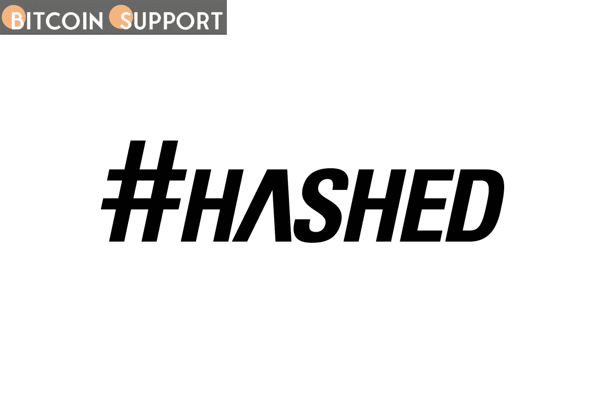

# Hashed Ventures 为 LOVO 的人工智能语音 NFTs 领投了 650 万美元的一轮融资

> 原文：<https://medium.com/coinmonks/hashed-ventures-leads-a-6-5-million-round-for-lovos-ai-powered-voice-nfts-44920dca78a4?source=collection_archive---------50----------------------->

**Visit our website:-** [**https://bitcoinsupports.com/**](https://bitcoinsupports.com/)

这家初创公司打算将其合成语音工具部署在聊天应用程序中，并作为游戏中的资产。一家公司正在从 Web 2 过渡到 Web 3 和元宇宙，从联络中心和企业培训视频过渡到 Web 3 和元宇宙。

人工智能衍生语音不可替代令牌(NFTs)的创始人 LOVO 已经完成了由加密风险投资公司 Hashed 牵头的 200 万美元的延期。这笔投资使这轮首轮融资前的总融资额增加到 650 万美元。

“我们打算用这笔钱扩大语音优先的领域，最终成为 web 3 的声音，”LOVO 首席执行官曹查理表示。加密投资财团 PKO 投资公司也参与了新一轮投资，带来了一批天使投资者，包括 Animoca Brands 创始人 Yat Siu 和 ROBLOX 和漫威影业有限责任公司的前首席财务官 Matt Finick。Hashed 的首席执行官兼管理合伙人 Simon Kim 告诉:“我们相信，LOVO 将通过将语音 NFT 引入社区，与许多区块链游戏和元宇宙项目合作，从而在虚拟世界中实现更高级别的身份个性化。“通过实时翻译、主动参与以及与其他用户和有影响力的人交流带来的专属用户体验，TTS(文本到语音)技术将为元宇宙计划开创一个新时代。”LOVO 在一月份发布了 8888 张 Voiceverse NFT 专辑，并很快销售一空。每一个 NFT 都有一个独特的声音，来自于从配音演员那里租赁的 100 个真实录音的种子，这些演员继续从每卖出一个 NFT 获得版税。NFT 的人工智能语音模型可用于生成任何形式的语音材料，或促进 Discord 等聊天应用程序中的实时对话。

[https://twitter.com/hood_fatNFT/status/1508959811513511938](https://twitter.com/hood_fatNFT/status/1508959811513511938)

LOVO 的首席执行官 Cho 解释说，他认为语音 NFTs 是游戏中的一个对象，类似于玩家目前可以改变他们化身的装束。虽然变声器已经在游戏中使用多年，但 LOVO 提供了一种听起来更自然的独一无二的选择。“我们希望走在最前沿，”赵承熙补充道。“我认为我们在市场准备方面有点早，但我们希望尽可能多地与这些团体合作，因为我们的目标是为正在形成的数十亿虚拟身份发出数十亿声音。”

**访问我们的网站:-**[**https://bitcoinsupports . com/hashed-ventures-leads-a-6-500 万-round-for-lovos-ai-powered-voice-nfts/**](https://bitcoinsupports.com/hashed-ventures-leads-a-6-5-million-round-for-lovos-ai-powered-voice-nfts/)

**免责声明:以上为作者观点，不应视为投资建议。读者应该自己做研究。**

> 加入 Coinmonks [电报频道](https://t.me/coincodecap)和 [Youtube 频道](https://www.youtube.com/c/coinmonks/videos)了解加密交易和投资

# 另外，阅读

*   [8 大加密联盟项目](https://coincodecap.com/crypto-affiliate-programs) | [eToro vs 比特币基地](https://coincodecap.com/etoro-vs-coinbase)
*   [最佳以太坊钱包](https://coincodecap.com/best-ethereum-wallets) | [电报上的加密货币机器人](https://coincodecap.com/telegram-crypto-bots)
*   [交易杠杆代币的最佳交易所](https://coincodecap.com/leveraged-token-exchanges) | [购买 HTZ 代币](https://coincodecap.com/how-to-buy-htz-token)
*   [5 大最佳社交交易平台](https://coincodecap.com/best-social-trading-platforms) | [瓦济克斯 NFT 印度](https://coincodecap.com/wazirx-nft-india)
*   [10 本关于加密的最佳书籍](https://coincodecap.com/best-crypto-books) | [英国 5 个最佳加密机器人](https://coincodecap.com/uk-trading-bots)
*   [ko only 回顾](https://coincodecap.com/koinly-review) | [Binaryx 回顾](https://coincodecap.com/binaryx-review)|[Hodlnaut vs CakeDefi](https://coincodecap.com/hodlnaut-vs-cakedefi-vs-celsius)