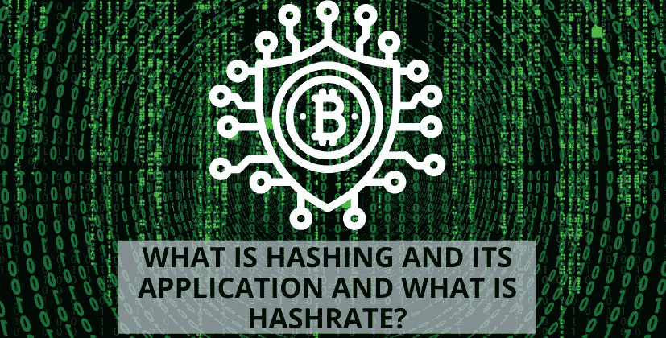

# 散列法及其应用，什么是散列法？

> 原文：<https://medium.com/coinmonks/hashing-and-its-application-and-what-is-hashrate-8652ce4abb9f?source=collection_archive---------42----------------------->

哈希是一种将任何数据转换为唯一字符串的加密技术。无论数据的大小或类型如何，任何数据都可以很容易地被散列。传统哈希是一种不管数据类型或大小都使用相同长度哈希的方法。哈希充当单向函数。您可以将数据输入哈希算法以获得唯一的字符串。然而，如果你发现一个新的散列，你将不能破译它所代表的数据。唯一数据将总是产生相同的散列。

# 它的秘密是什么？

哈希是一种数学运算，很容易做到，但很难逆转。加密和哈希的区别在于，加密可以使用特定的密钥反转或解密。MD5、SHA1 或 SHA256 是最流行的散列函数。有些散列函数比其他函数更难。例如，SHA1 比 bcrypt 简单。

# 哈希是任何人都可以使用的工具

普通用户每天都会遇到与密码相关的哈希问题。如果您创建了电子邮件地址或密码，您的电子邮件提供商可能不会保存您的密码。相反，您的提供商将通过哈希算法运行密码来保存哈希。每次您尝试登录电子邮件时，电子邮件提供商都会将您的密码散列与它存储的散列进行比较。只有当哈希匹配，你才可以访问你的电子邮件。

# 加密货币中的散列

比特币区块链的“挖掘”过程包括运行一系列 SHA256 哈希函数。如今，[加密货币区块链](https://www.thecoinleaks.com/)使用散列法创建新的交易，给它们打上时间戳，然后在前一个块中添加一个引用。一旦将一批交易添加到区块链中，并且运营商之间达成共识(确认他们拥有正确和真实的版本)，撤销交易几乎是不可能的。这是由于所需的巨大计算能力和散列的单向性质。为了保持区块链加密数据的完整性，哈希是必不可少的。

# 哈希和网络安全

如果一家公司发现某个平台上的密码已经被攻破，这通常表明黑客已经获得了哈希。为了破译用户保存的密码，黑客运行普通数字的散列和普通数字的组合。网络安全中使用了一种叫做“加盐”的技术。加盐是将随机数据添加到密码中并对其进行哈希运算的过程。然后，盐值与散列一起存储。这使得黑客很难破解他们使用预计算技术获得的散列数据的密码。

加密哈希在网络安全中的作用由来已久。现在，它已经准备好推动下一波区块链应用。

# 什么是 HashRate？

“Hashrate”是用于处理和挖掘区块链上的交易的组合计算能力，该区块链使用比特币或以太坊(2.0 版本之前)等工作证明。

术语“散列”是具有固定长度的字母数字代码，可用于表示任何长度的消息、单词和其他数据。加密项目采用一系列隔离算法来生成不同种类的哈希代码。可以把它们想象成随机单词生成器，每个算法都有一个单独的系统来生成随机单词。

在任何新的交易数据被包括在链的后续块中之前，矿工必须能够与他们的机器竞争，以便确定特定的数量。特别地，挖掘器试图通过改变一个被称为“随机数”的值来生成小于或等于“目标”散列中的数值的散列。每次 nonce 值发生变化时，都会生成一个新的哈希。这类似于彩票系统，其中每个哈希都是一个独特的彩票，具有唯一的号码。

添加到区块链的块“确认”其中包含的交易的有效性。每当一个新的块被添加到以前的块中时，以前的事务就会被一遍又一遍地确认，这使得修改变得更加困难。

在大多数工作证明(PoW)区块链中，区块奖励——即每次开采一个区块时给予矿工的固定数量的免费硬币——会自动减少一半，以便在硬币的开采寿命期间逐渐减少可用数量。对于比特币来说，21 万次交易后，交易奖励会减半，大约每年 4 次。2021 年，矿工们每创造一个区块，就会获得 6.25 个比特币。下一个比特币半周期预计将在 2024 年出现，届时 BTC 区块奖励将从每块 3.125 比特币降至每块 3.125 比特币。Dash 是一种不同的加密货币，可以开采，每完成 210，240 个区块，其区块奖励就会减少 7.14%，莱特币每次完成 840，000 个区块，其奖励就会减少。

> 加入 Coinmonks [电报频道](https://t.me/coincodecap)和 [Youtube 频道](https://www.youtube.com/c/coinmonks/videos)了解加密交易和投资

# 另外，阅读

*   [CoinLoan 评论](https://coincodecap.com/coinloan-review) | [YouHodler 评论](/coinmonks/youhodler-4-easy-ways-to-make-money-98969b9689f2) | [BlockFi 评论](https://coincodecap.com/blockfi-review)
*   XT.COM 评论 | [币安评论](https://coincodecap.com/xt-com-review)
*   [SmithBot 评论](https://coincodecap.com/smithbot-review) | [4 款最佳免费开源交易机器人](https://coincodecap.com/free-open-source-trading-bots)
*   [比特币基地僵尸程序](/coinmonks/coinbase-bots-ac6359e897f3) | [AscendEX 审查](/coinmonks/ascendex-review-53e829cf75fa) | [OKEx 交易僵尸程序](/coinmonks/okex-trading-bots-234920f61e60)
*   [如何在印度购买比特币？](/coinmonks/buy-bitcoin-in-india-feb50ddfef94) | [瓦济克斯审查](/coinmonks/wazirx-review-5c811b074f5b)