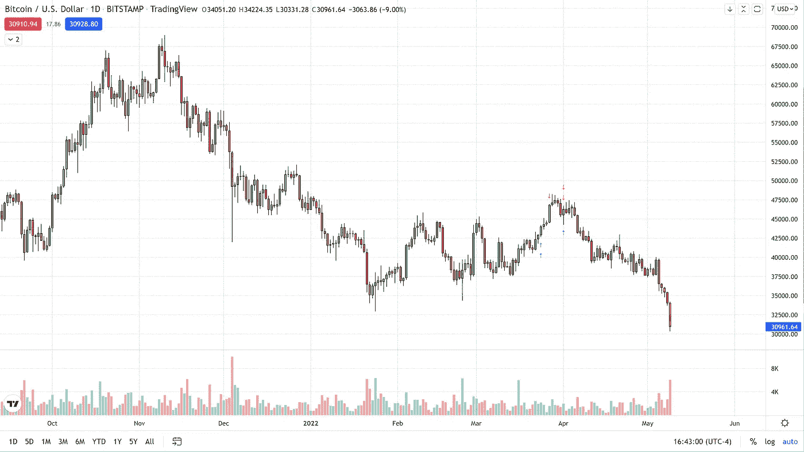

# 我讨厌说，我告诉过你

> 原文：<https://medium.com/coinmonks/hate-to-say-i-told-you-so-ea690bc225ae?source=collection_archive---------81----------------------->

今天，比特币跌至 2022 年的最低水平，在 Bitstamp 上跌至 30，330 美元的低点。不仅仅是加密领域今天崩溃了，几乎每个市场，除了美元，今天都深陷红色，因为投资者似乎终于认真对待 40 年来的通货膨胀水平。

我们看到纳斯达克综合指数收盘下跌 4.29%，抛售不仅限于与比特币密切相关的股票。原油甚至黄金都出现了强劲的下行走势，CL(轻质原油)下跌了 6.43%，甚至避险黄金今天也下跌了 1.66%。

科技行业受美联储货币紧缩的打击最大，我们肯定可以将比特币从更广泛的意义上引入科技行业。幸运的是，我们看到了这一点，并建议在 5 月 5 日周四从 36000 美元开始做空比特币，那么我们的目标是什么呢？事实是，我们还没有为这笔交易设定价格目标，因为我们怀疑，即使在今天之后，抛售压力也远未结束。

作为一个比特币牛市，它仍然刺痛，今天是那些“我告诉过你”不会让它变得更容易的时候之一。

对于任何有兴趣查看更多关于比特币的文章的人，只需点击这个[链接](https://www.thegoldforecast.com/bitcoin)。

> 加入 Coinmonks [电报频道](https://t.me/coincodecap)和 [Youtube 频道](https://www.youtube.com/c/coinmonks/videos)了解加密交易和投资

# 另外，阅读

*   [5 款最佳加密交易终端](https://coincodecap.com/crypto-trading-terminals) | [最佳 DeFi 应用](https://coincodecap.com/best-defi-apps)
*   [最佳网上赌场](https://coincodecap.com/best-online-casinos) | [币安评论](/coinmonks/binance-review-ee10d3bf3b6e) | [BitMEX 评论](https://coincodecap.com/bitmex-review)
*   [麻雀交换评论](https://coincodecap.com/sparrow-exchange-review) | [纳什交换评论](https://coincodecap.com/nash-exchange-review)
*   [美国最佳加密交易机器人](https://coincodecap.com/crypto-trading-bots-in-the-us) | [经常性评论](https://coincodecap.com/changelly-review)
*   [在印度利用加密套利赚取被动收入](https://coincodecap.com/crypto-arbitrage-in-india)