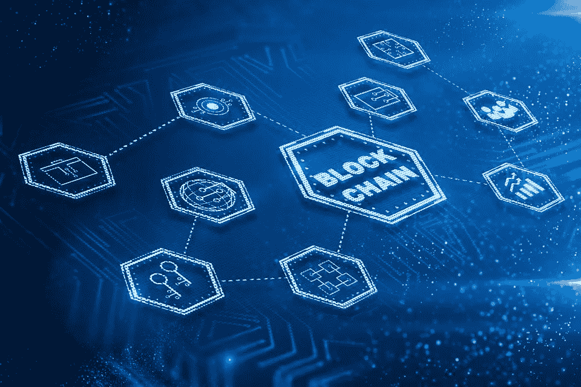

# 对区块链基础有清晰的了解

> 原文：<https://medium.com/coinmonks/have-a-crystal-clear-understanding-about-blockchain-basics-7e2c1262acee?source=collection_archive---------36----------------------->

Q1-区块链是由什么组成的？

A1-块由关于块的信息头和一组有效事务组成。

UTXO 代表什么？

A2-未用交易输出。

Q3-矿工是执行的计算机？

A3-矿工是由区块链协议定义的功能强大的计算机执行软件。

Q4-交易生成新的 UTXOs，用于转移输入 UTXOs 中指定的金额。真的还是假的？

A4-正确。事务使用由一个或多个输入 UTXOs 指定的数量，并将其传送到一个或多个新创建的输出 UTXOs。

Q5-比特币区块链中的共识算法被称为 _____ 协议。？

A5-功的证明(POW)
它之所以得名，是因为它涉及“功”或计算能力来解决难题，并要求形成下一个区块的权利。

Q6-交易确认由所有 miner 节点独立执行。真的还是假的？

A6- True
矿工，承担额外的工作或计算以验证交易、广播交易、竞争声明创建区块的权利、通过验证区块、广播新创建的区块和确认交易来达成共识。

Q7-比特币区块链中每个区块的交易 0 _ _ _

A7- a)用于支付矿工费用
b)被称为 coinbase 事务
c)没有任何输入 UTXO。
一切都正确

Q8 —什么允许在以太坊区块链中执行代码，同时增强比特币区块链的基本价值转移能力？

A8-智能合同

Q9- Solidity 有带修饰符的数据、函数或方法，以及 getter 和 setter 函数。真的还是假的？

A9-正确

问题 10-以太坊上有多少类型的账户？

A10-两种类型的帐户。外部拥有的账户(EOA)和合同账户。

q11-_ _ _ _ 可以发送以太网转账交易，也可以发送交易以调用智能合同代码。

A11-账户(地址)

Q12-以太坊上的加密货币最小面额是多少？

A12-魏

Q13- ____ 托管交易启动、验证、挖掘、区块创建和智能合同执行所需的软件。

A13-以太坊全节点

Q14- _____ 接收、核实、收集和执行交易。

A14- Miner 节点

Q15- GASLIMIT 是完成区块创建时消耗的实际气体量。真的还是假的？

A15-错误

Q16-解决了谜题但没有赢得方块创造的矿工叫什么？

A16- Ommers

Q17- _________ 为创建区块支付费用。

A17-一个街区的矿工

Q18-一种被称为 Rivest-Shamir-Adelman (RSA)算法的流行公钥-私钥实现用于比特币和以太坊区块链。真的还是假的？

假(使用 ECC 算法)

Q19-对于简单的对称密钥，很容易从加密数据中导出“秘密”密钥。真的还是假的？

真实的

请注意，对称密钥还有其他问题，如(I)密钥分发——如何将密钥发送给相关方,( ii)您需要为不同的接收者创建不同的秘密密钥，您不能与不同的参与者共享同一个密钥。

相反，在公钥加密中，您可以发布公钥供任何参与者使用，而不会泄露私钥

Q20- 256 位 ECC 密钥对在强度上相当于大约 3072 位 RSA 密钥对。因此，ECC 是比 RSA 方法更强的加密方法。真的还是假的？

真实的

问题 21-交易/文件的数字签名涉及对文件内容进行哈希处理，然后 ___

用私钥加密

Q22-在以太坊中，块哈希是 _________ 中所有元素的哈希。

块标题

Q23-Merkle 树哈希用于计算 _________ 哈希。

a)状态根

b)交易根

c)收据根

所有都是正确的

Q24-块哈希允许通过在当前块头中嵌入先前的块哈希来形成链式链接。真的还是假的？

真实的

Q25-如果一个参与节点篡改一个块，它会导致 ____。

a)哈希值不匹配

b)以无效状态呈现的节点的本地链

c)散列改变

所有都是正确的

Q26-矿工执行以太网传输交易，但不负责智能合同的执行。真的还是假的？

错误的

问题 27-在分权的区块链，信任度大约是 ____。

a)使用特定协议保护链。

b)验证防篡改的交易和块。

c)执行和确认交易。

所有都是正确的

Q28-工作证明是比特币区块链和以太坊拜占庭大都会区块链使用的 __________。

共识协议

问题 29——在区块链开发人员中引起激烈争论的一种共识协议方法是

利害关系证明

> 加入 Coinmonks [电报频道](https://t.me/coincodecap)和 [Youtube 频道](https://www.youtube.com/c/coinmonks/videos)了解加密交易和投资

# 另外，阅读

*   [我的密码交易经历](/coinmonks/my-experience-with-crypto-copy-trading-d6feb2ce3ac5) | [AAX 交易所评论](/coinmonks/aax-exchange-review-2021-67c5ea09330c)
*   [Bybit 融资融券交易](/coinmonks/bybit-margin-trading-e5071676244e) | [币安融资融券交易](/coinmonks/binance-margin-trading-c9eb5e9d2116) | [Overbit 审核](/coinmonks/overbit-review-9446ed4f2188)
*   [有哪些交易信号？](https://coincodecap.com/trading-signal) | [比特斯坦普 vs 比特币基地](https://coincodecap.com/bitstamp-coinbase)
*   [10 本关于加密的最佳书籍](https://coincodecap.com/best-crypto-books) | [英国 5 个最佳加密机器人](https://coincodecap.com/uk-trading-bots)
*   [Koinly 点评](https://coincodecap.com/koinly-review) | [Binaryx 点评](https://coincodecap.com/binaryx-review) | [Hodlnaut vs CakeDefi](https://coincodecap.com/hodlnaut-vs-cakedefi-vs-celsius)
*   [40 个最佳电报频道](https://coincodecap.com/best-telegram-channels) | [1xBit 回顾](https://coincodecap.com/1xbit-review) | [Keevo 钱包回顾](https://coincodecap.com/keevo-wallet-review)
*   [如何在印度购买以太坊？](https://coincodecap.com/buy-ethereum-in-india) | [如何在币安购买比特币](https://coincodecap.com/buy-bitcoin-binance)