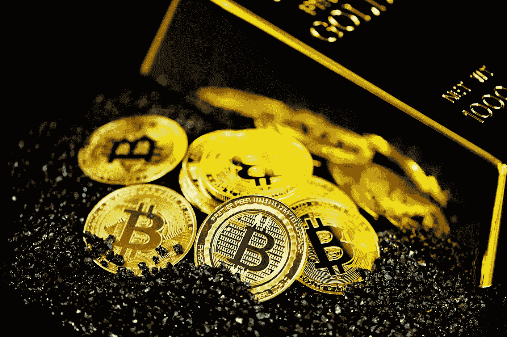

# 比特币有取代黄金的潜力吗？

> 原文：<https://medium.com/coinmonks/have-bitcoin-potential-to-replace-gold-cf55d896db9c?source=collection_archive---------33----------------------->

Source photo Unsplash.com

由于黄金是市值 11 万亿美元的最珍贵资产，因此值得注意的是，比特币确实被比作黄金，支持者称这种加密技术可能会取代黄金成为推定的价值储存手段。

尽管这两种资产都在通胀环境中发挥作用，但黄金一直保持坚挺。