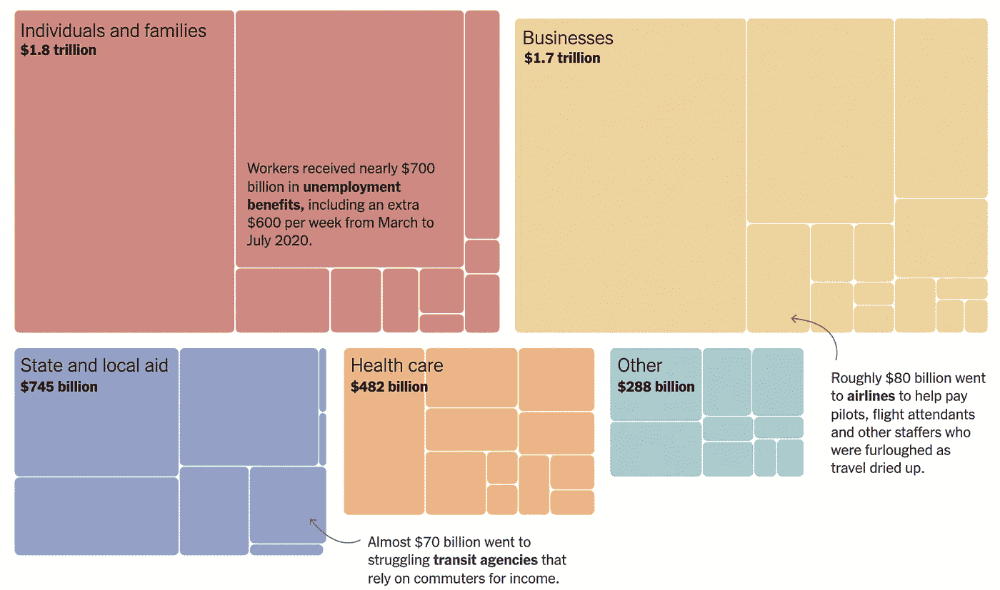
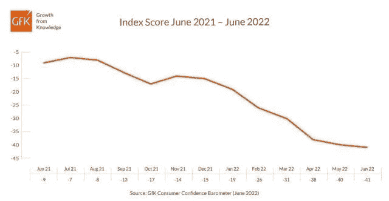

# 我们已经到达熊市的底部了吗？

> 原文：<https://medium.com/coinmonks/have-we-reached-the-bottom-of-this-bear-market-935c11eddca0?source=collection_archive---------28----------------------->

# 内容(3 分钟阅读):

*   🙃我们已经到达熊市的底部了吗？
*   🏖️个人退休帐户，避税帐户
*   👀雷达下
*   📰基督教青年会
*   🙏🏻感激…
*   💸优惠券

# 🙃我们已经到达熊市的底部了吗？

6 月 15 日，美联储今年第三次加息，使利率达到 1.5%。

**央行官员预计，到今年年底，联邦基金利率可能会在 3%至 3.5%之间。**

FOMC 今年还有 4 次会议，我们可以预计在下一次会议(7 月 26 日至 27 日)上至少有 50 个基点的增长。

除了影响经济的利率变化之外，联邦政府还能够:

*   提振货币，这将暂时提升企业利润和股价，但最终会降低价值并推高利率。
*   当企业或整个经济领域出现问题，或威胁到整个经济体系时，通过提供救助进行干预。
*   政府可以创造补贴，向公众征税，把钱给一个行业，或者关税，对外国产品征税，以提高价格，使国内产品更有吸引力。
*   更高的税收、费用和更多的监管会阻碍企业或整个行业的发展。
*   增加或减少货币供应量。

这一次，联邦政府的加息政策变成了试图控制通货膨胀和过度刺激的经济。这部分是由国会从 2020 年开始批准的刺激法案造成的，该法案向美国经济注入了有史以来最大规模的联邦资金。

大约[5 万亿美元流向了家庭](http://nytimes.com)、夫妻店、餐馆、航空公司、医院、地方政府、学校和全国各地其他应对新冠肺炎袭击的机构。

# 那现在怎么办？

消费者情绪非常低落，尽管工资和劳动力增长似乎很强劲，至少在纸面上是如此。

股票市场已经从之前的高点下跌了 20%以上，加密市场已经被彻底摧毁。

从长远来看，这在一定程度上是积极的。外面的情况很残酷，但量化紧缩政策可能有助于区分那些为经济提供真正价值的公司和区块链项目，以及那些为利润而来的公司和项目。

> **(****QT****)量化紧缩是各国央行为减少经济中的流动性或* [*货币供应量*](https://en.wikipedia.org/wiki/Money_supply) *而应用的一种紧缩性货币政策工具。央行通过向金融市场出售资产来减少其资产负债表上的金融资产，从而实施量化紧缩，这降低了资产价格，提高了利率。**

*目前有超过 2 万种加密货币在流通，我相信其中只有不到 20 种会在一年内蓬勃发展。*

*我们陷入这种困境的原因之一是，由于技术进步，创建一个商业或密码项目的成本已经大幅下降，这使得推出一个不一定会给经济或其用户带来价值的“花哨”产品变得容易得多。*

***比如:***

*   *在不到 20 年的时间里，DNA 测序的价格从 27 亿美元降到了 300 美元*
*   *1982 年，一个 10MB 的旋转硬盘售价为 2495 美元，经通胀调整后为 7210.55 美元。如今，4TB 旋转硬盘的价格为 70 美元。这是存储容量的 40，000 倍，而价格仅为百分之一。存储变得越来越快，越来越便宜！*
*   *IBM 最初的 PC 5150 带一个软驱的 64K 系统售价 2880 美元，相当于今天的 8352 美元。如今，400 至 500 美元已经是一台像样的入门级台式机的价格。*
*   *1993 年发布的第一款手机美国电话电报公司 EO 售价高达 1999 美元——加上通货膨胀后为 3858 美元。今天，我们可以用大约~$1k 的价格拥有最强大的 iPhone。不用说，iPhone 不仅仅是一个打电话的设备。*

*这个名单还可以继续下去，关键是几乎任何人都可以创建一家公司，吸引投资者和客户，而不提供真正的价值。但毫无疑问，创造价值变得更加困难了。*

*此外，更容易以更低的成本获得技术也可能意味着，如果经济政策没有得到认真实施，并考虑到当今技术领域的所有错综复杂的情况，我们可能会很快从通胀型经济转向通缩型经济。*

> ****总之，*** *没有人确切知道这次熊市是否已经触底，我们可以肯定的是，每一次牛市和熊市都是不同的，而且由于技术塑造了我们的日常生活和全球经济的方式，每个周期的差异似乎都更大。对于投资者来说，重要的是研究和寻找那些正在推出有价值的产品和服务的公司，这些公司拥有具有竞争力和道德的团队。对我们总体而言，我认为我们必须采取自己的经济紧缩措施，因为即使经济已经触底，我们可能也不会重拾信心，不会长期看涨。**

## *[连同 iCapital](https://itrustcapital.com/referral100?utm_source=partner&utm_medium=youtube&utm_campaign=partner637&oid=10&affid=637)*

**

*加密货币是这些天每个人都在谈论的东西之一。有各种不同的交易所进行加密交易……但是许多人没有意识到他们在税费上损失了多少。*

*iTrustCapital 允许其客户通过个人退休账户或个人退休帐户投资 crypto，而不必担心税收或费用。*

*IRA 是避税账户，这意味着你所有的加密交易都是免税的，并且可以随着时间的推移免税增长。*

*没有隐藏的费用。[要了解更多信息，请点击此处并开通免费账户。](https://itrustcapital.com/referral100?utm_source=partner&utm_medium=youtube&utm_campaign=partner637&oid=10&affid=637)*

*[分享 Yaro 的技术& WebX 简讯](https://yarocelis.substack.com/?utm_source=substack&utm_medium=email&utm_content=share&action=share)*

# *👀雷达下*

*   *[UNI WAP(UNI)](http://uniswap.org)—UNI WAP 是一种流行的分散式交易协议，因其在促进分散式金融( [DeFi](https://coinmarketcap.com/alexandria/article/what-is-decentralized-finance) )代币的自动化交易中的作用而闻名。Uniswap 是市值最大的 AMM，达 2250497805 美元，也是交易量最大的一家。如果以太坊成功过渡到 PoS，并且费用更实惠，我们可能会见证更多的大规模 DeFi 采用和更高的 AMMs 价值。*
*   *Fantom(FTM)——**Fantom 是第一层区块链**，旨在为以太坊用户经常抱怨的高成本和低速度提供一种替代方案。Fantom 运行在有向无环图区块链上，类似于 Hedera Hashgraph。*
*   *[Oasis](http://oasislabs.com) [(ROSE)](http://oasislabs.om) —一个支持隐私的 L1 区块链网络，专注于安全地提供高吞吐量和低交易费用。**其 TVL 攀升至 1.9492 亿美元的新高**，这在很大程度上要归功于 ValleySwap 自动做市商协议的兴起，其 TVL 在 3 月份攀升至 1.255 亿美元。*
*   *[基本令牌(BAT)](https://basicattentiontoken.org/)——Brave，建立在基本注意力令牌(BAT)基础上的以隐私为中心的网络浏览器，在 2020 年将其用户群规模扩大了一倍多。该浏览器的月活跃用户从 1160 万增加到 2021 年的**2540 万**，截至今天(2022 年 6 月)，其月用户数为 5930 万，日用户数为 1860 万。距离浏览器之王 Chrome 仍然很远，Chrome 估计有 34 亿用户，但 brave 是增长最快的浏览器。*

# *📰基督教青年会*

*   *[Bitfarms 出售 3K 比特币，作为改善流动性和偿还债务策略的一部分](https://cointelegraph.com/news/bitfarms-sold-3k-bitcoin-as-part-of-strategy-to-improve-liquidity-and-pay-debts)*
*   *[比特币的‘黑色星期一’和最终下跌的一切](https://ambcrypto.com/bitcoins-black-monday-and-everything-about-the-final-decline/)*
*   *[112 个国家的 Axie Infinity 顶级 NFT 社区](https://cryptoslate.com/axie-infinity-top-nft-community-in-112-countries/)*
*   *稳定之战:USDC 在以太坊的交易量超过 USDT*
*   *[Cardano Vasil 硬叉上市日期定，购买时间消息？](https://www.newsbtc.com/news/cardano/cardano-vasil-hard-fork-launch-date-set-time-to-buy-the-news/)*
*   *在三天的深度投降中，比特币投资者锁定了超过 73.25 亿美元的损失*
*   *[维塔利克·布特林:比特币 S2F 价格预测模型‘值得嘲笑’](https://beincrypto.com/vitalik-buterin-bitcoin-s2f-price-prediction-model-deserves-mockery/)*
*   *[在疯狂的熊市中，体育赞助陷入停滞](https://bitcoinist.com/crypto-sports-sponsorships-stall/)*
*   *[化合物，Aave，Synthetix 铅乙醚络合物](https://cryptobriefing.com/compound-aave-synthetix-lead-ethereum-defi-revival/?utm_source=feed&utm_medium=rss)*
*   *[根据该指标](https://u.today/bitcoin-might-be-on-reversal-edge-according-to-this-indicator)，比特币可能处于反转边缘*
*   *[自 6 月低点以来，基本注意力标志(BAT)增加了 50%:多硬币分析](https://beincrypto.com/basic-attention-token-bat-increases-by-50-since-june-lows/)*

> *加入 Coinmonks [电报频道](https://t.me/coincodecap)和 [Youtube 频道](https://www.youtube.com/c/coinmonks/videos)了解加密交易和投资*

# *另外，阅读*

*   *[CoinFLEX 评论](https://coincodecap.com/coinflex-review) | [AEX 交易所评论](https://coincodecap.com/aex-exchange-review) | [UPbit 评论](https://coincodecap.com/upbit-review)*
*   *[AscendEx 保证金交易](https://coincodecap.com/ascendex-margin-trading) | [Bitfinex 赌注](https://coincodecap.com/bitfinex-staking) | [bitFlyer 点评](https://coincodecap.com/bitflyer-review)*
*   *[Bitget 回顾](https://coincodecap.com/bitget-review)|[Gemini vs block fi](https://coincodecap.com/gemini-vs-blockfi)cmd |[OKEx 期货交易](https://coincodecap.com/okex-futures-trading)*
*   *[AscendEx Staking](https://coincodecap.com/ascendex-staking)|[Bot Ocean Review](https://coincodecap.com/bot-ocean-review)|[最佳比特币钱包](https://coincodecap.com/bitcoin-wallets-india)*
*   *[霍比审核](https://coincodecap.com/huobi-review) | [OKEx 保证金交易](https://coincodecap.com/okex-margin-trading) | [期货交易](https://coincodecap.com/futures-trading)*
*   *[网格交易机器人](https://coincodecap.com/grid-trading) | [Cryptohopper 审查](/coinmonks/cryptohopper-review-a388ff5bae88) | [Bexplus 审查](https://coincodecap.com/bexplus-review)*