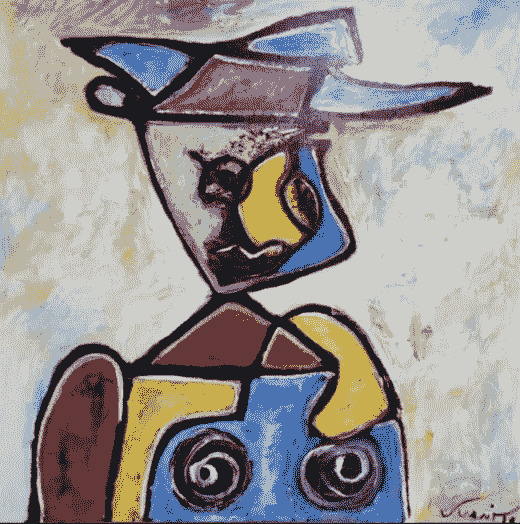
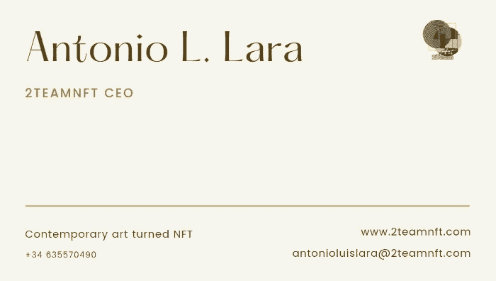

# 你是不是在 Crypto 赚了点钱，不知道怎么再投资？这里有一个解决方案

> 原文：<https://medium.com/coinmonks/have-you-earned-some-money-in-crypto-and-dont-know-how-to-reinvest-it-here-is-a-solution-752a27097969?source=collection_archive---------61----------------------->

众所周知，加密市场波动很大，你可以在很短的时间内赚一大笔钱，但你也可以损失很多钱。因此，明智的做法是只投资那些你确定短期内不需要的钱。

另一个要遵循的建议是资产多样化和时间多样化，这样，通过不把所有的鸡蛋放在同一个篮子里，在不同的时间，最大限度地捕捉价值的可能性会降低很多。如果投资是定期进行的，而不是一次性的，那么吸收衰退和上升的能力会好得多，稳定性是投资者的好朋友。

至于资产多元化，建议投资非相关资产，即不同时涨跌的资产，否则就像投资单一产品，你也会是同样的情况。因此，我邀请您考虑这样一项购买:以同样的价格，为您提供一项价格非常稳定、年回报率约为 0.5%至 1%的有形资产，同时以同样的价格为您提供一项加密资产。

我说的是购买一个著名艺术家的艺术作品的可能性，无论是一幅画，一个雕塑，还是另一种形式，此外，以同样的价格收到一幅相同作品的 NFT。所有这些都有多重优势，我列举如下:

-用同样的钱让你的投资翻倍:实物资产投资价值的 100%和艺术 NFT 投资价值的 100%。如果你没有钱包来存放 NFT，我们会为你提供保管服务，直到你决定卖掉它或者把它存放在你的加密钱包里。
-将您的投资 100%稳定在一件您可以在家欣赏的艺术品上，并获得一件 NFT，通过它您有很高的可能性获得高回报。
-分散你的投资组合，在秘密世界中分散投资，比如艺术品。

所以货比三家。你不会找到像这样的投资，由胡安·科尔特斯·阿玛雅、[克拉拉·德·博贝斯](https://nextagegallery.com/clara-de-bobes_en/)、[萨沙·阿森西奥](https://nextagegallery.com/sasha-asensio/)以及其他国际知名艺术家支持。

Men with a hat (Juanito Cortés Amaya)

前往[次时代画廊](https://nextagegallery.com/next-age-gallery/)选择自己喜欢的作品。你对未来的投资是有保证的。

> 加入 Coinmonks [电报频道](https://t.me/coincodecap)和 [Youtube 频道](https://www.youtube.com/c/coinmonks/videos)了解加密交易和投资

# 另外，阅读

*   [比特币基地跑马圈地](https://coincodecap.com/coinbase-staking) | [Hotbit 点评](/coinmonks/hotbit-review-cd5bec41dafb) | [KuCoin 点评](https://coincodecap.com/kucoin-review)
*   [购买 Dogecoin 的 7 种最佳方式](https://coincodecap.com/ways-to-buy-dogecoin) | [ZebPay 评论](https://coincodecap.com/zebpay-review)
*   [iTop VPN 审查](https://coincodecap.com/itop-vpn-review) | [曼陀罗交易所审查](https://coincodecap.com/mandala-exchange-review)
*   [比特币基地 vs 瓦济克斯](https://coincodecap.com/coinbase-vs-wazirx) | [比特鲁点评](https://coincodecap.com/bitrue-review) | [波洛涅克斯 vs 比特鲁](https://coincodecap.com/poloniex-vs-bittrex)
*   [美国最佳加密交易机器人](https://coincodecap.com/crypto-trading-bots-in-the-us) | [经常性回顾](https://coincodecap.com/changelly-review)