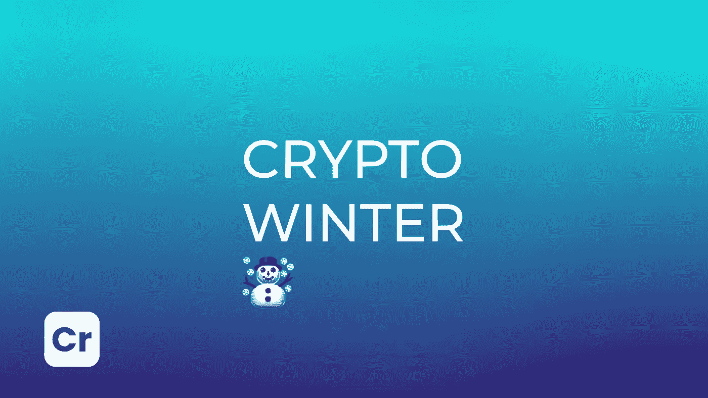

# 你听说了隐冬的开始吗？

> 原文：<https://medium.com/coinmonks/have-you-heard-about-the-onset-of-crypto-winter-e155f3417d29?source=collection_archive---------50----------------------->

随着全球加密市场在过去三个月里缩水 1.2 万亿美元，加密冬天这个术语又开始流行了。crypto winter 通常与 2017 年底至 2018 年底的比特币市场低迷有关，是指资产价格持续下跌数月的长期熊市。

Glassnode 分析师声称，链上指标指向 BTC 的悲观前景——过去一个月有 219，000 个地址“归零”，这可能表明用户开始从网络流出。在 11 月初创下历史新高后，加密货币的价格开始大幅下跌，这导致交易员亏损，清算了他们的头寸。

此外，以太坊的创始人维塔利克·布特林(Vitalik Buterin)在接受彭博采访时谈到了加密冬天的开始以及当前价格下跌的优势，这降低了投资者的需求。开发者确信这一时期有助于创造出具有改进技术的严肃的加密货币项目，并从市场上清除不可靠和脆弱的项目。

> 加入 Coinmonks [电报频道](https://t.me/coincodecap)和 [Youtube 频道](https://www.youtube.com/c/coinmonks/videos)了解加密交易和投资

# 另外，阅读

*   [如何在 Uniswap 上交换加密？](https://coincodecap.com/swap-crypto-on-uniswap) | [A-Ads 审核](https://coincodecap.com/a-ads-review)
*   [WazirX vs coin dcx vs bit bns](/coinmonks/wazirx-vs-coindcx-vs-bitbns-149f4f19a2f1)|[block fi vs coin loan vs Nexo](/coinmonks/blockfi-vs-coinloan-vs-nexo-cb624635230d)
*   [本地比特币审核](/coinmonks/localbitcoins-review-6cc001c6ed56) | [加密货币储蓄账户](https://coincodecap.com/cryptocurrency-savings-accounts)
*   [什么是保证金交易](https://coincodecap.com/margin-trading) | [美元成本平均法](https://coincodecap.com/dca)
*   [支持卡审核](https://coincodecap.com/uphold-card-review) | [信任钱包 vs MetaMask](https://coincodecap.com/trust-wallet-vs-metamask)
*   [Exness 回顾](https://coincodecap.com/exness-review)|[moon xbt Vs bit get Vs Bingbon](https://coincodecap.com/bingbon-vs-bitget-vs-moonxbt)
*   [如何开始用加密贷款赚取被动收入](https://coincodecap.com/passive-income-crypto-lending)
*   [BigONE 交易所评论](/coinmonks/bigone-exchange-review-64705d85a1d4) | [电网交易机器人](https://coincodecap.com/grid-trading)