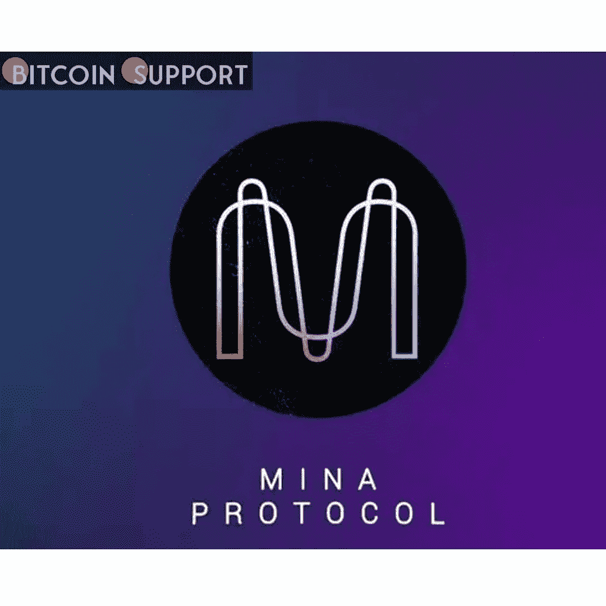
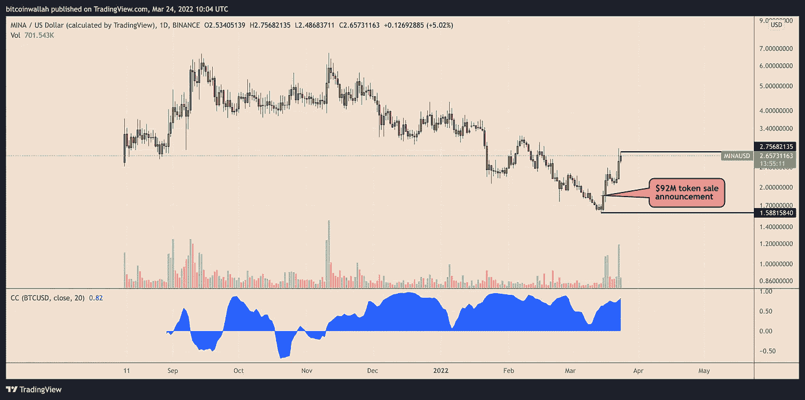
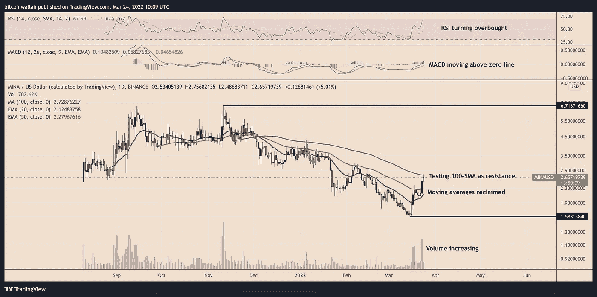
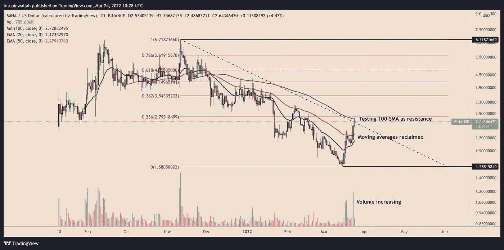

# 你跌到谷底了吗？米娜在触及有史以来最低点九天后上涨了 75%

> 原文：<https://medium.com/coinmonks/have-you-hit-rock-bottom-mina-is-up-75-nine-days-after-hitting-its-lowest-point-ever-6618fdecba16?source=collection_archive---------70----------------------->

**Visit our website:-** [**https://bitcoinsupports.com/**](https://bitcoinsupports.com/)

MINA 的显著上升得益于 9200 万美元的代币销售、比特币基地上市和加密市场的全面复苏。由同名“轻量级”智能合约平台支持的公用事业令牌 MINA 在从迄今为止的最低点 1.58 美元反弹后，保持了 9 天的上涨趋势。

随着交易员评估一轮高调的投资，涉及向三箭资本、FTX 风险投资公司和其他风险投资家出售价值 9200 万美元的米娜代币，3 月 24 日，硬币飙升约 75%，至 2.75 美元。

**Visit our website:-** [**https://bitcoinsupports.com/**](https://bitcoinsupports.com/)

因为替代硬币通常与比特币同步移动，加密市场的整体反弹情绪也有助于推动米娜的价格上涨(BTC)。

此外，比特币基地在 3 月 23 日宣布将为其加密交易所增加 MINA 支持，这可能增强了其在交易商和投资者中的上升潜力。“如果流动性条件得到满足，交易将于 3 月 24 日(星期四)太平洋时间上午 9 点或之后开始，”比特币基地解释道。

**米娜是不是要跌到谷底了？**

在米娜市场最近的购买热潮之后，经历了一段时间的剧烈抛售，每枚代币的价格从 2021 年 11 月 11 日的创纪录高点 6.71 美元暴跌至 2022 年 3 月 15 日的 1.58 美元，跌幅约为 76.50%。

尽管如此，基于三个广泛采用的技术设置:不断增长的交易量、显著的移动平均线和价格动量指标，MINA 正在进行的上行回撤已经显示出触底的迹象，即 11 月至 3 月熊市周期的结束。

**Visit our website:-** [**https://bitcoinsupports.com/**](https://bitcoinsupports.com/)

MINA 的反弹已经看到它分别突破了 20 天和 50 天的指数移动平均线(上图中的绿色和红色波浪)。与此同时，伴随上涨的是交易量的增加，这表明交易员和投资者对反弹充满信心。

米娜的移动平均线收敛发散(MACD；蓝色波浪)也高于其零线，表明趋势是积极的。

另一方面，米娜面临回落的风险，因为其相对强弱指数(RSI)接近 70 的超买基准水平，价格在其 100 天简单移动平均线(100 天 SMA 上图中的紫色波浪)为 2.72 美元。

**米娜价格:关键水平要留意**

100 天的 SMA 也正好与斐波那契回撤结构的 0.236 斐波那契回撤线(2.79 美元附近)重合——从 6.71 美元的摆动高点到 1.58 美元的摆动低点形成——为米娜的上涨愿望增加了又一层阻力。

**Visit our website:-** [**https://bitcoinsupports.com/**](https://bitcoinsupports.com/)

作为超买 RSI 信号的结果，一个良好的回调可能会看到 MINA 测试其 20 天和 50 天 EMAs 作为临时下跌目标，延长的抛售将 1.58 美元带回视线。另一方面，突破 2.36 美元至 2.72 美元阻力区间的决定性上涨可能会首先推动米娜的价格超过 3 美元——一个心理上涨目标——然后延伸至 3.50 美元以上的 0.382 Fib 线。

**访问我们的网站:-**[**【https://bitcoinsupports.com/】**](https://bitcoinsupports.com/)

**免责声明:以上为作者观点，不应视为投资建议。读者应该自己做研究。**

> 加入 Coinmonks [电报频道](https://t.me/coincodecap)和 [Youtube 频道](https://www.youtube.com/c/coinmonks/videos)了解加密交易和投资

# 另外，阅读

*   [折叠 App 回顾](https://coincodecap.com/fold-app-review) | [LocalBitcoins 回顾](/coinmonks/localbitcoins-review-6cc001c6ed56) | [Bybit vs 币安](https://coincodecap.com/bybit-binance-moonxbt)
*   [加密保证金交易交易所](/coinmonks/crypto-margin-trading-exchanges-428b1f7ad108) | [赚取比特币](/coinmonks/earn-bitcoin-6e8bd3c592d9) | [Mudrex 投资](https://coincodecap.com/mudrex-invest-review-the-best-way-to-invest-in-crypto)
*   [WazirX vs coin dcx vs bit bns](/coinmonks/wazirx-vs-coindcx-vs-bitbns-149f4f19a2f1)|[block fi vs coin loan vs Nexo](/coinmonks/blockfi-vs-coinloan-vs-nexo-cb624635230d)
*   [比斯勒评论](https://coincodecap.com/bitsler-review)|[WazirX vs coin switch vs coin dcx](https://coincodecap.com/wazirx-vs-coinswitch-vs-coindcx)
*   [7 大副本交易平台](https://coincodecap.com/copy-trading-platforms) | [BuyCoins 点评](https://coincodecap.com/buycoins-review)
*   [XT.COM 评论](https://coincodecap.com/profittradingapp-for-binance)币安评论 |