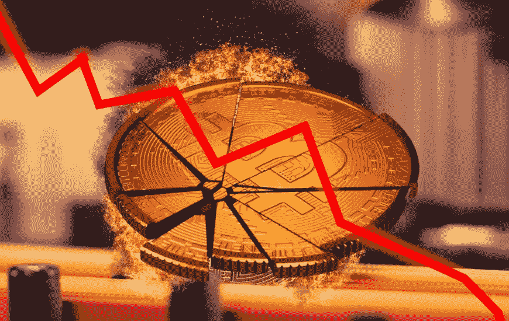
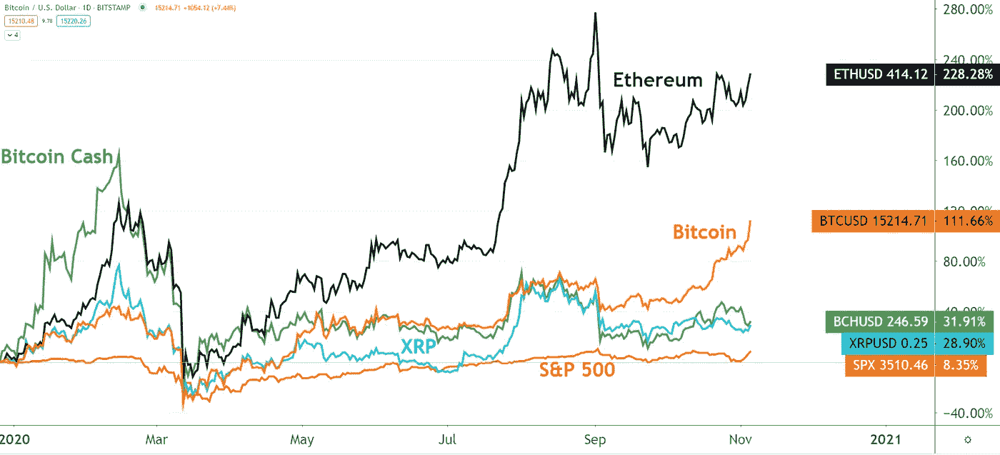

# 你想知道为什么会发生加密崩溃吗？这里有五个原因

> 原文：<https://medium.com/coinmonks/have-you-wondered-why-the-crypto-crash-is-happening-here-are-five-reasons-b872c671bb6c?source=collection_archive---------22----------------------->

**亮点**

*   **UST 遭遇袭击，导致其与美元脱钩**
*   **美联储加息引发抛售压力，导致代币价格暴跌**
*   在宏观经济的不确定性中，机构投资者已经放弃了风险更高的资产
*   **价格波动是加密市场的第二天性**

目前尚不清楚市场目前的平静是否表明熊市可能已经结束。但在过去的 48 小时里，市场出现了一定程度的稳定，过去几个月的波动让投资者损失了数十亿美元，许多人对加密市场的信心从根本上动摇了。

最大的输家是那些持有稳定债券的人。这个加密利基市场在几周内就蒸发了 90%以上的象征性价值。大约一个月前，LUNA 的交易价格为 117 美元，目前的象征性价格不到 1 美元。

也许交易者，尤其是新进入者心中最大的问题是，这次非同寻常的市场崩溃的原因是什么？这篇文章将强调几个因素，专家们认为这些因素在这场肆虐的熊市中发挥了重要作用。

**袭击 UST**

嗯，对于加密市场崩盘的原因，或许不可能 100%准确，但有一个共识是，它始于对 Terra 的 UST 的流动性攻击，直到上个月，它是仅次于 USDT 和 USDC 的市值最大的银行。

Weiss Crypto 的加密分析师 Marija Matic 表示，考虑到最初的大部分销售是以 30 万美元为增量完成的，人们普遍认为这次攻击可能是故意的，是由一个财大气粗的大型实体发起的。

袭击发生后，UST 失去了盯住美元的政策，汇率跌至略低于 1 美元。

此后，随着抛售压力继续扩大，攻击似乎加剧，导致更大幅度的脱钩。因此，随着 UST 价格进一步下跌，恐慌和恐惧开始在整个市场蔓延，因为投资者想知道发生了什么。结果是银行挤兑失控，让 UST 喘不过气来。

为了恢复联系汇率，LUNA Foundation Gate 决定使用其 4 万 BTC 储备进行干预，但干预未能达到预期目的，因为 UST 继续自由落体，并拖累了 LUNA。

在短短一周内，ust 几乎破产，而卢娜从 100 多美元跌到几乎为零。

有趣的是，直到上个月，LUNA 还是市值超过 400 亿美元的前十名硬币。这是自 Bitconnect 崩溃和烧毁以来最大的一次加密崩溃。

拯救 UST 的绝望竞赛对更广泛的加密市场产生了连锁反应，因为抛售压力席卷了整个生态系统，导致令牌价格持续暴跌。

似乎受崩溃影响最大的替代硬币是那些与 DeFi 严重相关的硬币，即那些与 UST 有大量接触的硬币，特别是雪崩。

**美联储加息**

美联储主席杰罗姆·鲍威尔(Jerome Powell)在美国通胀创纪录上升后宣布加息后，加密市场的反应是在接下来的几天里损失了近 2000 亿美元。抛售压力仍在持续，突显出数字货币市场与传统金融基础设施之间的相关性日益增强。

Oanda 的高级市场分析师 Edward Moya 指出，加密市场与纳斯达克等指数高度相关。他观察到像 crypto 这样以技术为中心的指数下跌了。莫亚补充说，信心很低，该资产在今年的大部分时间里一直在巩固。

同样，财政部长珍妮特·耶伦在最近的参议院银行委员会听证会上的评论也可能导致了危机。在听证会上，Janet 指出，UST stablecoins 上的挤兑说明了不受监管的加密货币对金融稳定构成的潜在威胁。这引发了对加密货币可能受到监管打压的担忧，并加剧了抛售压力。她的评论显然是为了争取对加密市场监管的支持，这是许多政策制定者的共同观点，包括一直在推动禁止大规模稳定加密的欧盟委员会。

**机构投资者隐秘兴趣降温**

去年对 crypto 来说是一个伟大的时刻，因为许多机构投资者被吸引到了这个资产上。特斯拉、MicroStrategy 和萨尔瓦多等公司都帮助将 crypto 拖入了全球金融系统的主流。然后是由 NFTs，DeFi，元宇宙等加密利基创造的嗡嗡声。这些引发了对数字资产的巨大购买压力，代币价格飙升至前所未有的水平，为投资者提供了巨大的价值。

但由于投资一直在下降，到 2022 年为止，这种兴奋似乎已经被抑制了。

根据 CoinShares 的数据，机构加密基金已经连续四周流出，这表明市场的信心水平似乎已经下降。

**投资者回避高风险资产**

更广泛市场的不确定性水平已促使投资者放弃科技股和加密等风险更高的资产，转而青睐美元等更安全的避风港。鉴于当前美国通胀处于历史高位，这令人震惊，但投资者宁愿押注于美元，因为美元是一种风险较低的资产。比特币爱尔兰共和军的联合创始人克里斯·克莱恩(Chris Kline)表示，一些加密投资者正在权衡其他选择，并“将他们的资金转移回美元，作为一个起点，然后看看他们接下来会做什么。”

**牛市熊市周期**

尽管加密市场的崩溃引起了恐慌，但对于那些已经交易了一段时间数字货币的人来说，剧烈波动并不新鲜。波动是市场的第二天性，自比特币推出加密技术以来，已经出现了四次截然不同的牛市/熊市。

## *“更广泛市场的不确定性水平已促使投资者放弃科技股和加密等风险更高的资产，转而青睐美元等更安全的避风港”*

尽管市场在过去 48 小时内相对稳定，但专家认为暴跌远未结束，他们预测熊市可能会持续到 2022 年剩余时间，比特币价格可能会低至 20，000 美元，然后上涨趋势可能会在 2023 年初开始。

Joseph 是一名密码作家、分析师和交易员，致力于提供经过充分研究的教育内容，帮助密码交易员和投资者做出明智的决策。

Joseph 是一名密码作家、分析师和交易员，致力于提供经过充分研究的教育内容，帮助密码交易员和投资者做出明智的决策。

> *加入 Coinmonks* [*电报频道*](https://t.me/coincodecap) *和* [*Youtube 频道*](https://www.youtube.com/c/coinmonks/videos) *了解加密交易和投资*

# 另外，阅读

*   [3 商业评论](/coinmonks/3commas-review-an-excellent-crypto-trading-bot-2020-1313a58bec92) | [Pionex 评论](https://coincodecap.com/pionex-review-exchange-with-crypto-trading-bot) | [Coinrule 评论](/coinmonks/coinrule-review-2021-a-beginner-friendly-crypto-trading-bot-daf0504848ba)
*   [莱杰 vs n rave](/coinmonks/ledger-vs-ngrave-zero-7e40f0c1d694)|[莱杰 nano s vs x](/coinmonks/ledger-nano-s-vs-x-battery-hardware-price-storage-59a6663fe3b0) | [币安评论](/coinmonks/binance-review-ee10d3bf3b6e)
*   [Bybit 交易所评论](/coinmonks/bybit-exchange-review-dbd570019b71) | [Bityard 评论](https://coincodecap.com/bityard-reivew) | [Jet-Bot 评论](https://coincodecap.com/jet-bot-review)
*   [3 commas vs crypto hopper](/coinmonks/3commas-vs-pionex-vs-cryptohopper-best-crypto-bot-6a98d2baa203)|[赚取加密利息](/coinmonks/earn-crypto-interest-b10b810fdda3)
*   最好的比特币[硬件钱包](/coinmonks/hardware-wallets-dfa1211730c6) | [BitBox02 回顾](/coinmonks/bitbox02-review-your-swiss-bitcoin-hardware-wallet-c36c88fff29)
*   [block fi vs Celsius](/coinmonks/blockfi-vs-celsius-vs-hodlnaut-8a1cc8c26630)|[Hodlnaut 审核](/coinmonks/hodlnaut-review-best-way-to-hodl-is-to-earn-interest-on-your-bitcoin-6658a8c19edf) | [KuCoin 审核](https://coincodecap.com/kucoin-review)