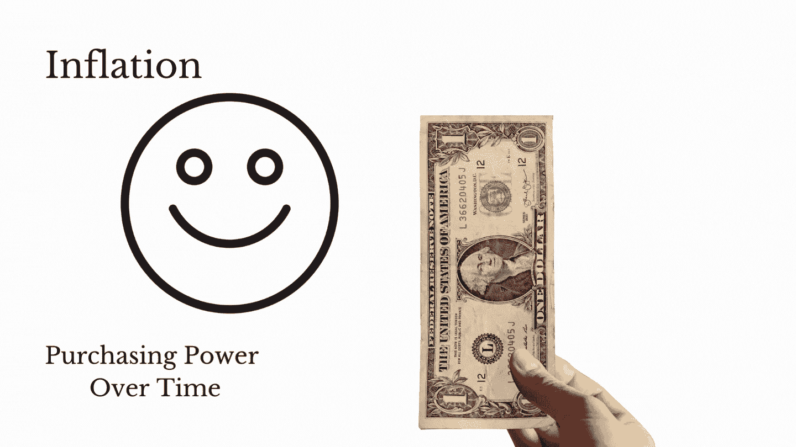

# 现金太多？这会改变你的视角。

> 原文：<https://medium.com/coinmonks/having-too-much-cash-this-will-change-your-perspective-8e4ca109445c?source=collection_archive---------10----------------------->

***通胀天价的时候怎么办？***

我害怕在 2019/2020 年期间银行里没有足够的现金。除了应急资金之外，我还有大约 25%的净资产存在储蓄账户里。

在 COVID 期间，美联储提出了各种货币宽松(或)刺激措施，从而印了很多钱。钱是多余的…