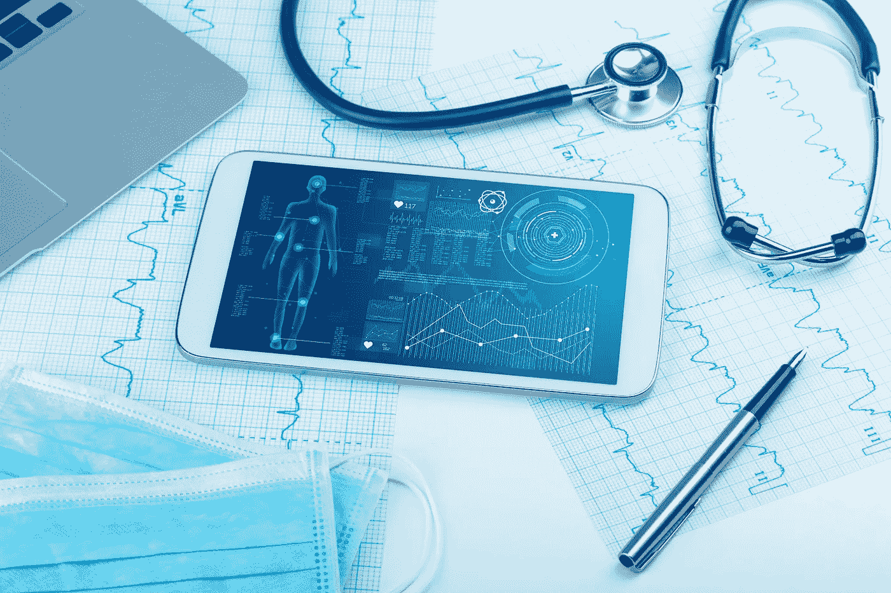
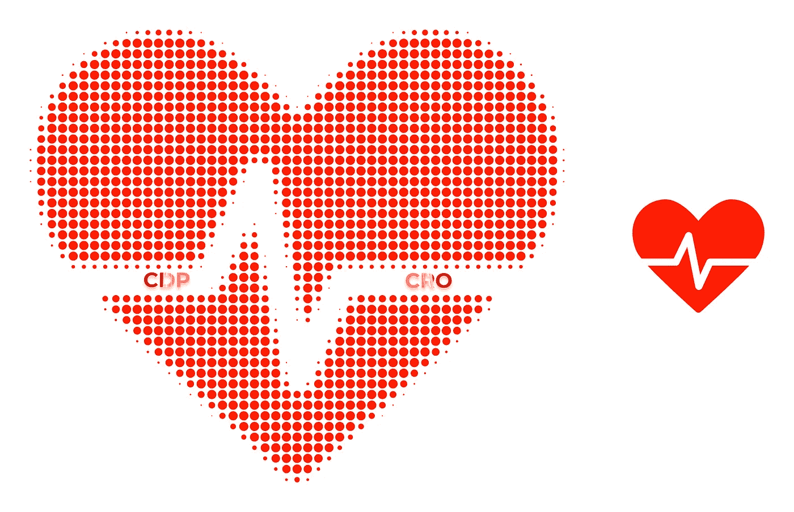
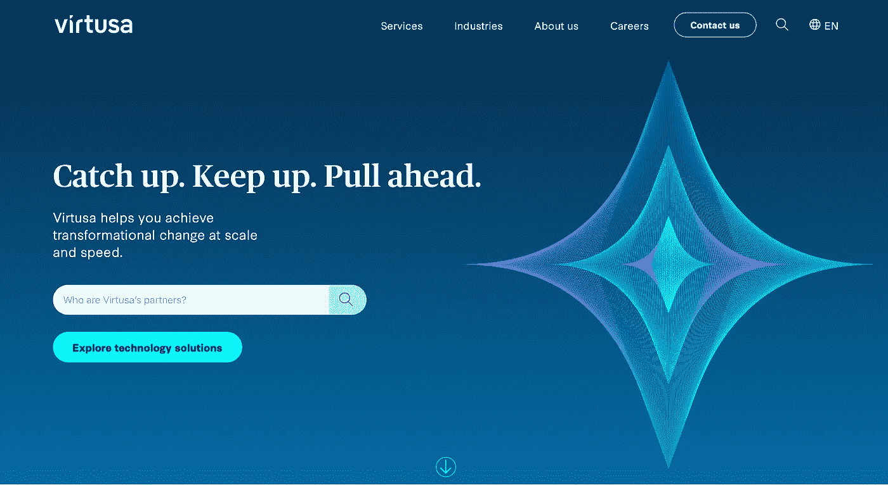

# 在医疗保健领域利用 CRO 和 CDP 的力量

> 原文：<https://medium.com/coinmonks/healthcare-providers-and-harnessing-the-power-of-cro-and-a-cdp-c2322f39df2?source=collection_archive---------24----------------------->

在 COVID 之前，没有人相信可以通过虚拟手段充分提供医疗保健。然而，COVID 证明这一想法完全错误，现在疫情领导的数字化转型正在进行中，这将永远重塑患者和医生的格局。

Technology based Medical Body Screening

本文将关注医疗保健提供商和营销人员如何通过利用 CRO 和 CDP 的力量来利用这一变化。首先，我们将通过解释这些首字母缩写词的含义来确保我们都在同一页上。在此基础上，我们将了解患者和医疗保健提供者如何从使用这些工具中获益。

# 什么是 CRO？

转化率优化(CRO)营销是一项严重依赖真实用户数据的战略，其[目标是提高转化率](/@sidpix/the-four-technologies-driving-innovation-in-the-digital-age-and-how-to-leverage-them-56a1e6570a7a)。这可以是传统的电子邮件订阅、演示注册、在表单中输入个人信息等等。

然而，CRO 并不是为了给 T4 带来更多的流量。这是关于转换那些已经来到网站的人，不管是付费的还是有机的。因此，对于医疗保健提供商来说，这一点尤为重要，因为这意味着你在营销工作中可以获得更大的回报。

反过来，这意味着有更多的钱花在其他领域，以获得更好的患者结果。

# 什么是 CDP？

简单地说，CDP 就是一个客户数据平台。它是一种收集和组织客户信息的软件，可以创建一个全面和持久的数据库，使营销人员和决策者能够从客户互动中获得有价值的洞察力。

它从各种来源建立了一个 360 度的个人资料，以创建一个关于他们的习惯、喜欢、细节和软件所接受的任何其他数据的统一视图。它被领先品牌用来创造更好的客户体验和提高投资回报率。这也有利于非营利组织和其他组织的筹款活动等等。 [Igor](/@ibobriakov) 很好地阐述了[医疗保健领域的数据科学用例](/activewizards-machine-learning-company/top-7-data-science-use-cases-in-healthcare-cddfa82fd9e3)

# 利用 CRO 和 CDP 的力量

既然我们对这些首字母缩写词的含义有相同的理解，那么让我们从提供者和患者的角度来看两个[用例](/activewizards-machine-learning-company/top-7-data-science-use-cases-in-healthcare-cddfa82fd9e3)，看看医生和医疗保健营销人员如何利用这些工具。

# CRO 和 CDP 如何惠及医疗保健行业

医疗保健行业的[客户数据平台](/analytics-and-data/cdp-and-dmp-a-story-of-advertising-platforms-draft-9359162f6713)和 CRO 有很多好处。与其他领域一样，疫情给整个行业带来了压力。这里缺少员工，但对他们服务的需求却在增加。此外，人们希望医疗保健能与他们从金融服务、拼车和其他创新中获得的轻松和便利相匹配。

很简单，病人也是消费者。今天，你可以在网上做任何事情，从购物、购买食品杂货到从一个应用程序送货上门的麦当劳，现在，你可以从你的 iPad 屏幕上看到你的医生。患者希望这些服务是个性化的，并与他们的需求相关。

此外还有管理所有患者信息和偏好、可能分布在不同机构并具有不匹配数据的病历、保持 HIPAA 合规性、患者和医生之间准确可靠的沟通等方面的后勤工作。

然而，这也使医疗保健处于独特的地位，可以利用由数据驱动的决策所引领的变革。使用 CRO 和 CDP 是完美的答案，因为这是一种以人为本、客户至上的营销和数据聚合方法。让我们看看下面的几个用例。

● **增强患者的远程医疗体验:**CDP 允许您将来自患者的未知和已知数据点联系起来，并将它们统一起来，以创建并直接向远程医疗提供商或医疗呼叫中心提供关于患者的实时和最新医疗信息。这种方法的核心是积极的患者之旅，因此远程医疗或呼叫中心代理可以迅速专注于为患者提供最好的护理。

● **确保您符合 HIPAA:**由于 CDP 将患者的所有数据统一到一个全面的档案中，医疗保健提供商可以将数据库存储在一个已经符合 HIPAA 且安全的私有云系统中。信任和隐私是健康最重要的基石。

● **获得新的患者和会员:**CRO 的最佳实践，比如使预约或注册变得容易，使你的内容和文本可浏览，创建移动响应网站等。所有这些都增加了患者找到他们需要的东西的机会，也提高了忠诚度。

# CRO 和 CDP 如何使患者受益

如果我们从病人的角度来看，在医疗系统中导航可能是困难和挑战的。他们可能会以各种方式与该组织接触，例如在谷歌上查找他们的治疗方案，去看医生，参加网络研讨会等。

问题是没有任何东西将这些联系在一起，信息变成了孤岛。数字医疗通过统一不同来源的*所有*数据(无论是第一方、第二方还是第三方信息)来消除这种情况。

CRO 营销意味着更多的人得到了他们需要的帮助。如上所述，它让他们更容易在线预约，通过他们喜欢的方式(电话、缩放等)与医生交流。)，还有更多。

# 与 Virtusa 合作开发医疗保健解决方案

成功的关键是使用正确的工具，把病人放在第一位。 [Adobe real-time CPD](https://business.adobe.com/products/real-time-customer-data-platform/RTCDP.html) 技术通过汇集已知和未知数据来创建统一、全面的患者档案，从而增强了医疗机构的能力。

如果您需要在您的设施中实施数字医疗保健方面的帮助，那么只需看看领先的 IT 医疗保健解决方案提供商 [Virtusa](https://www.virtusa.com/industry/healthcare) ，它拥有强大的创新工具，如人工智能驱动的 vLife 和其他服务。请立即联系我们，了解我们能为您做些什么。