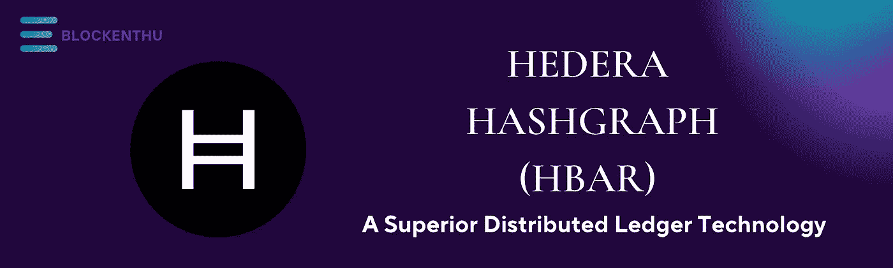
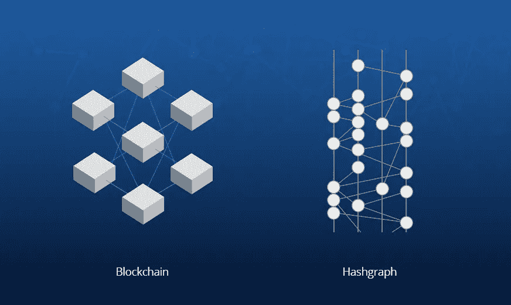
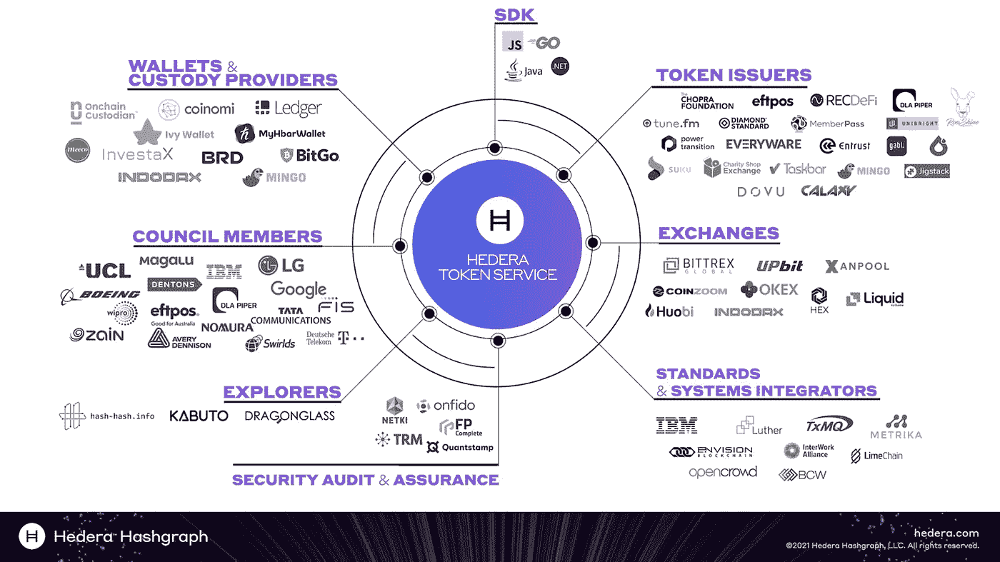

# 海德拉·哈希格拉夫(HBAR)

> 原文：<https://medium.com/coinmonks/hedera-hashgraph-hbar-f34e5c93308b?source=collection_archive---------20----------------------->

# 海德拉是什么？

**Hedera** 是一个公共分布式分类账和治理系统，从头开始设计，以适应新的和现有的应用程序。开发人员使用 Hedera Hashgraph 的网络服务将计算信任直接嵌入到他们的应用程序中。Hedera 是最广泛使用的，持久的，**企业级公共网络**用于去中心化经济，允许个人和公司构建强大的去中心化应用(DApps)。它旨在成为一个更加公平和高效的系统，克服以前基于区块链的平台的一些缺点，如**性能慢和不稳定。**

# HASHGRAPH 到底是什么意思，是什么让它独一无二？

Hedera 的独特之处在于，它实现了与最受欢迎的公共区块链(如比特币或以太坊)相同的结果，但以更快、更节能的方式，这些好处归功于底层的**哈希图** **共识算法**和全球企业管理机构，后者目前拥有并运营 Hedera。Hedera 是唯一一个使用 hashgraph consensus 的公共分类帐，这是一个比工作证明共识机制更快、更安全的替代方案。它有效地验证 Hedera 网络上的交易，同时保持最高的安全标准，以防止恶意攻击。Hashgraph 技术目前**专利**，唯一授权的账本是 **Hedera Hashgraph** 。

Hedera Hashgraph 有两位创始人:**Leemon Baird 博士**和 **Mance Harmon** 。Hashgraph consensus 是 2015 年创建的 DAG(有向无环图)。Hashgraph 是一个公共的、去中心化的分布式分类帐。然而，它在关键方面不同于区块链，甚至还提供了一些重要的进步。Hashgraph 的辉煌一笔是基于人类最快速、最强大的基本交流方式之一——流言蜚语。我们都以这样或那样的方式分享过有趣的消息，我们总是惊讶于谣言像野火一样传播得如此之快。事实上，一旦消息传出，就无法阻止了。Baird 博士设计了 hashgraph 算法背后的**流言蜚语协议**。与区块链不同，它使用一种工作证明协议，矿工按块排序数据，hashgraph 采用一种完全不同的网络架构或数据结构，称为有向非循环图或 DAG。

这种 hashgraph 技术使其在速度、成本和可伸缩性等重要领域超过了几家总部位于区块链的竞争对手。Hedera 交易的平均交易费用为 **$0.0001 美元**，通常不到五秒钟即可完成。总体而言，Hedera Hashgraph 承诺每秒能够处理超过 **10，000 个事务** (TPS)，相比之下，最常见的基于工作证明(PoW)的区块链为 5-20 个。

公共账本存储在 mainnet 节点上，最初由 Hedera 管理委员会管理——管理委员会现在包括**谷歌、IBM、Wipro、波音、塔塔通信、IIT 马德拉斯、德国电信、LG、**等。将来，Mainnet 节点将是无权限的，任何人都可以运行它们而不会惊动 Hedera。

Hedera 为像 as **Hyperledger Fabric 和 R3 Corda** 这样的区块链框架提供连接器，这些框架将私有网络的保密性与公共网络的信任度结合在一起。通过将许可的区块链框架链接到 Hedera Hashgraph，私有应用程序可以提供公共可验证性和去中心化的交易排序。

# **HEDERA HASHGRAPH 网络有多安全？**

为了保证网络安全，Hedera Hashgraph 采用了一种新的共识技术，称为 Hashgraph consensus。这是通过使用由多达 11 个不同行业的 39 个极其多样化的团体组成的旋转管理委员会来实现的。他们负责指导 Hedera 代码库、对平台决策进行投票，以及运行最初的 Hedera 公共网络节点。

Hedera 采用了一种革命性的利害关系证明(PoS ),允许 HBAR 用户将其资源用于帮助网络安全。目前，所有 Hedera 节点都由 Hedera 或管理委员会成员管理，但有计划在未来过渡到无许可系统。

总体而言，Hedera 的安全配置确保了它实现了**“异步”拜占庭容错** (ABFT)，这意味着即使某些数据被延迟或丢失，它也能保证一组事务的时序和顺序。

# **HEDERA HASHGRAPH(HBAR)硬币目前的发行量是多少？**

海德拉 Hashgraph token HBAR 的总量，被限制在**500 亿 HBAR 的**。截至 2022 年 2 月，约有**180.9 亿**在流通，约占总供应量的 **36%** ，市值为 39 亿美元，在撰写本文时，目前交易价为 **0.21 美元**。

根据 Hedera 的资源，两位项目创始人每人获得 20 亿 HBARs T1 的硬币奖励，这相当于 T2 总供应量的 4%。这些代币有 6 年的归属期。

Hedera 的其他高级管理人员(2018 年前加入)获得的硬币奖励从**2.5 亿到 3 亿**硬币不等。这些代币将在 2021 年 12 月结束的一年内授予。根据 Hedera 的经济学白皮书(2020 年 6 月发布)。

# **HBAR 在海德拉公共网络中是否扮演着双重角色？**

Hedera Hashgraph 系统的原生加密货币是 **HBAR** ，有 500 亿 hbars 的固定供应量。它在 2018 年 8 月通过首次发行硬币(ICO)获得了资金，并在一年多后的 2019 年 9 月开放了对其 mainnet 的访问。在 ICO 期间，投资者能够以最低的可行价格购买平台的本地公用令牌(HBAR)。HBAR 是推动 Hedera 服务(如智能合同、文件存储和常规交易)的燃料。其次，它被用来帮助保护网络，因为 HBAR 用户可以用他们的令牌来帮助保持平台的安全。

# **HBAR 立桩**

Hedera 没有传统的赌注共识机制，像 Cardano 或 Tezos，网络直接用新铸造的硬币奖励赌注者。相反，验证节点在给定的时间段内收取所有交易费用的一定百分比。

# **海德拉哈希图的未来**

Hedera 是一个很有前途的公共网络，旨在解决当前公共区块链和分布式总账的缺点。Hedera 已经被许多公司和协议使用，mainnet 每天产生超过 140 万笔交易，超过了以太坊区块链。供应链管理、医疗保健、支付和其他行业都由这些应用提供服务。有许多引人入胜的项目正在进行中，新的合作伙伴关系定期出现。

Hedera 目前已获得许可，mainnet 节点由 Hedera 管理委员会成员运营。随着 Hedera 接近完全的网络去中心化，mainnet 将变得没有权限，允许任何人运行节点。

# 跟着我们走

# Whatsapp

 [## ⚡BLOCKENTHU⚡

### WhatsApp 群邀请

chat.whatsapp.com](https://chat.whatsapp.com/FTKme4XzkOU73ZDv99Oatj) 

# 电报

 [## ⚡·布洛克登胡·⚡

### 可以马上查看并加入@blockenthu。

t.me](https://t.me/blockenthu) 

# 商务化人际关系网

 [## Blockenthu | LinkedIn

### LinkedIn 上有 117 名粉丝。“面向大众的 Web 3.0 福利”加密和区块链| BlockEnthu 是社区…

www.linkedin.com](https://www.linkedin.com/company/blockenthu/) 

# 照片墙

[https://www.instagram.com/blockenthu/](https://www.instagram.com/blockenthu/)

# 想吃点酒吗

使用印度最安全的加密交换。#CoinDCX

 [## CoinDCX -加密交易所|购买、出售和交易比特币和顶级替代币

### CoinDCX 是印度最大、最安全的加密货币交易所，在这里你可以买卖比特币和其他…

coindcx.com](https://coindcx.com/)