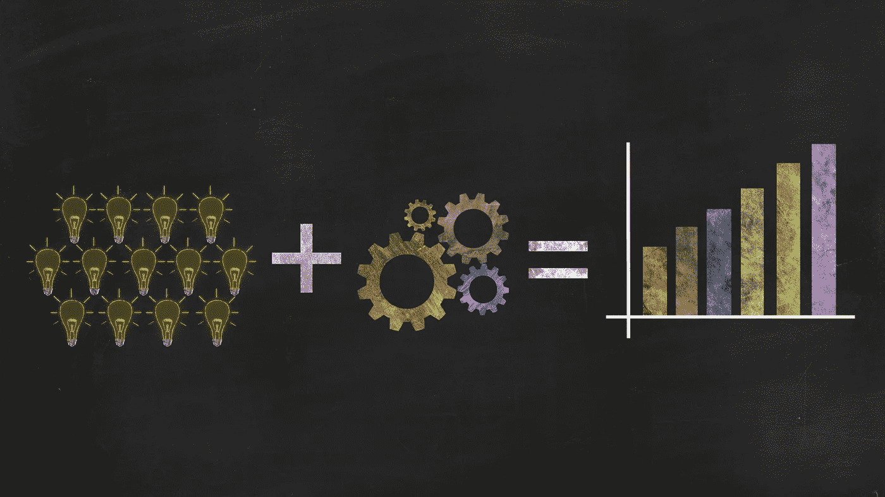

# 对冲，或永远不会失去交易的艺术

> 原文：<https://medium.com/coinmonks/hedging-or-the-art-of-never-loosing-a-trade-f8fb5006553e?source=collection_archive---------0----------------------->

Idea + Thinking = Growth (Pixabay Image)

# 如何永远不会遇到糟糕的交易

当我第一次对金融和交易感兴趣时，我开始观察不同的市场，以感受它们的行为。我的目标是发现支配每一个现有市场的共同行为，因为我认为这意味着更加稳健。我想发现定期出现并以相同方式进化的模式…