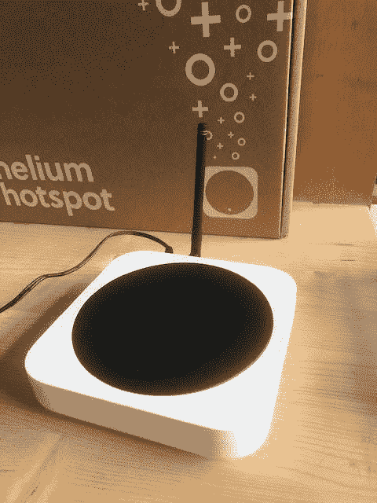
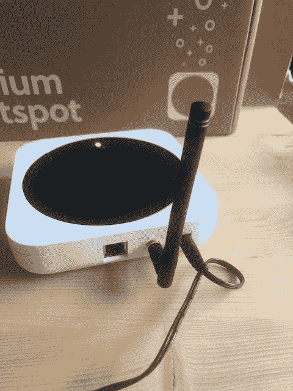
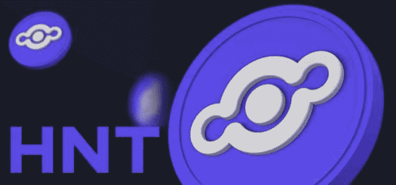

# 氦热点矿工审查-赚取巨额利润开采氦！

> 原文：<https://medium.com/coinmonks/helium-hotspot-miner-review-make-huge-profits-mining-helium-e44749ff6f62?source=collection_archive---------18----------------------->

氦热点使用户能够通过连接氦热点与移动设备来访问互联网。很多人怀疑这东西是如何工作的，它是什么，以及如何通过采矿利用氦热点来获益。

虽然我们有许多公司提供热点电缆，例如 smile。这些公司不向使用他们电缆的用户提供收入，但氦热点通过 HNT 矿业公司提供；氦热点的原生加密货币。

用户可以通过使用已经成为人民网一部分的热点来获得 HNT。你想知道和学习这个东西是如何工作的，它是什么，以及如何通过采矿标准从使用氦热点中受益，拿一杯酒和一个座位，在我揭示氦热点的重要细节时继续阅读。

因此，本文涵盖了什么是氦热点，氦开采如何工作，什么是氦数据信用价格，什么是氦令牌，氦网络如何保护以及如何获得氦令牌。

# 什么是氦热点？

氦网络背后的组织在他们的白皮书中将氦描述为“一个分散的远程组织，它使地球上任何地方的小工具都能够远程与互联网关联并进行地理定位，而不需要渴望电力卫星区域设备或昂贵的蜂窝计划。”

Helium 正在通过一个名为“人民网络”的组织与一系列传递 GPS、水和生态信息的设备进行接口。氦系统公司通过使用无线电波(这使得开采氦成为一个诱人的推荐)来连接这些设备，而不是花费大量的美元来制造和保持一个远程框架。

与 WiFi 不同，Helium 使用的是 LoRaWAN 协议，这使得它们可以传输更远的距离。无论如何，它伴随着它的障碍:你不能通过无线电波用 Wi-Fi 组织传递尽可能多的信息。

这不是一个问题，因为氦为小束信息提供了广泛的包容性，类似于 GPS 跟踪器或运动传感器，或空气质量屏幕。

希雷姆正在用你我这样的标准人建立人民网。当一个热点的所有者与该组织发生联系时，他们就成为了这个在美国、欧洲和中国发展的氦人团体的一部分。

氦的业务发展副总裁“马克·菲利普斯”在接受采访时说；人民网没有以巨大的塔为特色，因为“我们正在建设一些根本不同的东西。”

他还提到了这样一句话:他们的目标是建立一个社区来帮助小型设备传输数据，任何人都可以成为其中的一员。这和任何人做过的都不一样。

# 氦矿是如何工作的？

开采氦就像 ABC 一样简单。假设你理解这种方法，这对人们的网络很重要，你想要一个室内或室外热点，与氦宇宙中的不同热点连接。

热点为企业和工程师的物联网应用提供了所需的网络和移动技术。为了让组织交流信息，他们需要数据信用。

为了获得这些数据信用，组织需要消费 HNT 令牌。那些有热点的人可以从这些氦令牌中分得一杯羹，因为它们增加了网络的数量。

我将详细阐述什么是数据信用及其成本，这样你就能完全理解氦开采是如何工作的。

# 什么是氦数据信用价格？

数据信用是通过大众网络发送数据的主要支付方式。

数据信用允许客户利用氦 LongFi 移动数据字节，并用它们支付区块链交易所的费用。数据积分的费用以美元计算(1 个数据积分= 0.00001 美元)。像预付费手机通话时间或运营商里程一样，数据信用是不可适应的，必须由它们唯一的所有者使用。

为了获得数据信用，网络客户转换 HNT 或者从 HNT 的所有者那里得到它们。任何完全转换为数据信用的 HNT 将永远从流动库存(流通供应)中消除(“消耗”)。

通俗易懂的讲解，获取数据信用；需要将 HNT 从流通中移除以创建数据信用，并且设备使用数据信用来使用网络。

# 网络数据传输奖励

数据传输奖励与 HNT 支出的比例为 1:1，上限为所有铸造 HNT 的 30%(第一年)。剩余部分作为提供早期保险的奖金授予保险证明奖励池。

# 氦令牌是什么？

氦(HNT)被描述为一个分散的区块链控制的物联网(IoT)设备网络。

氦创新增强了小工具之间的通信，而框架则通过网络节点发送数据。在氦框架中，组成组织的节点被称为热点。热点让公共组织参与进来，并依赖于 LoRaWAN。

LoRaWAN 是一个媒体访问控制层约定，它有一个云部分，像氦这样的级可以与之接口。

Helium 是最大的 LoRaWAN 网络之一，有超过 25，000 个热点作为组织中的节点。鉴于区块链的创新，Hotspot 加入了 LoRaWAN 和采矿小工具的力量。

氦原生令牌于 2019 年 7 月推出，因此，工作节点的用户可以在氦的原生加密货币令牌 HNT 中挖掘和获得补偿。

Helium 的目标是为未来的物联网通信做准备，从 2013 年诞生开始就确定当前基础设施的不足之处。

# 氦网络是如何保护的？

Helium 使用一种定制的共识机制，称为覆盖范围证明(PoC ),奖励用户对挖掘(验证交易)和确保稳定性的贡献。

PoC 基于 HoneyBadger BFT 协议，该协议专门为条件不可靠时的节点通信而设计。

Helium 表示，最有可能的攻击媒介以热点入站端口的形式影响节点运营商。对于令牌持有者，平台的钱包使用非对称密钥来帮助用户使用私钥安全。

# 我如何得到氦代币？

*   对于每种加密货币，CoinMarketCap 都会给出一个购买选择的纲要(也称为市场对)。去 CoinMarketCap 搜索氦。点击价格图表旁边名为“市场”的按钮。在这个视图中，你会看到一个你可以购买氦气的地方的总数，作为你可以用来得到它的货币。在“pairs”下面，你会看到氦、HNT 的简写，还有后来的钱。后续的钱就是你可以用来买氦气的。假设你想用美元购买 HNT，搜索 HNT/美元。
*   加入我们的电报社区，获取加密新闻、加密宝石、支持和加密教程；电报链接:[https://t.me/+6ek5FpdVW89jNjE0](https://t.me/+6ek5FpdVW89jNjE0)

# 定论

HNT 的供应来自对一个可行热点的开采，这两家公司开采 HNT，并为物联网设备提供网络覆盖。

整个 HNT 从一开始就被开采，开始以每月 500 万 HNT 的速度开采，然后每隔一段时间就被开采一次。2021 年 8 月 1 日，HNT 净发行量降至每月 250 万 HNT。

> 加入 Coinmonks [电报频道](https://t.me/coincodecap)和 [Youtube 频道](https://www.youtube.com/c/coinmonks/videos)了解加密交易和投资

# 另外，阅读

*   [TraderWagon 回顾](https://coincodecap.com/traderwagon-review) | [北海巨妖 vs 双子星 vs BitYard](https://coincodecap.com/kraken-vs-gemini-vs-bityard)
*   [如何在 FTX 交易所交易期货](https://coincodecap.com/ftx-futures-trading) | [OKEx vs 币安](https://coincodecap.com/okex-vs-binance)
*   [OKEx vs KuCoin](https://coincodecap.com/okex-kucoin) | [摄氏替代品](https://coincodecap.com/celsius-alternatives) | [如何购买 VeChain](https://coincodecap.com/buy-vechain)
*   [ProfitFarmers 回顾](https://coincodecap.com/profitfarmers-review) | [如何使用 Cornix 交易机器人](https://coincodecap.com/cornix-trading-bot)
*   [如何匿名购买比特币](https://coincodecap.com/buy-bitcoin-anonymously) | [比特币现金钱包](https://coincodecap.com/bitcoin-cash-wallets)
*   [瓦济克斯 NFT 评论](https://coincodecap.com/wazirx-nft-review)|[Bitsgap vs Pionex](https://coincodecap.com/bitsgap-vs-pionex)|[Tangem 评论](https://coincodecap.com/tangem-wallet-review)