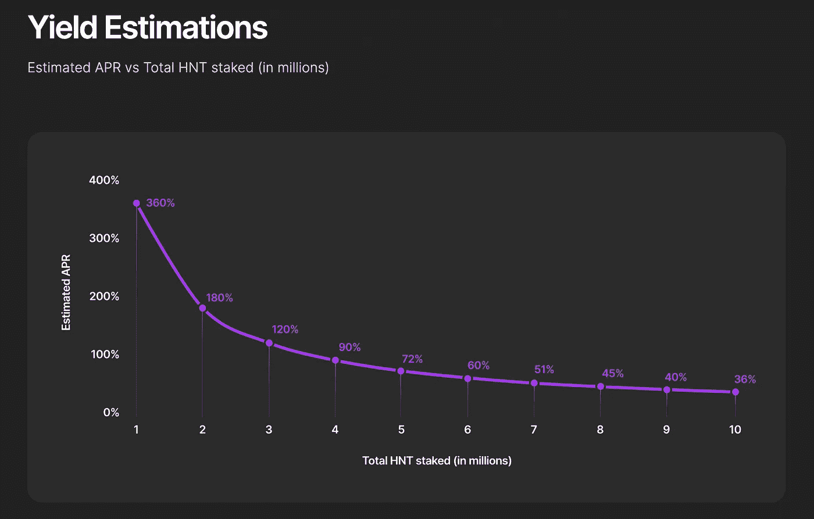

# 氦:人民网

> 原文：<https://medium.com/coinmonks/helium-peoples-network-ee756c113482?source=collection_archive---------28----------------------->

> ***物联网的去中心化无线网络。***

虽然世界还没有完全抓住区块链的潜力，但一个特别的区块链已经引发了一场**去中心化无线革命** **，其加密激励模型**允许用户为“物联网”设备建立点对点(或去中心化无线)网络。今天，我们将看看氦，以及它是如何改变点对点格局的。

# **氦气:简介**

氦不是作为一种加密货币或一家区块链公司成立的。它于 2013 年开始运营，通过说服用户设置热点 **并将它们连接起来，成为一个**“远程点对点无线网络】** **。**创始人在 **2019** 决定允许用户自己创建网络，并以加密货币获得报酬。**

氦已经发展成为物联网设备的区块链网络。氦 mainnet 允许**低功率无线设备**相互通信。该网络还可以向所有节点传送数据，这些节点被称为“热点 T21”每个热点都包含一个无线网关和一个区块链采矿单位。

这些热点价格约为 300 美元，可以通过无线电频率远距离传输适量的数据。**这些热点的功能是传统 wifi 热点的 200 倍**，并且可以与连接到互联网的相邻设备(如停车计时器、智能厨房电器和空气质量传感器)共享网络带宽。

所有创建这些热点的用户都会因参与网络而获得奖励。用户在氦币(HNT)中采矿并获得奖励，氦币是区块链的本地加密货币。

# 是什么让氦如此特别？

氦打算增加无线物联网(IoT)设备的通信能力。2013 年，物联网基础设施仍处于起步阶段，但开发者试图将去中心化添加到他们的产品中，因此官方文献将其称为**“人民网络”**

它的主要目标受众将是设备所有者和物联网爱好者，财务激励提供了额外的拓展机会。

网络中的参与者可以购买或开发自己的热点，这是一个无线网关和一个矿工的组合。每个热点在特定的半径范围内提供网络覆盖，同时还挖掘 HNT，氦的本地令牌。

氦网络建立在区块链的基础设施上，使用基于 [**HoneyBadgerBFT**](https://docs.helium.com/blockchain/consensus-protocol) 的共识系统。它具有以下特点:

**氦热点:**一个低成本的硬件设备，既可以作为矿工，也可以作为氦区块链的无线接入点。

**覆盖范围证明:**使用无线电波验证网络覆盖范围的挖掘过程。

**LongFi:** 将远程广域网(LoRaWAN)无线协议与氦区块链相结合，允许任何 LoRaWAN 设备通过网络发送数据。

# **氦气真的在用吗？**

在采用方面，氦正在取得重大进展**。DISH Network 于 2021 年 10 月宣布与氦合作**“促进开源和低成本的无线连接生态系统”，并使用氦部署 5G。**加利福尼亚州圣何塞市成为第一个加入氦网络的城市，并将利用它为低收入居民提供互联网接入。为了一项测试计划，该市向志愿者捐赠了氦路由器。随着美国对连接差距或信息鸿沟的日益关注，氦可能会通过帮助弥合这一差距而在物联网之外有一个潜在的用例。氦可以改善服务不足的社区的连通性，无论它们是低收入的城市地区还是农村地区。**

## **记号组学**

氦网络的本地加密货币是 HNT 硬币，这是开采。它提高了平台的激励性。在撰写本文时，HNT 股票的交易价格为 24.4 美元，市值为 26 亿美元(T21)。HNT 的收益根据不断变化的增长计划进行分配，节点所有者因开发基础设施而获得更多收益，随后因传输设备数据而获得更高回报。这一修正过程预计将持续至少 20 年。

HNT 目前的流通数量为 1.12 亿枚硬币，是市值排名前 50 位的加密货币之一。

## 目前 HNT 硬币的发行量是多少？

30 到 60 分钟的挖掘时间用于解锁奖品，这些奖品是根据变化的增长计划提供的。根据 Helium 的说法，节点所有者最初将因构建网络基础设施而获得更多 HNT，但以后传输设备数据会更有利。这种代币分配调整方式计划持续 20 年左右。

截至 2022 年 2 月底，有 **112，235，712.47** HNT 在流通。

# **技术基础设施**

**保险证明**

**覆盖证明** (PoC)是一种工作证明(PoW)算法，采用**无线电波**来证明热点，提供可用的无线覆盖。

PoC 挑战要求路由器通过解密并在氦网络上传输 **LongFi** 数据包来确认其无线覆盖的强度，并不断测试网络上的氦热点。

氦热点通过提交有效的覆盖证明和见证其他挑战的发生，赢得了参与 PoC 挑战的 HNT。

# **氦共识协议**

每一个时代都会选举出一个由 16 名成员组成的新**共识小组(CG)。**氦网络中活跃的所有氦热点都有资格被选入 CG。如果一个热点在 PoC 挑战中表现出色，它更有可能当选。

**每次选举将选出四名新的协调小组成员。其余 12 名成员在上次中央选举中当选。**一个热点被选中后，最多可以参与四个连续的 CG。

表现不佳的 CG 成员肯定会在达到 4 个时期的限制之前从 CG 中删除。

在一个新的 CG 被选择之后，一个门限加密密钥(TPKE)被产生。TPKE 允许网络中的任何热点使用主公钥(PK)对交易进行加密，这需要 CG 进行协作才能对其进行解密。TPKE 用于通过使 CG 成员更难任意忽略或延迟特定交易来使网络审查具有抵抗力。

# **目前可用的产品**

**氦的热点**

氦的氦热点是一个 **LoRaWAN** (远程广域网)无线路由器，它设计和分发。氦热点生成一个远程无线网络，用于将数据包路由到启用氦的设备，类似于网络中的其他 LoRaWAN 兼容设备，并进行连续的采矿工作以保护氦网络。你可以在这里得到所有现存氦热点的地图。

**氦气控制台**

Helium 控制台是一个基于 web 的设备管理应用程序，允许开发人员注册、验证和管理他们的 Helium 设备。除了设备控制之外，氦控制台还包括用于通过 HTTPs 或 MQTT 路由设备数据的预建连接。氦控制台的产品设备管理功能包括带有标签和用户级权限的组织结构。注册设备 ID、安全登录和在氦网络中认证，使用数据信用。

## **LONGFI**

LongFi 将 LoRaWAN 无线协议与氦区块链结合起来，允许任何 LoRaWAN 设备连接到氦网络并发送数据。

以下是 LongFi 的一些特性:

1.LongFi 允许企业根据需要搭载任意多的设备，而无需额外配置或第三方帮助。

2.**设备漫游:**车载设备被分配了保存在区块链上的唯一 id，允许它们使用任何热点在网络中传输数据。

3.**赢取 HNT 代币:** LongFi 允许设备所有者通过网络传输数据来赢取 HNT 代币。

4.**支持 LoRaWAN:** 任何 LoRaWAN 设备或传感器都可以通过氦网络发送数据，只需很少的配置。

## **氦气标签**

氦标签是连接到氦网络的 GPS 追踪器。氦标签可以跟踪氦网络服务区内的狗、行李、钥匙和其他物品。

**氦气是节能的吗？**

虽然有些人批评比特币和其他工作证明资产的高能耗，但氦脱颖而出，因为它的**覆盖共识**(基本上验证路由器位于他们声称的位置，并且它们正在运行并提供覆盖)使用的能源少得多大约 5 瓦，大约相当于一个 LED 灯泡。

**是否存在重大风险？**

我认为氦的最大危险是互联网服务提供商将阻止他们的客户访问氦热点，因为转售他们的带宽可能违反他们的服务条款。如果氦变得广泛可用，互联网服务提供商可能会打击那些利用他们的带宽分一杯羹的客户。

# **对未来的展望**

社交媒体对氦的总体反应似乎是积极的。鼓励社区成员展示他们的采矿设备和方法，以覆盖尽可能多的地面。该项目的 subreddit 提供了许多有用的信息，并且是许多关于硬件方面以及最近几个月收入如何变化的讨论的网站。

此外，人们似乎真的对基于他们的位置能赚多少钱感到兴奋。有些人一天能赚 50 美元，这是一个很好的被动收入来源。其他人可能收入较低，这取决于他们的居住地、覆盖质量以及他们连接的设备数量。

人们似乎对氦越来越感兴趣，因为已经有超过 604，823 个热点被注册，其中超过 80%是在线的。大约有 **163，000 个不同的热点**业主遍布 **162 个国家，**说明了该项目的吸引力。

然而，作为氦网络的一部分，获得必要的硬件来开始开采 HNT 可能会很困难。社区正在争先恐后地寻找装备，但似乎所有授权供应商都缺货。

# 想装些氦气吗？

在印度最受信任的交易所@[https://coindcx.com/](https://coindcx.com/)购买 HNT

现在加入我们吧！！

# WHATSAPP

 [## ⚡BLOCKENTHU⚡

### WhatsApp 群邀请

chat.whatsapp.com](https://chat.whatsapp.com/FTKme4XzkOU73ZDv99Oatj) 

# 商务化人际关系网

 [## Blockenthu | LinkedIn

### blockenthu | LinkedIn 上有 143 名粉丝。“面向大众的 Web 3.0 福利”加密和区块链| BlockEnthu 是社区…

www.linkedin.co](https://www.linkedin.com/company/blockenthu/) 

# INSTAGRAM

[https://www.instagram.com/blockenthu/](https://www.instagram.com/blockenthu/)

# 电报

 [## ⚡·布洛克登胡·⚡

### 可以马上查看并加入@blockenthu。

t.me](https://t.me/blockenthu)