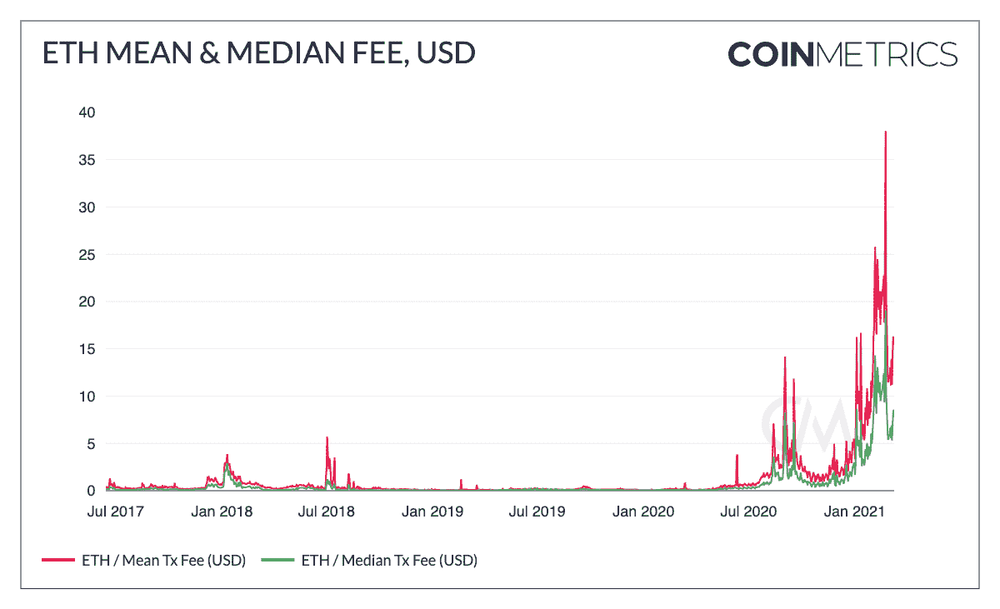
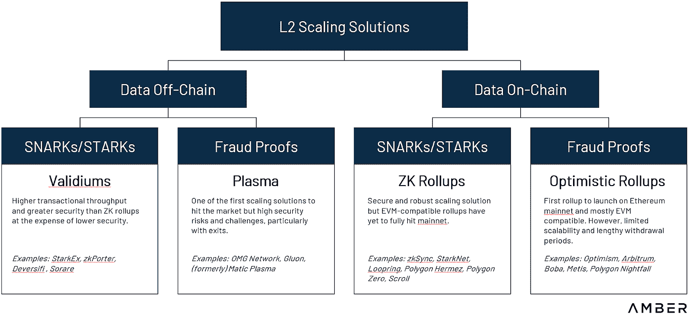

# 你好，dYdX！我们认可的代表介绍

> 原文：<https://medium.com/coinmonks/hello-dydx-our-endorsed-delegate-introduction-7f1c99015432?source=collection_archive---------23----------------------->

就在一个学期前，Boiler Blockchain 开始将普渡大学的学生与为区块链生态系统做出贡献的机会联系起来。今天，我们很高兴向 [dYdX 社区](https://commonwealth.im/dydx/discussion/3781-endorsed-delegates-profile-and-pitch?comment=18911?comment=18911)介绍我们的组织。锅炉区块链将作为认可代表加入一流的生态系统合作伙伴团队。

以下帖子概述了 dYdX 协议的基础知识。锅炉区块链团队期待着学习并为 dYdX 和为其提供动力的社区做出贡献。如果你想了解更多，你可以在这里查看我们的代表地址。

**开始**

dYdX 成立于 2017 年 9 月，由创始人安东尼奥·尤利亚诺领导。白皮书中概述的最初愿景针对在以太坊区块链寻找复杂金融产品的交易者。传统金融的主食，如期权、保证金和空头头寸，都有需求。dYdX 在以太坊虚拟机(EVM)上以智能合约的形式逐步实现了一套投资产品，通过 0x 协议汇集现有流动性，为用户的头寸提供资金。

dYdX 的订单簿架构与自动化做市商(AMM)形成对比，如 Uniswap，另一个流行的分散式交易所。订单簿法跟踪基础资产的买入和卖出订单，尽可能将它们配对以完成交易。另一方面，AMMs 允许用户添加交易对，并提供流动性，用于在算法上完成用户的订单，同时不断重新设定汇率目标。

**成长和优势**

dYdX 于 2018 年 4 月推出了其保证金交易合约，允许用户卖空并进行杠杆多头交易。一年后，该公司发布并开源了其面向用户的交易平台，该平台旨在为来自非加密背景的高级交易者所熟悉。这次发布恰逢两个新的保证金功能，总结在卓勋尹的[博客文章](/dydxderivatives/dydx-is-live-48df862105c0)从 2019 年:

*   交叉保证金，使用用户的整个 dYdX 账户来维持和最小化清算的机会，以及
*   隔离保证金，允许用户指定他们对高达 4 倍杠杆交易的确切风险承受能力。

2020 年 4 月，从比特币开始，dYdX 推出了永久合约。永久合约是一种创新的、相对较新的金融产品，类似于期货合约，但没有预先指定的交割日期。维基百科对永久财产的总结如下:

“加密货币永久物的特点是高杠杆的可用性，有时超过保证金的 100 倍，以及自动去杠杆化的使用，这迫使高杠杆，盈利的交易者放弃一部分利润，以弥补另一方在市场高度波动期间的损失。”

dYdX 是首批实施永久合约的平台之一，到 2020 年中期，dYdX 已经成为该领域的市场领导者，在分散式交易所中拥有近 50%的市场份额，日交易量为 1000 万美元。

**油价暴涨**

由复合金融和流动性挖掘的快速增长导致的 2020 年末去中心化金融(DeFi)的兴起，对 dYdX 的统治地位是一个重大打击。dYdX 团队无法以足够快的速度将这些令牌添加到他们的平台上，以跟上增长的步伐。(相比之下，Uniswap 等简单的 AMM 平台几乎可以立即添加交易对。)此外，DeFi 热潮导致天然气价格大幅上涨，dYdX 一直在为其用户提供补贴(因为天然气费与贸易量相比通常可以忽略不计)。交易代币数量的突然增加，以及以太坊气体价格的相应上涨，给 dYdX 造成了严重的财务困难。

[来源:币量网数据图表](https://charts.coinmetrics.io/network-data/#928)

一度只有 9 个月的财务跑道，天然气价格的飙升迫使 dYdX 对平台进行了两项重大改变:(1)最小交易规模提高到 10，000 美元以上，(2)天然气价格将不再由公司补贴。

**第二层产品**

至此，协议的未来显然需要运行在某种第 2 层解决方案上。为此，该团队与 ZK 易拉宝达成和解，并最终使用 Starkware 而不是其他替代产品，如乐观易拉宝、等离子或其他 EVM 兼容的侧链。

**为什么选择 ZK 易拉宝？**

上滚聚合链外的事务，以减少费用和增加吞吐量。在 ZK-roll-ups 中，所有资金都由基础 L1 上的智能合约持有，而计算和存储是在链外进行的。侧链数据的有效性由[零知识证明](https://en.wikipedia.org/wiki/Zero-knowledge_proof)保证。ZKPs 可以从数学上证明拥有某些秘密信息，而不会泄露信息本身。然而，有些误导性的是，zkp 的这种“保密”属性并不是它们在 ZK 卷背景下的主要好处。ZK 汇总更多地受益于仅记录一些事务的 ZK 证明而不是基础事务本身的减少的存储和计算复杂度。

有了 ZK 汇总，每笔交易不必单独提交。相反，在某个时间范围内的所有交易都可以在链外进行分组。然后，ZK 证明会将这些事务的哈希值合并到一个固定大小的数据对象中，从而允许该解决方案在不考虑提交的事务数量的情况下进行扩展。这些证明随后被提交并由智能合同在链上验证，之后区块链状态被更新。订单簿和订单匹配发生在链外，允许以非常低的延迟进行即时更改和更新，从而显著改善用户体验。

[来源:@sdyshi](https://twitter.com/sdyshi/status/1476245389837680640/photo/1)

Starknet 是运行在以太坊上的 ZK-rollup 服务，它允许应用程序从这些解决方案的可扩展性中受益，而不会损害安全性。Starknet 和 ZK-rollups 还为交易者带来了额外的隐私好处，这意味着只有账户余额，而不是完整的交易历史会在链上公布。

在推出的时候，这项技术比其他替代技术更成熟，如乐观的 Rollups，或使用欺诈证据但需要很长时间退出的 Plasma，以及其他 EVM 兼容链，这些也引发了一些安全问题。

**好处**

更快的交易导致几乎即时的交易终结，使它感觉像一个集中的交易所，但以更分散和不信任的方式进行。随着这些变化，汽油费能够被移回零，有效地降低了交易费用和最小交易规模。

这个新层次的下一个创新是允许交叉保证金，而不是以前的隔离保证金系统，在隔离保证金系统中，抵押品必须单独用于不同的交易对。这使得 dYdX 的资本效率更高，并使该协议能够推出更多的交易对，使其能够与其他 dex 竞争，同时为其更高级的主要是机构用户提供无缝体验和复杂的金融产品。

新的第 2 层架构支持的一个额外功能是对用户进行更高杠杆的保证金交易，从其资本的几倍增加到最高 25 倍，使该产品更具吸引力。这是因为 oracle 价格馈送的延迟大大增加。这些变化有很大的影响，尤其是对永久交易者。

**未来:提案&治理向前发展**

分散交易所的一般产品演变是从体育交易到保证金交易，然后扩展到衍生品和合成产品。大多数 dex 将继续提供新产品和交易对，同时推动进一步的去中心化，包括运营(订单簿和匹配)以及通过治理和代表计划。

治理令牌本身在 2021 年 8 月初开始其发布计划[。到那年 9 月底，代币价格飙升至每枚代币近 27 美元的最高价。自那以来，该货币一直在下跌，目前约为历史最高水平的六分之一。代币历史上头两个月的价格上涨很大程度上可以归因于散户投资者错误地认为代币将在某个时候](http://messari.io/asset/dydx/profile/launch-and-initial-token-distribution)[提供交易所产生的收入](https://forums.dydx.community/proposal/discussion/1709-is-the-team-thinking-to-share-exchange-revenue-to-stakers/)的一部分。但任何形式的收入分成都会将代币牢牢地置于“证券”的定义之下，从而在监管方面给代币和团队带来困难。

dYdX 还在 2022 年初发布了其 [Hedgies NFT 系列](https://dydx.exchange/blog/introducing-hedgies)。NFT 旨在为社区成员提供身份，并为持有者提供公用事业福利:费用折扣、奖励等。

治理令牌被用来为治理提案委派和投票，这可以在 dYdX [治理和赌注仪表板](https://dydx.community/dashboard)中查看。

dYdX 计划在 2022 年底发布 V4 版本，以实现完全去中心化。

***

供稿人:陈楚翔、安东尼奥·多明格斯

> 加入 Coinmonks [电报频道](https://t.me/coincodecap)和 [Youtube 频道](https://www.youtube.com/c/coinmonks/videos)了解加密交易和投资

# 另外，阅读

*   [Bookmap 点评](https://coincodecap.com/bookmap-review-2021-best-trading-software) | [美国 5 大最佳加密交易所](https://coincodecap.com/crypto-exchange-usa)
*   最佳加密[硬件钱包](/coinmonks/hardware-wallets-dfa1211730c6) | [Bitbns 评论](/coinmonks/bitbns-review-38256a07e161)
*   [新加坡十大最佳加密交易所](https://coincodecap.com/crypto-exchange-in-singapore) | [购买 AXS](https://coincodecap.com/buy-axs-token)
*   [红狗赌场评论](https://coincodecap.com/red-dog-casino-review) | [Swyftx 评论](https://coincodecap.com/swyftx-review) | [CoinGate 评论](https://coincodecap.com/coingate-review)
*   [投资印度的最佳密码](https://coincodecap.com/best-crypto-to-invest-in-india-in-2021)|[WazirX P2P](https://coincodecap.com/wazirx-p2p)|[Hi Dollar Review](https://coincodecap.com/hi-dollar-review)