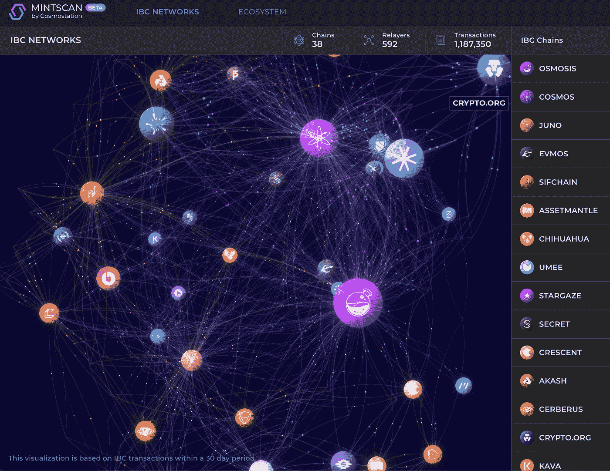

# 针对 Juno 的有用工具和应用

> 原文：<https://medium.com/coinmonks/helpful-tools-and-apps-for-juno-18b2288c2dac?source=collection_archive---------25----------------------->

# 为新应用的爆发做好准备

每个区块链都使用各种工具在各自的生态系统中导航。整个大宇宙生态系统的区块链已经标准化了其中的一些工具。正如您将在本文末尾看到的，Mintscan 是一个强大的应用程序，它在 Cosmos 的整个区块链互联网上旋转其网络。

在我研究 Mintscan 的超级有用功能之前，我想向您介绍一些其他强大的工具，它们将帮助您探索和分析 Juno 网络上的 dApps、令牌和治理活动。这个年轻的区块链的发展活动已经令人印象深刻；然而，随着新协议和 dApps 在未来几周和几个月的加入，这一活动将会加快。在新的发布吸引我们的注意力之前，没有比现在更好的时机来识别和学习如何使用这些工具了！

为了帮助您进行自己的探索和研究，我在本文下面的源代码部分准备了一个链接列表，这些链接指向这里讨论的所有工具和 dApps。在文章的最后，我还添加了一个额外的部分，带有 Juno 应用程序和有影响力的人可以关注的 Twitter 句柄。

# ATOMScan

ATOMScan 为保护 Juno 网络的验证程序提供了清晰易读的概述。一旦您选择了 Juno 区块链，点击验证器，您将看到所有 135 个活动验证器的列表。有一个按钮可以切换到那些不活动的验证器，并试图进入活动集。提供的数据包括验证者投票权、JUNO 令牌授权量和佣金百分比。选择一个特定的验证器会打开另一个页面，其中包含关于该公司的其他重要信息。

如果您也积极参与治理投票，投票页面是查看和访问所有活动的和以前的提案的最清晰的方式之一。点击一个特定的提案，会显示详细的信息，包括开始和结束时间、描述、投票百分比、更多信息的链接，甚至是按地址列出的特定投票。

ATOMScan 上另外两个很棒的工具是观察列表和赌注计算器:

*   ATOMScan 观察列表—[https://atomscan.com/myaccounts](https://atomscan.com/myaccounts)
*   ATOMScan 赌注计算器【https://atomscan.com/tools/staking-calculator 

对于那些需要为家庭成员或企业保留单独钱包，但希望将所有 JUNO 资产放在一起查看的人来说，观察列表非常有用。您只需输入您的每个 Juno 地址，单击添加到观察列表，然后选择观察列表屏幕。

我非常喜欢在 Keplr 中使用 JUNO 令牌的一个原因是钱包提供的灵活性。如果你想要求奖励并在 DeFi 中重新部署它们，将它们换成另一个令牌，或者复合它们，你可以做所有这些。ATOMScan 内置的赌注计算器真正展示了复利的威力。玩玩计算器，见证你每天、每周、每月或每年计算复利的非凡结果。

# 英联邦(由英国和其他大多数曾经隶属于大英帝国的国家组成)

我认为 Commonwealth app 是一个市政厅，一个讨论当前提案、即将到来的治理投票以及影响 Juno 网络的热门话题的地方。您可以使用您的电子邮件地址设置一个登录 ID，或者使用您现有的 Github、Discord 或 wallet ID/地址。

目前正在就二级法令的主题进行讨论。我在下面的资源部分留了一个 Juno Commonwealth 页面的链接，这样您就可以跟踪社区正在提议、讨论和辩论的内容。

# 使用 CosmosPug 的图表和空投

CosmosPug 是宇宙中的一个验证器，他们开发了一些超级有用的工具。您可以访问 25 种不同令牌的图表，包括来自 Juno 网络上 dApps 的许多令牌。

CosmosPug 还有一个很棒的空投页面，可以随时了解当前和即将在宇宙区块链进行的空投，包括 Juno dApps。

# 乔道图表

Joe DAO 在其网站上提供了令人印象深刻的 48 个价格图表。图表可以每月、每周、每天、每小时，甚至每隔五分钟查看一次。IBC 代币，以及其他一些。除了图表，JoeDAO 还在其网站上提供了一个令牌快照工具，完全建立在 DAO DAO 上，并推出了自己的 JOE 令牌。

# 使用 Bro_n_Bro 的统计数据和图表

Bro_n_Bro 也是一个验证器，可以保护宇宙中的许多区块链。它们提供了一套广泛的价格和统计仪表板，以及图表。为 JUNO 网络提供的信息包括区块链本身和 Juno 治理令牌，但也包括 Juno 上运行的 dApps 的另外 11 个令牌的图表。

# Mintscan

当你启动 Mintscan 时，你需要一点时间来调整你的眼睛，因为那里有太多的信息。然而，一旦他们被调整，提供的信息财富是非常令人满意的。除了所有的定价、交易量、市值、产生的交易量和产生的交易量信息之外，仪表板还直接链接到 JunoSwap、JunoDocs 和 Juno 的 Twitter、Medium 和 Github。

Juno 网络有一个全面的验证程序列表，每个列表都有大量数据。除了 JUNO 验证的数量、投票权百分比和收取的佣金率之外，还有正常运行时间百分比和投票参与率。在选择将您的 staked JUNO 委托给谁时，您可以在这里找到有助于您做出决定的所有信息。

有详细的页面，其中包含块处理信息、治理建议、带有价格信息的令牌以及区块链的参数参考。但是，我最喜欢的关于 Mintscan 的信息是在 IBC 继电器和智能合同页面上。

我强烈推荐在各种指数上使用存款和取款功能，当把 IBC 资产放在链上或者把它们放回到它们的本地链上时。所有的 IBC 交易都在后台处理，链间资产转移过程确实是一个了不起的工程壮举。然而，有时您必须在链之间进行手动 IBC 转移，通过 Mintscan 的 IBC 继电器页面上提供的通道信息，将链添加到 Keplr 很容易。

> 加入 Coinmonks [电报频道](https://t.me/coincodecap)和 [Youtube 频道](https://www.youtube.com/c/coinmonks/videos)了解加密交易和投资

智能合同页面也充满了有用的信息。我经常使用 Mintscan 来查找令牌合同地址，我想将这些地址添加到我的 Keplr Juno 钱包中。LP 令牌的合约地址也在此处提供，并且智能合约的长列表是可搜索的。

# 扩张和增长

随着未来几个月大量 dApps 和协议的推出，Juno 网络将变得更加繁忙。

*   Loop Finance 将其 DEX 和 NFT 市场引入 Juno 网络，并带来了大量人才，包括 Loop Ventures 团队。
*   FanFury 正在将梦幻体育引入区块链，通过日常互动、游戏化赌注和新的 Fury 令牌进行增强。
*   Leap Cosmos 团队正准备部署其漂亮的超级钱包。
*   Kado Money 正在准备其 dApp，以合理的交易成本和对易用性的关注推动新用户的采用，为菲亚特上匝道和下匝道提供多链。
*   Coinhall 表示，它将在 Juno 网络上推出，带来定价信息、图表和聚合器。
*   AquaDAO 还宣布将它的非营利组织引入 Juno 网络。
*   Loop Ventures 和 WeFund 联手将 launchpad 引入 Juno，作为更大的多链战略的一部分。
*   Spark IBC 将很快启动，为 Juno 带来社区资助活动，首批使用案例围绕教育内容和课程。
*   Howl Social 正在开发一款连锁微博应用。这个概念侧重于创作者和用户之间的互动，并带有内置的奖励元素。它将与分散式名称服务紧密结合，您的(不)NS 别名将用于在 Howl Social 上建立您的个人资料。
*   该图继续其多链扩展，跨链索引器将进入 Juno。

而且，这仅仅是一个开始，随着更多的公告不断发布，激动人心的事情越来越多。

如果您还不完全熟悉 Juno 网络，我希望这些信息对您有所帮助。我还在下面的来源部分添加了我以前关于 Juno 网络的文章的链接。我认为现在是探索区块链的好时机，趁价格低，换成一些 JUNO 和 RAW，并习惯于在令牌周围移动。USDC 已经可以在 JunoSwap 上交易了。它还可以使用 Axelar 的卫星应用程序，从 Juno 网络外部的其他协议和区块链桥接到 Juno，包括 Ethereum、Avalanche、Fantom、Moonbeam 和 Polygon。

我真的很期待接下来的几个月，迫不及待地想尝试所有这些新的 dApps，并参与协议发布。

他在门口喊——Opa。

# 资料来源、参考文献和进一步阅读

atoms can—[https://atomscan.com/juno](https://atomscan.com/juno)

英联邦朱诺号—【https://commonwealth.im/juno/ 

CosmosPug 图表—【https://cosmospug.com/charts/ 

CosmosPug 空投—[https://cosmospug.com/airdrops/](https://cosmospug.com/airdrops/)

JoeDAO 排行榜—[https://joedao.io/charts/](https://joedao.io/charts/)

Bro-n-Bro Juno 网络统计—[https://monitor.bronbro.io/d/juno-stats/juno-stats?orgId=2&刷新=5s](https://monitor.bronbro.io/d/juno-stats/juno-stats?orgId=2&refresh=5s)

Bro-n-Bro Juno 网络图—[https://monitor.bronbro.io/d/juno-graph/juno-stats-graph?orgId=2 &刷新= 10 秒](https://monitor.bronbro.io/d/juno-graph/juno-stats-graph?orgId=2&refresh=10s)

Juno 网络统计和图表上的令牌(CW20 令牌)–

[https://monitor . bron bro . io/d/Juno-cw20-stats/Juno-cw20-stats？orgId=2](https://monitor.bronbro.io/d/juno-cw20-stats/juno-cw20-stats?orgId=2)

明斯坎—[https://www.mintscan.io/juno](https://www.mintscan.io/juno)

朱诺的文件—[https://docs.junonetwork.io/juno/readme](https://docs.junonetwork.io/juno/readme)

朱诺的 Github—[https://github.com/CosmosContracts](https://github.com/CosmosContracts)

朱诺的媒介—[https://medium.com/@JunoNetwork](/@JunoNetwork)

Axelar 的卫星应用—[https://satellite.money/?source=ethereum&目的地=朱诺& asset_denom=uusdc](https://satellite.money/?source=ethereum&destination=juno&asset_denom=uusdc)

我的循环文章“了解朱诺”——【https://www.loop.markets/getting-to-know-juno/ 

我的循环文章《网赚》——【https://www.loop.markets/neta-money/ 

# Juno 网络新项目的链接

循环—[https://www.loop.markets/](https://www.loop.markets/)

粉丝狂怒—[https://fury.fan/](https://fury.fan/)

飞跃—[https://leapwallet.io/](https://leapwallet.io/)

卡多钱—[https://www.kado.money/](https://www.kado.money/)

coin hall—[https://coinhall.org/](https://coinhall.org/)

Aqua DAO — @AquaOnJuno

我们的基金—[https://wefund.app/](https://wefund.app/)

火花 IBC — @SparkIBC

嚎叫社交—@嚎叫 _ 社交

图形协议—[https://thegraph.com/en/](https://thegraph.com/en/)

# 额外收获:谁是 Juno 网络的 Twitter 关注对象

朱诺网络—@朱诺网络

C1 — @Core1_official

JunoNews — @Junonewsteam

JunoSwap — @junoswapdex

生刀—@生刀

刀刀—@刀刀

NETA DAO — @Neta_DAO

网钱—@网钱

(去)NS—@去中心化 dns

JunoTools — @junotools

积极参与 Juno 网络的开发人员、创始人、验证人员和其他有影响力的人士:

@dimiandre

@JakeHartnell

@jack_zampolin

@wolfdotjuno

@max_maxsolo

@CosmosChain

@frey_needlecast

@callum_and1

@ben2x4

@ToschDev

@gadikian

@nullMames

@JoeAbbey

@高地节点

@KevinGarrison