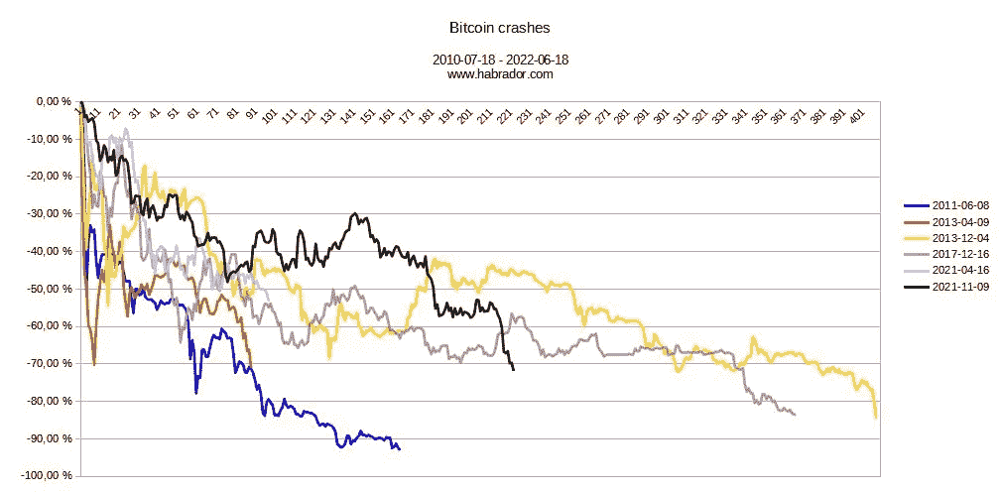

# 这是这次事故和以前事故的对比

> 原文：<https://medium.com/coinmonks/here-is-a-comparison-between-this-crash-and-previous-crashes-259cc9bcd7f5?source=collection_archive---------48----------------------->

## 这是你需要知道的。历史会重演。

[https://www.habrador.com/p/bitcoin/](https://www.habrador.com/p/bitcoin/)

假设我们跟随这个趋势，我们将看到-80%的 ATH 大约是底部，在 13800 美元左右。

免责声明:过去的业绩不能预测未来的结果。