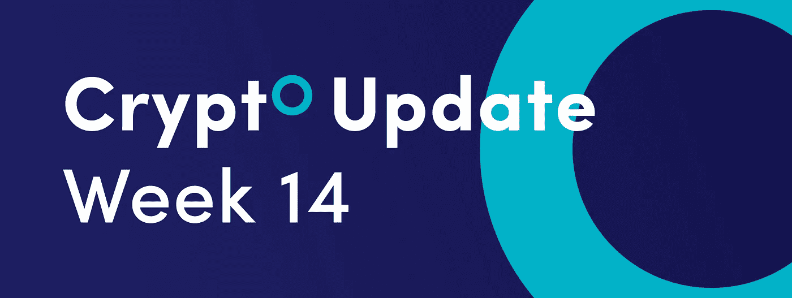
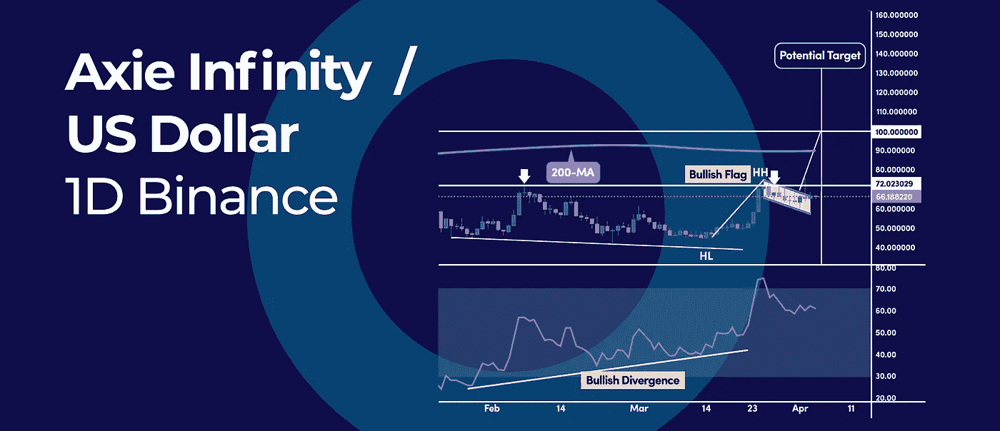
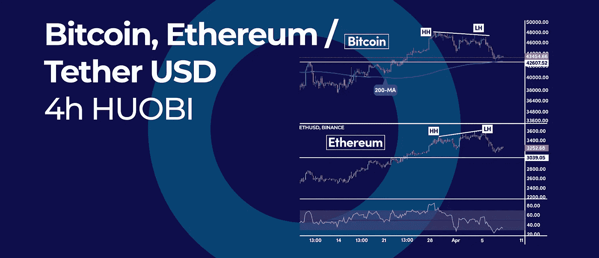
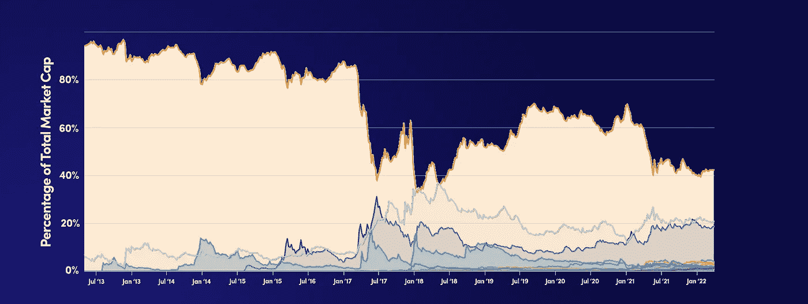
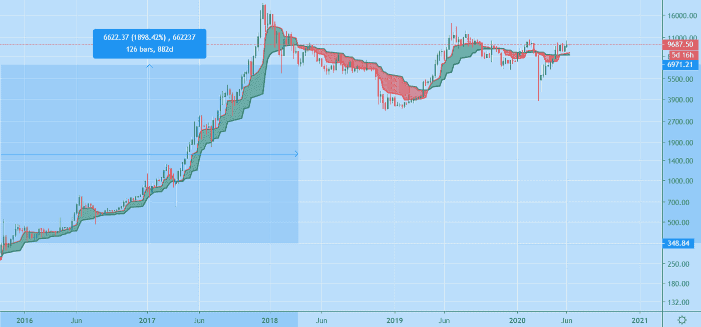
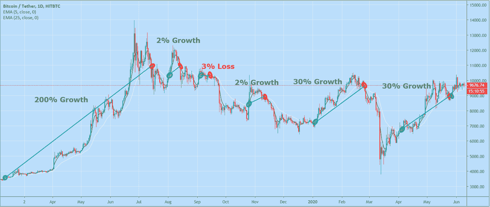
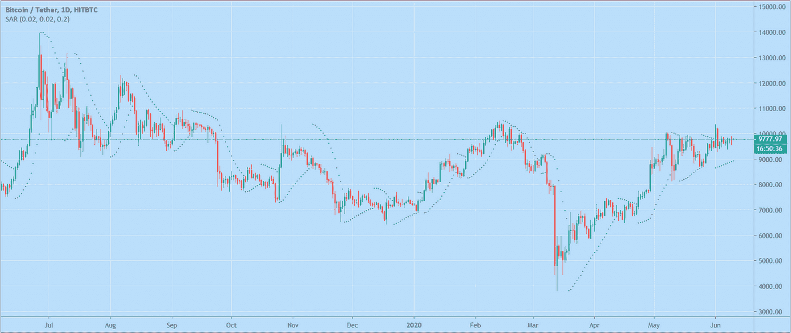

# 以下是比特币优势比率如何让你成为一个更聪明的加密交易者|以及本周的加密更新。

> 原文：<https://medium.com/coinmonks/here-is-how-bitcoin-dominance-ratio-can-make-you-a-smarter-crypto-trader-and-more-in-this-weeks-397fed247f12?source=collection_archive---------33----------------------->

*   这就是 Axie Infinity 如何再次达到 100 美元的原因
*   比特币——以太坊 SMT 背离。一个更强，一个更弱
*   以下是比特币优势比率如何让你成为更聪明的加密交易者

# 这就是 Axie Infinity 如何再次达到 100 美元的原因

Axie Infinity (AXS)有潜力达到 100 美元的大心理目标，如果目前的日线看涨旗目标得到满足。AXS 价格很有可能正在触底，因为当前的反弹是在低点发现看涨背离信号后出现的。

# AXS 看涨旗图案

看涨标志是一种延续形态，它简单地标志着持续上涨趋势的暂停，随后是持续上涨。看涨旗目标可以通过向上方投射等于极点大小的相同价格距离来获得。

在我们的例子中，衡量的移动目标正好落在 100 美元的大心理数字附近。

我们也有一个市场结构的突破，因为价格开始打印更高的高点和更高的低点，这通常会导致更高的价格。然而，从技术上讲，只要我们的交易低于关键的 200 天简单移动平均线，我们仍然处于下降趋势。因此，多头也需要清除该水平，以确认市场情绪的大规模转变。

此外，RSI 振荡指标继续保持在 50 的中间水平之上，表明当前反弹背后的看涨势头仍然存在。

# 比特币——以太坊 SMT 背离。一个更强，一个更弱

交易员使用智能资金工具(SMT)背离来确定趋势是变强还是变弱，这可能会导致市场情绪的转变。如果我们比较比特币(BTC)和以太坊(ETH)，我们可以注意到一个更强，另一个更弱。

然而，这种相关性是肉眼看不到的，因为它们似乎是一前一后移动的。

# 比特币——以太坊 SMT 背离

根据 [coinmetrics 数据](https://charts.coinmetrics.io/correlations/)，BTC-联邦理工学院的关联度为 0.89，接近历史最高水平。这意味着这两种加密货币之间存在很强的正相关关系。

SMT 背离概念可以帮助交易者发现短期价格差异。如果 BTC 和 ETH 有很强的相关性，价格应该模仿相同的价格行为。比如以太坊做更高的高点，比特币也应该这样。

然而，有时这种相关性会被打破，这正是最近发生的事情。ETH 的价格创造了更高的高点，但比特币创造了更低的高点。实际上，这意味着 ETH 比比特币更强，因此我们可以预计比特币在当前的回调中相对于 ETH 卖得更多。

# 以下是比特币优势比率如何让你成为更聪明的加密交易者

简单来说，比特币主导率衡量的是该币相对于整个加密货币市场的市值。因此，这个比率可以成为一个方便的工具，用来确定比特币(BTC)与替代币相比有多强。

# 如何利用比特币优势地位

作为加密投资者和交易者，区分 BTC 和替代硬币之间的市场条件差异是至关重要的。经验丰富的投资者已经知道，加密市场是在循环发展的。

因此，有时比特币的表现优于整体加密市场。同样，在其他时候，替代币的价格比比特币上涨得更快。

利用比特币优势的一个最简单的方法是确定 BTC 和替代币之间哪个趋势最强。如果你知道比特币的价格跑赢 altcoins 或者相反，你可以据此定位，实现利润最大化。

您需要遵循一个两步流程:

1.  确定比特币优势图表上的趋势
2.  判断比特币趋势

最后，一旦普遍偏差成立，如果 BTC 优势比率和 BTC 价格都处于上升趋势，你就买入比特币，如果它们处于下降趋势，你就卖出比特币。同样，如果 BTC 优势比率处于下降趋势，而 BTC 的价格处于上升趋势，你就买入替代硬币。同时，如果 BTC 优势比率处于上升趋势，而 BTC 的价格处于下降趋势，你就卖出替代硬币。

# 我们什么时候可以确认 BTC 或加密市场的牛市？

在加密领域，一些最常见的问题是:“我们处于上升趋势吗？”"牛市开始了吗？"。那么，我们如何确定牛市何时开始，何时结束？这就是我们将在这篇博客中探讨的内容。敬请期待最后一探究竟。

# 我们如何根据技术指标确定牛市？

识别牛市从选择正确的时间框架开始。在这种情况下，正确的时间框架是头寸交易者通常使用的，要么是 1 周，要么是 1 天。

然后，我们需要选择正确的指标。趋势跟踪指标通常是最合适的。

# 梅萨周线图

在看涨的市场条件下，台面显示为绿色的云，在看跌的市场条件下，台面显示为红色的云。这个指标应该只在试图识别主要的看涨走势(持续至少 180 天)时使用。周线图上的梅萨确定了 2015 年 10 月 26 日至 2018 年 3 月 26 日的看涨上升趋势。即使你刚刚持有这个头寸超过 882 天，你也能获得 2000%的利润。这个牛市持续了很长时间，我们不得不使用对数图来拟合下图。

像所有指标一样，这个指标并不完美。它会发出假信号，比如在 2 月 3 日到 3 月 2 日之间，如果你仅仅基于此交易，你可能会亏损。

# 5 + 25 均线日线图的交叉

日线图上 5 均线和 25 均线的交叉是识别多头和空头市场的另一个选择。该指示器对变化的反应比前一个选项更快。因此，它会在周线图上的台面之前显示牛市何时开始和结束。如下图所示，这个指标也不完美。然而，如果你在过去的一年里仅仅使用这个指标，你将会获得大约 500%的收益。所以如果你从 1000 美元开始，那么你最终会得到 1000 美元* 3 * 1.02 * 0.97 * 1.02 * 1.3 * 1.3 = 5117 美元。

# 抛物线 SAR 日线图

最后但同样重要的是，我们在日线图上有抛物线 SAR。抛物线 SAR 是本博客中所有其他选项中反应最快的。在看涨市场条件下，该指标在价格下方显示为圆点，在看跌市场条件下，在价格上方显示为圆点。这个指标可以被持仓者用作止损。这对那些使用非常依赖市场条件的策略的黄牛党来说特别有用。

# 结论

选择正确的时间框架是识别牛市的第一步。每日和每周时间框架是最常见的选择。然后你可以用趋势跟踪指标，比如台面，均线交叉，抛物线 SAR 来确定当前趋势的方向。本博客中提到的所有指标都可以在 Cryptohopper 上找到。你可以将它们添加到你的全自动策略中，以确保你只在牛市条件下交易。

订阅我们的媒体每周博客和更新。
在[推特上关注我们](https://twitter.com/cryptohopper) | [脸书](https://www.facebook.com/cryptohopper)|[Reddit](https://www.reddit.com/r/CryptoHopper/)|[insta gram](https://www.instagram.com/cryptohopper/?hl=nl)

在 [Cryptohopper](https://www.cryptohopper.com/) 开始交易！

> 加入 Coinmonks [电报频道](https://t.me/coincodecap)和 [Youtube 频道](https://www.youtube.com/c/coinmonks/videos)了解加密交易和投资

# 另外，阅读

*   [CoinFLEX 评论](https://coincodecap.com/coinflex-review) | [AEX 交易所评论](https://coincodecap.com/aex-exchange-review) | [UPbit 评论](https://coincodecap.com/upbit-review)
*   [AscendEx 保证金交易](https://coincodecap.com/ascendex-margin-trading) | [Bitfinex 赌注](https://coincodecap.com/bitfinex-staking) | [bitFlyer 评论](https://coincodecap.com/bitflyer-review)
*   [麻雀交换评论](https://coincodecap.com/sparrow-exchange-review) | [纳什交换评论](https://coincodecap.com/nash-exchange-review)
*   [支持卡审核](https://coincodecap.com/uphold-card-review) | [信任钱包 vs 元掩码](https://coincodecap.com/trust-wallet-vs-metamask)
*   [Exness 点评](https://coincodecap.com/exness-review)|[moon xbt Vs bit get Vs Bingbon](https://coincodecap.com/bingbon-vs-bitget-vs-moonxbt)