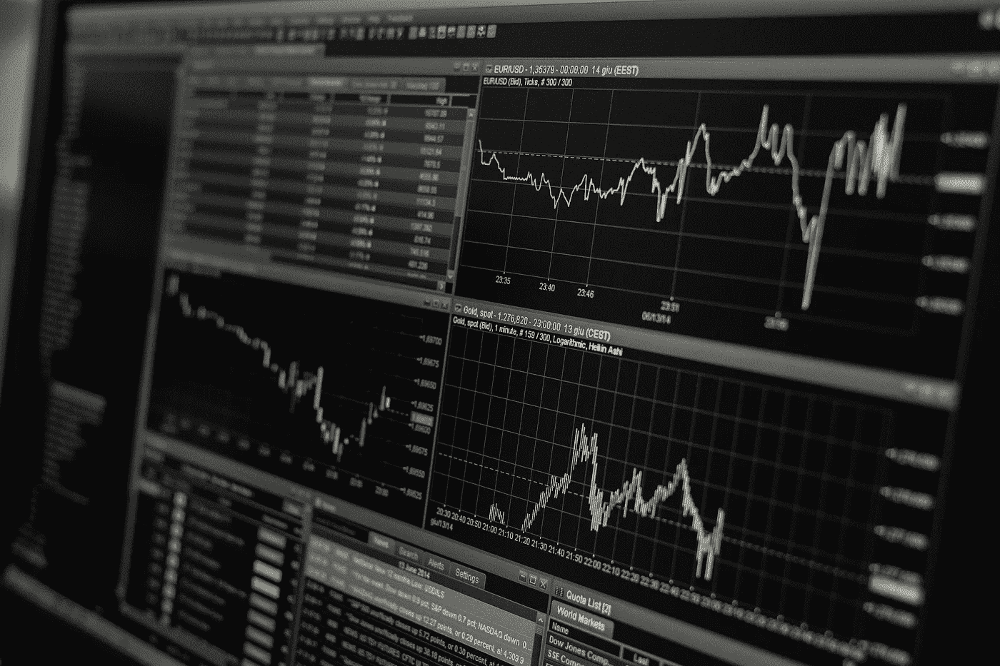

# 下面是我如何用 Python 编写多资产回溯测试器的代码

> 原文：<https://medium.com/coinmonks/here-is-how-i-coded-a-multi-asset-backtester-in-python-ff39db1751f7?source=collection_archive---------2----------------------->

Trading image by Lorenzo Cafaro from Pixabay.

# 我的规格

在我最新的文章中，我解释了我放弃之前对冲交易想法的原因。我开始列出我想要/需要改进的工作方式，寻找策略并测试它们。我想达成的主要决议如下:

*   **能够在**上回测给定的策略…