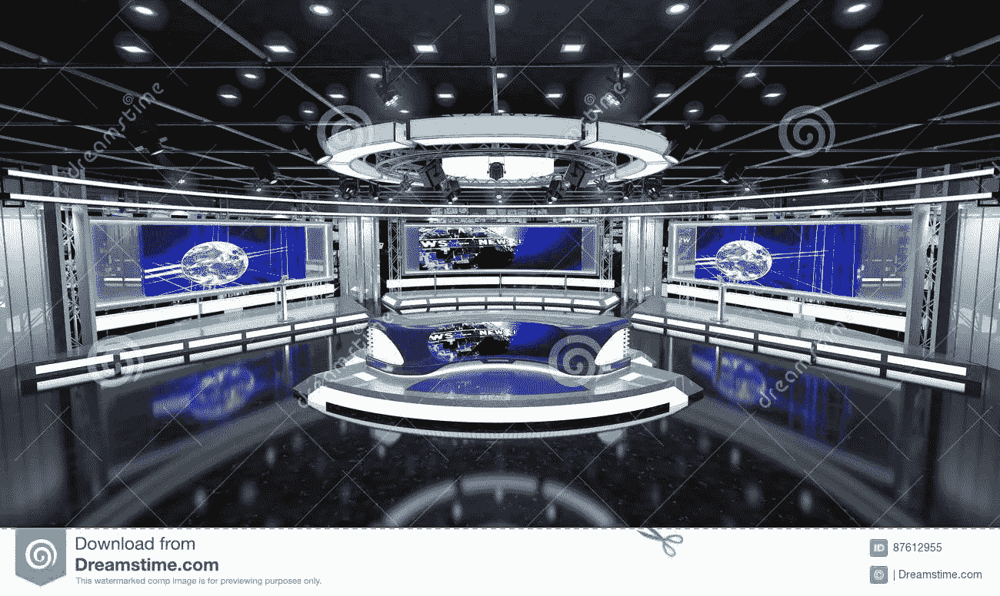

# 这是我的看法，也许你也应该这样看

> 原文：<https://medium.com/coinmonks/here-is-how-i-see-it-and-perhaps-you-should-too-b78b63ce6077?source=collection_archive---------57----------------------->

Dreamstime

我承认；这个星期我一直在努力寻找可以写的东西！坏消息(. 75%的加息)之后是更多的坏消息(汽油价格目标为每加仑 8 美元)。

当我一篇接一篇地阅读 crypto 文章时，我注意到了一个又一个解决方案。然而，当我点击链接，我发现一个接一个的营销策略。我见过绝对令人恼火的事情；他们都是…