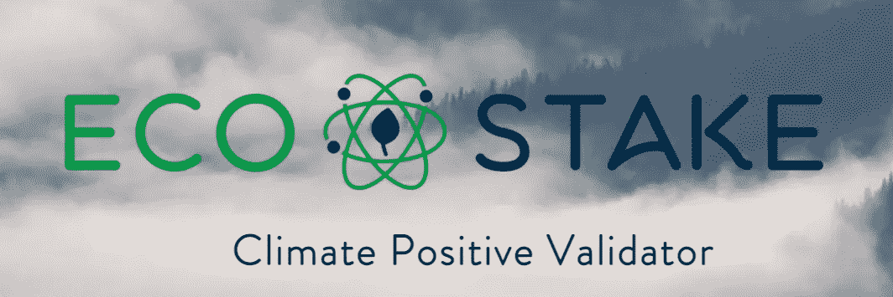
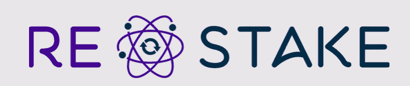
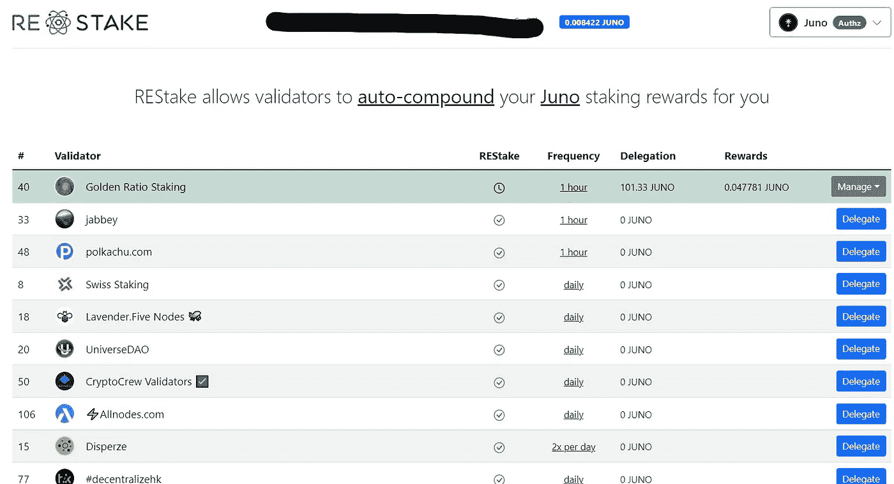
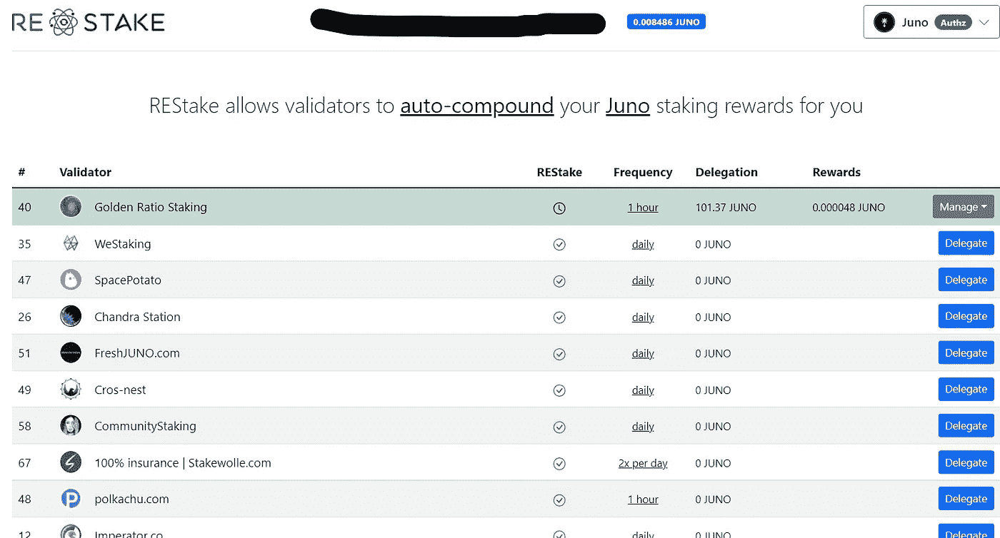
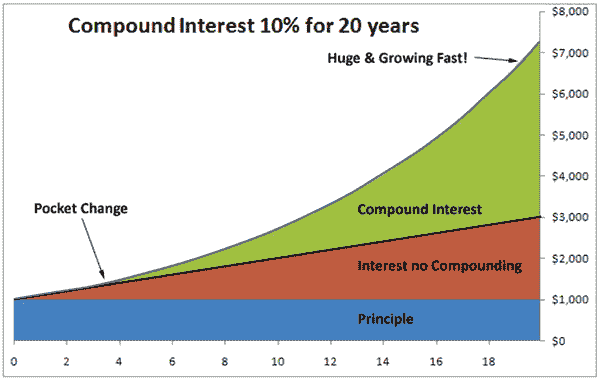
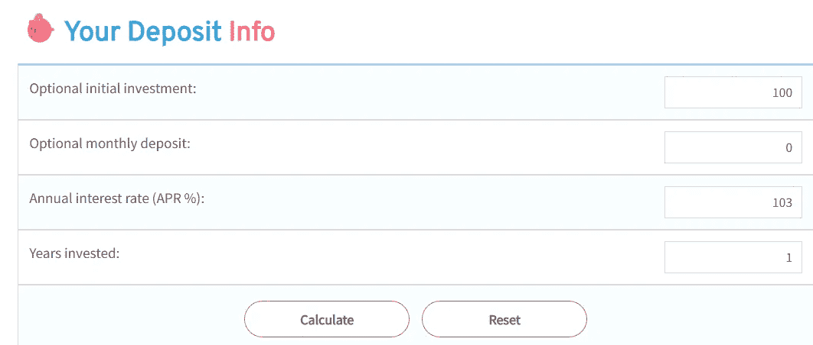
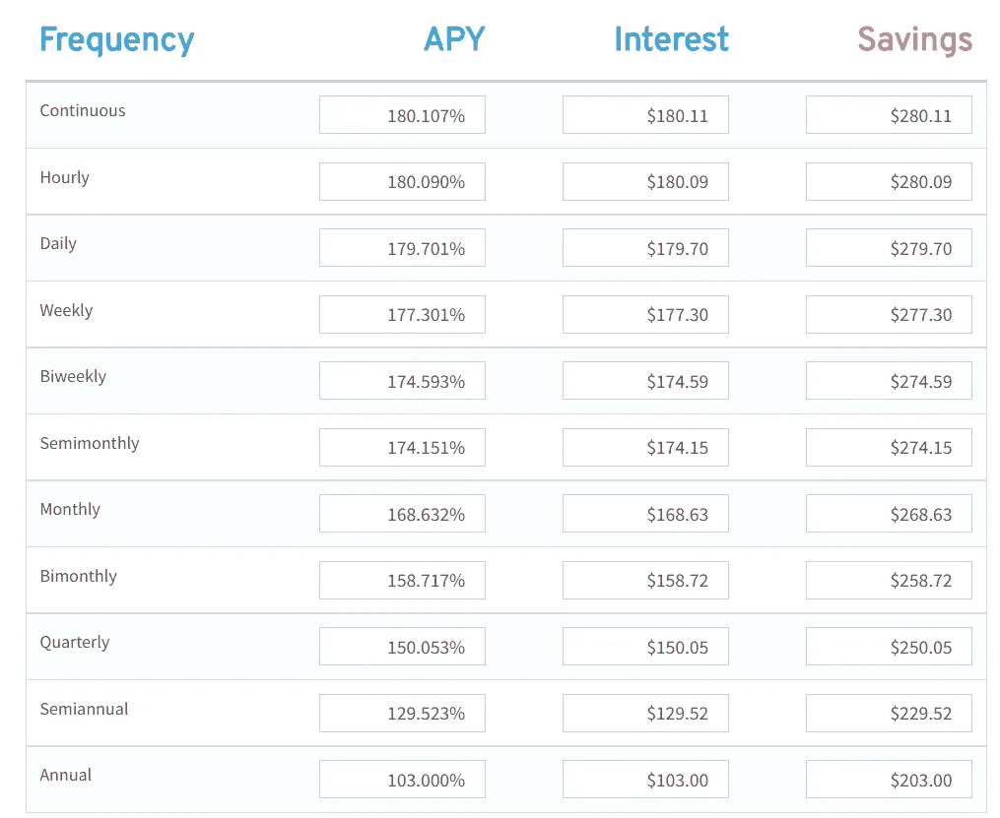
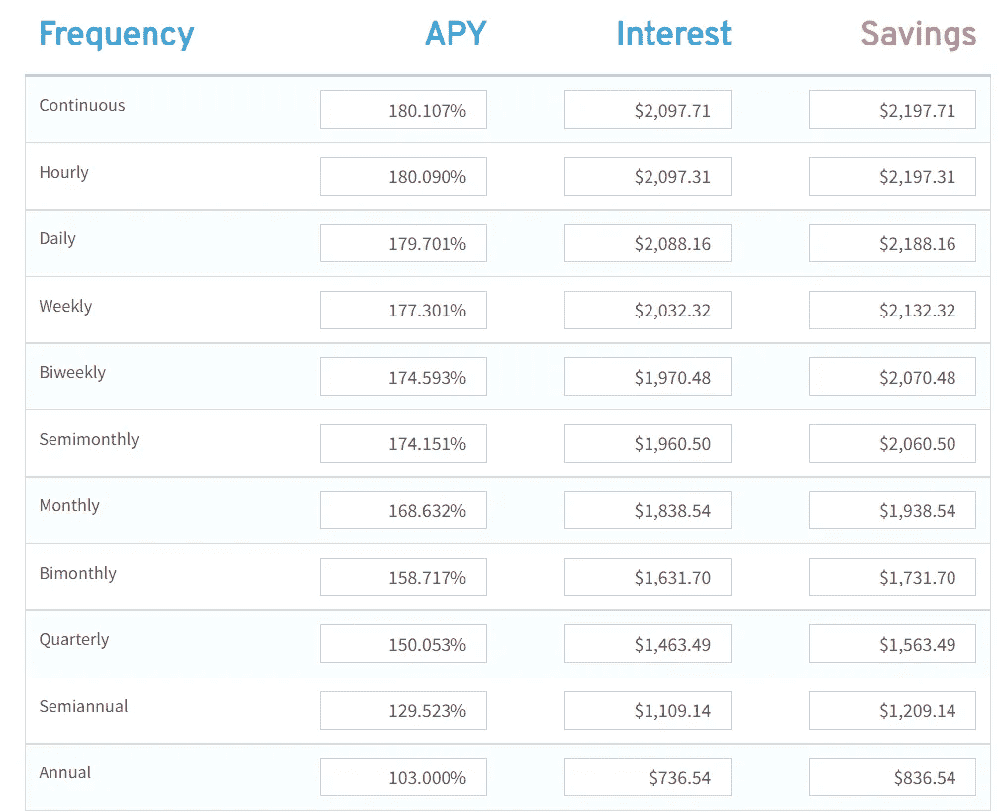

# 这是我如何在宇宙中自动合成的

> 原文：<https://medium.com/coinmonks/here-is-how-im-auto-compounding-in-the-cosmos-9f6e41945d3e?source=collection_archive---------1----------------------->

在加密货币的世界里，项目使用起来往往非常复杂，以至于限制了使用它们的人数。我认为没有多少人会在这一点上反对我。比如，我父亲是一名退休的软件开发人员，曾供职于几家知名公司。我已经教他如何使用渗透和 Keplr 钱包，但他仍然有一个偶然的问题，他需要我的帮助。他知道自己想做什么，但就是不知道如何去做，而这是来自一个有很强计算机背景的人。具体来说，他的问题源于申请/重新下注奖励流程。对于我的所有 Cosmos 生态系统用户，你知道申领和重新下注你的赌注奖励的麻烦是耗时和重复的。这已经成为我日常生活的一部分。每天东部时间下午 1 点 15 分(UTC 下午 5 点 15 分)，我登录 Osmosis，领取每日奖励。我收集流动性池奖励以及赌注奖励。流动性池奖励会立即支付出去，我可以下注、交易它们，或者将它们添加回流动性池。赌注奖励需要一点额外的步骤。在我可以拥有代币并重新投资赌注奖励之前，我必须申请奖励并批准交易，然后如果我决定下注奖励，我必须进行新的交易并批准它。每个事务需要几秒钟的时间，并且通常需要在每个步骤之后“刷新”页面。更不用说，你必须不断地保留一些代币来支付汽油费，如果你用完了，这很快就会变得令人沮丧，因为你可能需要增加 IBC 转移。将这一步做几个区块链，然后每天都这样做，你会很快意识到这是一种折磨。更不用说，也许你有义务或者你没有权限使用你的手机/电脑。令人欣慰的是，有一个宇宙生态系统验证器，使这一过程变得一点也不麻烦！

[https://www.ecostake.com/](https://www.ecostake.com/)

**方便**

大家向“生态木桩”问好！ECO stake 是宇宙中的一个验证器，为 Osmosis、Akash、Dig、Chihuahua、Dig 和 Nomic 提供节点。ECO Stake 不仅允许您代表赌注奖励，还非常注重帮助改善气候。“通过与 Ecologi.com 合作，我们抵消了我们的全部碳足迹，并为全球气候危机解决方案提供了资金支持。我们还帮助种植了成千上万棵树。在这里查看我们的[虚拟森林](https://ecologi.com/ecostake)！”就我个人而言，我玩了一下这个网站，很高兴看到他们对改善环境的直接影响。去看看！他们不仅改善了环境，还通过一款名为“ [REstake](https://restake.app/osmosis) ”的应用改善了宇宙。

对于任何想要创造最大收益的自由体验的人来说，REstake 是必备的。重新下注允许您自动申领和重新下注代币。REstake 可以用于所有主要的 Cosmos 项目，只有少数项目不兼容。必须为每个链手动操作的日子已经过去了！更不用说，你再也不用支付交易费用了！“REStake 利用了 Cosmos chains 的一个名为 Authz 的新功能，该功能将随着 chains 的更新而逐步推出。您首先授权 REStake 验证程序代表您发送委托和索赔事务。然后，验证程序会定期运行一个脚本来检查未决奖励，并为您执行索赔和委托 TX”。值得注意的是，目前并不是所有的验证器都允许使用 ReStake，但是 REstake 是开源的，所以所有的验证器都有能力使用它。让我们看一个我自己用的例子。我拥有的密码之一是朱诺。我最喜欢的验证器之一是[黄金比例赌注](https://medium.com/u/8e96c9751927?source=post_page-----9f6e41945d3e--------------------------------)，谢天谢地，他们使用了 REstake。黄金比例每小时整点重新下注我的代币。这是晚上 7 点 59 分的截图。

以下是晚上 8:02 的截图:

04 Juno 被认领并重新下注，我这边无需任何交易。唯一花费的时间是一次性设置交易。要设置这一点，我所要做的就是委托给黄金比例，然后在应用程序上启用重新开始。现在，在接下来的一年里，我不需要做任何事情来最大化我的收益！不再需要耐心等待奖励支付，不再需要交易费，不再令人头疼！

**复利的力量**

在宇宙中，复合的频率产生了巨大的差异。让我告诉你为什么我喜欢使用 REstake。对于 Juno 而言，目前的固定令牌年利率约为 103%。这意味着，如果我今天下注 100 个 Juno 代币，假设我不在下注金额中添加任何额外代币且 APR 保持不变，我将在 365 天内获得 203 个代币(赢得 103 个代币)。让我们看看一系列不同的复利频率和不同的收益率。

以下是参数:

[https://pigly.com/savings/compound-interest.php](https://pigly.com/savings/compound-interest.php)

以下是不同的复合频率:

[https://pigly.com/savings/compound-interest.php](https://pigly.com/savings/compound-interest.php)

如果我一年只复利一次，我赚 103 代币利润，但是如果我每小时复利一次，我赚 180 代币利润。多了 77 个代币。那也只是一年。如果你从图表中推断，赚取的利息差异会更大。此外，这不能低估，你将节省大量的时间，并削减交易费用。

如果您将参数从 1 年更改为 3 年，则图表如下:

[https://pigly.com/savings/compound-interest.php](https://pigly.com/savings/compound-interest.php)

这些图表应该会让你想要停止你现在正在做的事情，并确保你尽可能多的复利。REstake 允许你自动设定你的复利。

总之，ECO Stake 帮助改变了一个平凡的、重复的、耗时的过程，他们把它变成了一个“设置好就忘了”的协议。花 2 分钟来设置 REstake，你将为自己节省大量的时间和头痛。喜欢并理解复利的人喜欢这个特性，很可能你也会喜欢。

在我的上一篇文章中，我提到了一个更新的平台，叫做 [NewsCrypto.io](https://newscrypto.io/) 。我写了我是如何参加他们的免费学院课程的，我很自豪地宣布，我已经完成了所有这些课程。每堂课都是教育性和简单性的完美结合，而且在每一节的结尾都有小测验，以确保我掌握了所有我读过的内容。我最喜欢的部分是关注 DeFi 和理解交易模式。几天之内，我就用在这些课上学到的知识来识别成功的交易！作为一个多年投资的人，我能学到这么多意味着如果你是新手，你也会学到很多！我喜欢学习我热爱的事情，我沉迷于让自己变得更好。在完成了学院的课程后，我为自己完成了这些课程而感到自豪，并且很高兴知道这是值得的。爱学就去看看吧！

**免责声明:**我与本文中提到的任何验证器或应用程序都没有付费关系。这不是财务建议。

https://restake.app/osmosis**REstake App**:

**生态股份:**[https://www.ecostake.com/](https://www.ecostake.com/)

**生态股份环境影响:**[https://ecologi.com/ecostake](https://ecologi.com/ecostake)

**复利计算器:**[https://pigly.com/savings/compound-interest.php](https://pigly.com/savings/compound-interest.php)

个人:

**【https://twitter.com/WarrenFeldman3】推特:** [推特](https://twitter.com/WarrenFeldman3)

***电子邮件*:**warrenfeldman92@gmail.com

***news crypto . io*:https://app.newscrypto.io/unchained-education/WarrenF92**

***Instagram***:[https://www.instagram.com/warren_feldman/](https://www.instagram.com/warren_feldman/)

> 加入 Coinmonks [电报频道](https://t.me/coincodecap)和 [Youtube 频道](https://www.youtube.com/c/coinmonks/videos)了解加密交易和投资

# 另外，阅读

*   [什么是保证金交易](https://coincodecap.com/margin-trading) | [美元成本平均法](https://coincodecap.com/dca)
*   [支持卡审核](https://coincodecap.com/uphold-card-review) | [信任钱包 vs MetaMask](https://coincodecap.com/trust-wallet-vs-metamask)
*   [Exness 回顾](https://coincodecap.com/exness-review)|[moon xbt Vs bit get Vs Bingbon](https://coincodecap.com/bingbon-vs-bitget-vs-moonxbt)
*   [如何开始用加密贷款赚取被动收入](https://coincodecap.com/passive-income-crypto-lending)
*   [BigONE 交易所评论](/coinmonks/bigone-exchange-review-64705d85a1d4) | [电网交易机器人](https://coincodecap.com/grid-trading)
*   [氹欞侊贸易评论](https://coincodecap.com/anny-trade-review) | [货币现场评论](https://coincodecap.com/coinspot-review)