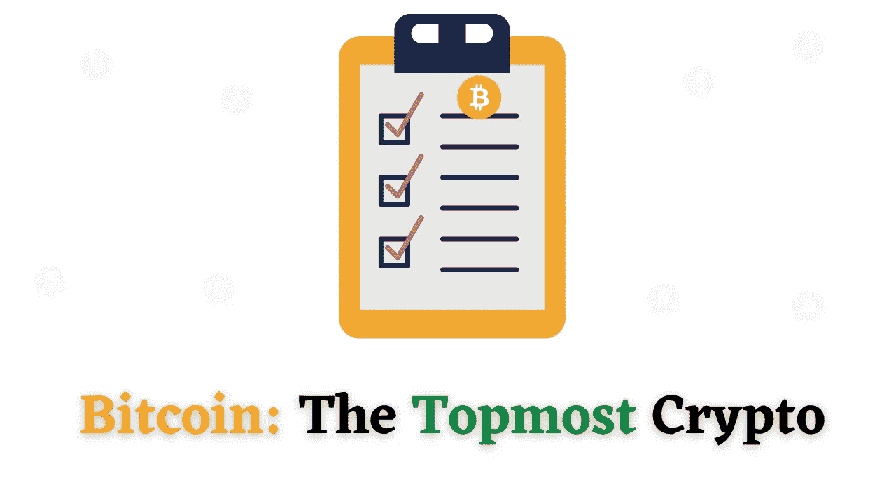

# 这就是为什么比特币在最受欢迎的密码中排名第一

> 原文：<https://medium.com/coinmonks/here-is-why-bitcoin-ranks-the-top-of-the-list-of-popular-cryptos-2c485c549761?source=collection_archive---------15----------------------->

Bitcoin

比特币的价值已经“超越指数级”增长。

这是在过去几个月令人难以置信的太空火箭之旅后发生的。

比特币具有相当高的价格潜力。

然而，达到并保持这一水平需要数年时间。

这笔钱将需要在相当大比例的交易中被更广泛地拥有和使用。

可扩展性是比特币相对于其他加密领域的一个优势。

它比其他的膨胀得更快。“这表明，目前比特币是明显的赢家。

[**新创造的**](https://bitcoin-code.live/) 方法是未来的现象，或是加密货币市场的“下一件大事”。

它已经到来，并正积极试图改变我们过去一个世纪所熟知的全球金融模式。

这是从货币形式到货币形式的唯一自然步骤。

加密货币是独立于银行和政府运行的虚拟货币，但可以像传统货币一样进行交换或赌博。

2009 年首次亮相的比特币是第一种去中心化的加密货币。

# 为什么选择比特币交易？

以下是你应该计划开始比特币交易的几个原因-

# 1.完全匿名

利用比特币技术保持匿名的能力可以防范网络盗窃。

因为交易和账户与现实世界的身份无关，所以你可以利用这种技术来隐藏你的身份。

即使交易的细节可以被仔细审查，确定某人是谁也是困难的。

比特币将被接收或发送到只有 30 个字符链的地址。

# 2.市场声誉

比特币的价值近年来有所上升，尽管它的应用程序比许多年轻的竞争对手少，但它仍然是市值最大的加密货币。

这表明比特币定价仍然受到声誉的影响。

# 3.没有中间人或中介

如果您使用银行系统，一些门卫会禁止您完成交易。

没有中间人。

任何拥有自由软件的人都可以用这种方法接收和传输比特币。你必须为自己负责。

# 4.增强的安全保障

侵入你的比特币账户几乎很难。

一个加密方案保护它的钱。

只有私人密钥的所有者可以发送比特币。

很难破解该地址，因为它是用强加密和大整数创建的。

# 5.没有外部监管

没有人能控制比特币网络，因为个人或组织并不拥有它。

比特币由全球所有比特币用户管理。

全球各种开发者全力以赴，提升整体比特币软件；他们不能改变比特币协议。

比特币的所有用户都可以自由使用任何兼容的软件和版本。

这里需要注意的是，只有所有用户都同意某些重要的考虑因素，比特币才能正常运行。

# 6.向所有人开放交易

越来越多的公司和个人正在使用比特币。

这包括传统公司，如餐馆、住宅、法律事务所，以及知名的互联网服务，如 Namecheap 和 Overstock.com。

虽然比特币仍然是一个相对年轻的现象，但它正在迅速扩张。

所有比特币的总价值已超过 1000 亿美元，因为全球每天都有数百万美元的比特币被处理。

# 7.便捷的支付选项

比特币支付比使用借记卡或信用卡支付更简单。

就像信用卡一样，比特币被许多企业接受，不需要商家账户。

付款是通过各种钱包进行的，比如苹果支付(Apple Pay)或你电脑或智能手机上的 Gpay。

你只需要收件人的地址和金额。

# 结论

比特币的流行日复一日，因为它不需要信任。

比特币是去中心化的开源货币，任何人都可以使用。

因此，地球上任何地方的任何开发者都可以验证比特币的工作原理。

任何人都可以实时检查所有交易和产生的比特币。

所有的支付都可以在没有第三方参与的情况下进行，并且该系统受到类似于网上银行所使用的同行评审加密程序的保护。

比特币不受任何组织或个人控制，使其网络安全。

*最初发表于*【https://www.nigeriabitcoincommunity.com】

> *加入 Coinmonks [电报频道](https://t.me/coincodecap)和 [Youtube 频道](https://www.youtube.com/c/coinmonks/videos)了解加密交易和投资*

# *另外，阅读*

*   *[SmithBot 评论](https://coincodecap.com/smithbot-review) | [4 款最佳免费开源交易机器人](https://coincodecap.com/free-open-source-trading-bots)*
*   *[比特币基地僵尸工具](/coinmonks/coinbase-bots-ac6359e897f3) | [AscendEX 审查](/coinmonks/ascendex-review-53e829cf75fa) | [OKEx 交易僵尸工具](/coinmonks/okex-trading-bots-234920f61e60)*
*   *[如何在印度购买比特币？](/coinmonks/buy-bitcoin-in-india-feb50ddfef94) | [瓦济克斯评论](/coinmonks/wazirx-review-5c811b074f5b)*
*   *[隐翅虫替代品](/coinmonks/cryptohopper-alternatives-d67287b16d27) | [HitBTC 审查](/coinmonks/hitbtc-review-c5143c5d53c2)*
*   *[CBET 点评](https://coincodecap.com/cbet-casino-review) | [库币 vs 比特币基地](https://coincodecap.com/kucoin-vs-coinbase)*
*   *[折叠 App 审核](https://coincodecap.com/fold-app-review) | [Kucoin 交易机器人](/coinmonks/kucoin-trading-bot-automate-your-trades-8cf0ca2138e0) | [Probit 审核](https://coincodecap.com/probit-review)*
*   *[如何匿名购买比特币](https://coincodecap.com/buy-bitcoin-anonymously) | [比特币现金钱包](https://coincodecap.com/bitcoin-cash-wallets)*