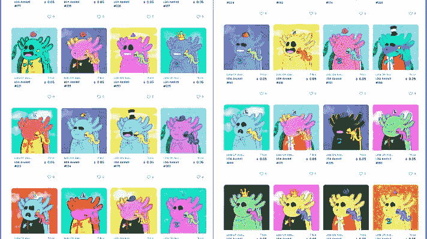
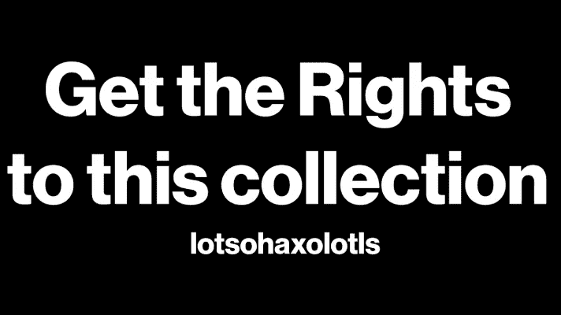
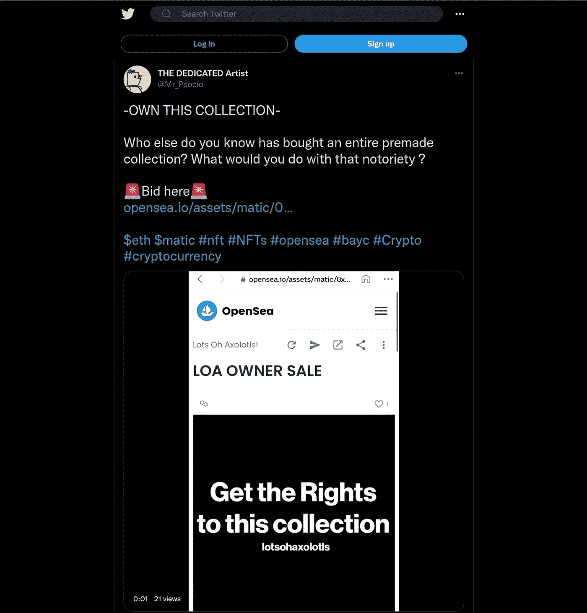

# 这是一个购买 NFT 系列知识产权的机会

> 原文：<https://medium.com/coinmonks/heres-an-opportunity-buy-the-ip-to-this-nft-collection-87ab4326c11b?source=collection_archive---------38----------------------->

## 是什么导致这个收藏所有者出售版权，为什么创作者说他“看不到自己继续”支持这个项目。

就在上周， [Lotsohaxolotls](https://opensea.io/collection/lotsohaxolotls?search[sortAscending]=true&search[sortBy]=PRICE) 和 [Ruggable Degens](https://www.ruggabledegens.xyz/) 都是 NFT 的两个孩子[,](https://twitter.com/Mr_Psocio)满怀信心地出生了。现在，他们中的一个需要一个新教练来带领他们更上一层楼。

尽管是由同一个创造者创造的，他们有两种不同的创造和推广方式。虽然 Lotsohaxolotls 最初是使用以太坊的姐妹链 Polygon 创建的，并使用更复杂的社交媒体进行营销。有些事情从根本上不同于为什么 Ruggable Degens 以更少的方式飙升，甚至能够创造一个硬币来补充 NFT 项目。

具有讽刺意味的是，更擅长营销的人并没有离开鸟巢，现在@TheDedicatedArtist 正在把 Lotsohaxolotls 的版权卖给出价最高的人。

## 两个神童

Lotsohaxolotls 创建于 2021 年 9 月。总共供应 500 种独特的非功能性食物。在多边形网络上列出 0.05 ETH。这个项目的目标是，至少在匆忙制作的 nft 系列中，制作一个看起来不错的 PFP 系列。

Lotsohaxolotls 很快成为一个充满激情的项目，@TheDedicatedArtist 将创建一个 [Tiktok](https://vm.tiktok.com/ZTdyaejs8/) 、[推特](https://mobile.twitter.com/lotsohaxolotls)、网站、广告、赠品等等，只是为了推广这个系列。一些人真的开始对这个项目感兴趣了。但很少销售进来，只有导致收集看到 0.01 ETH 交易。

这种表现被相对成功的广告蒙上了阴影。

Ruggable Degens 很快成为 Avax 区块链的热门人物。第一家[德根在新年(2022 年)时在 Kalao](https://marketplace.kalao.io/collection/0xcc7c6efd2409d10e88b971e930c1036b119c5c02) 上市，很快在第一个月内就有近 10 家 Avax 上市。

大部分收益被重新投资到尽快让更多的德根上市上。他们在某种程度上成为了 Avax 链上的一个迷因，代表了区块链上最堕落的人。

Ruggable Degens 更新更快，价格更低，是 Kalao 首批认证系列之一，给了它一个全新的开始。此外，在不和谐聊天中支持的人有助于传播退化的非功能性营养不良的好消息。

但是对于一些持有者来说，能够收到一个名为 RugDust 的可折叠的德根斯[令牌是这个项目的一个很酷的补充。根据](https://traderjoexyz.com/trade?inputCurrency=0xa2869a58cec44993a7fb5631b8d8215ee1c474a1&outputCurrency=0xb31f66aa3c1e785363f0875a1b74e27b85fd66c7#/) [Ruggable Degens 网站](http://ruggabledegens.xyz)，其被制作成:

> 用于 Ruggable Degens 项目的扩展。无论是奖励、交易、赌注、流动性等等。它将在未来的 RDs 项目中使用，并将为 NFTs 提供流动功能。

至于这些功能何时实现还不知道，但对于这个系列的未来来说，这仍然是一件乐观的事情。

但是所有这些成功都给 Lotsohaxolotls 留下了一丝失望，这也是为什么@TheDedicatedArt 要出售该系列的版权。

## 为什么要出售版权？

在@TheDedicatedArtist 关于他更个人化的 tiktok 的最新视频中，他说:

> 很遗憾地说，当你制作了一个 NFT 系列，却没有推动它的动力时，你可能会看到它在另一个人手中做得更好。

不仅如此，他还继续陈述他是如何相信这一点的:

> 可能会改变我们所知道的 OpenSea 的政策。

因为这不是商业收购，而是从一个所有者到另一个所有者[的大规模资产转让，这符合 Openseas 政策的指导方针。但是，即使在**crypto punk**和 **Meebits** 被**宇迦实验室促成的情况下，**这也是在个人规模上出售权利的拍卖，如果 NFT 的收购成为常态，为什么不从像](https://opensea.io/assets/matic/0x2953399124f0cbb46d2cbacd8a89cf0599974963/61345819045959120112620761527807528736424525991600659272989488910424539660289) [Lotsohaxolotls 这样已经建立的创作开始呢？](https://opensea.io/assets/matic/0x2953399124f0cbb46d2cbacd8a89cf0599974963/61345819045959120112620761527807528736424525991600659272989488910424539660289)

## 下一阶段

@TheDedicatedArtist 在新的“权利”上声明，NFT 将使车主能够:

*   作为合作者添加到此页面。在那里他们可以将支付钱包地址更改为他们自己的地址。
*   基本上拥有、营销或增强这个项目的能力。
*   创作者不得干涉项目的新努力。

《NFT》还列出了 NFT 所有权没有授予的几项规定:

*   公司实体或所有权中的股份、股份或证券。
*   回报的承诺。
*   转移社会句柄或相关网站或域名。
*   项目、合伙或证券中的利益。

尽管@TheDedicatedArtist 可能会出售他的系列 Lotsohaxolotls 的版权，但他仍在尝试并坚持在 Avax 上创作可皱德根和不同的产品，以及特定链上和链下的产品。

他愿意看看另一个创意者会对他的收藏做些什么，以及他们能做到什么程度。

> 加入 Coinmonks [电报频道](https://t.me/coincodecap)和 [Youtube 频道](https://www.youtube.com/c/coinmonks/videos)了解加密交易和投资

# 另外，阅读

*   [Bookmap 评论](https://coincodecap.com/bookmap-review-2021-best-trading-software) | [美国 5 大最佳加密交易所](https://coincodecap.com/crypto-exchange-usa)
*   最佳加密[硬件钱包](/coinmonks/hardware-wallets-dfa1211730c6) | [Bitbns 评论](/coinmonks/bitbns-review-38256a07e161)
*   [新加坡十大最佳加密交易所](https://coincodecap.com/crypto-exchange-in-singapore) | [收购 AXS](https://coincodecap.com/buy-axs-token)
*   [红狗赌场评论](https://coincodecap.com/red-dog-casino-review) | [Swyftx 评论](https://coincodecap.com/swyftx-review) | [CoinGate 评论](https://coincodecap.com/coingate-review)
*   [投资印度的最佳加密软件](https://coincodecap.com/best-crypto-to-invest-in-india-in-2021)|[WazirX P2P](https://coincodecap.com/wazirx-p2p)|[Hi Dollar Review](https://coincodecap.com/hi-dollar-review)