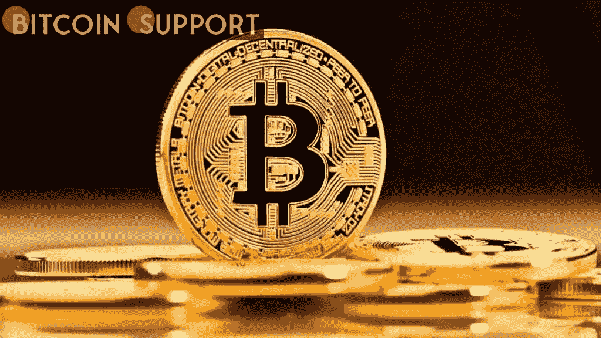

# 以下是比特币如何达到 50000 美元的

> 原文：<https://medium.com/coinmonks/heres-how-bitcoin-could-achieve-50-000-64a5c80fb66e?source=collection_archive---------84----------------------->

**Visit our website:-** [**https://bitcoinsupports.com/**](https://bitcoinsupports.com/)

根据 IntoTheBlock 的统计，比特币升至 47，000 美元以上并不一定意味着第一种加密货币正在走向 50，000 美元，因为它前面至少有两个大的阻力点。

**比特币即将面临的阻力**

根据 IntoTheBlock 开发的资金进出价格指标，比特币目前正在一个关键阻力位附近盘整，该阻力位阻止加密货币突破 48270 美元的阻力位。

[https://twitter.com/intotheblock/status/1508466430525808641](https://twitter.com/intotheblock/status/1508466430525808641)

49620 美元起的区间，其中近 150 万地址建仓，将是 50000 美元之前的下一个关口。总成交量 116 万 BTC，显示区间远小于 47，796 美元-49，211 美元阻力区。

最真实的阻力位仍然大幅高于最近的支撑位，根据指标显示为 46312 美元。

**为什么 IOMAP 支持比特币？**

虽然该指标不能用来精确定位阻力位或支撑位，但围绕某一特定价格的资金集中度信息可能会为交易者提供资产可能移动速度的指示。

交易者利用该指标所做的预测是基于持有人的心理；长期亏损的交易者倾向于在进场时卖掉或处理掉他们的资产，以便在资产因为任何原因回撤时减少损失。

在提供的示例中，47，796 美元到 49，211 美元的范围包含大约 240 万个地址，这些地址开立了价值近 120 万 BTC 的头寸，这意味着当第一种加密货币进入该区域时，集中在该范围内的部分资金可能会被出售，从而对资产价格造成巨大压力。

**访问我们的网站:-**[**https://bitcoinsupports.com/**](https://bitcoinsupports.com/)

**免责声明:以上为作者观点，不应视为投资建议。读者应该自己做研究。**

> 加入 Coinmonks [电报频道](https://t.me/coincodecap)和 [Youtube 频道](https://www.youtube.com/c/coinmonks/videos)了解加密交易和投资

# 另外，阅读

*   [WazirX vs coin dcx vs bit bns](/coinmonks/wazirx-vs-coindcx-vs-bitbns-149f4f19a2f1)|[block fi vs coin loan vs Nexo](/coinmonks/blockfi-vs-coinloan-vs-nexo-cb624635230d)
*   [本地比特币审核](/coinmonks/localbitcoins-review-6cc001c6ed56) | [加密货币储蓄账户](https://coincodecap.com/cryptocurrency-savings-accounts)
*   [什么是融资融券交易](https://coincodecap.com/margin-trading) | [成本平均法](https://coincodecap.com/dca)
*   [支持卡审核](https://coincodecap.com/uphold-card-review) | [信任钱包 vs 元掩码](https://coincodecap.com/trust-wallet-vs-metamask)
*   [Exness 回顾](https://coincodecap.com/exness-review)|[moon xbt Vs bit get Vs Bingbon](https://coincodecap.com/bingbon-vs-bitget-vs-moonxbt)