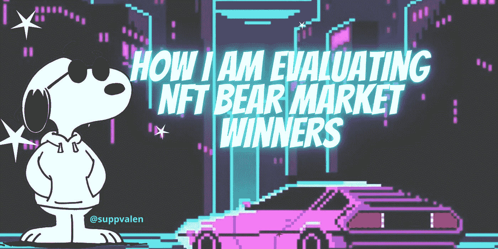

# 以下是我对 NFT 熊市中可能的赢家的评估

> 原文：<https://medium.com/coinmonks/heres-how-i-m-evaluating-possible-nft-bear-market-winners-7ea94c0ab2ab?source=collection_archive---------21----------------------->

所以…过去的几个月，尤其是最近几周，是疯狂的，可怕的，糟糕的。目前的市场状况显然不好，但是，我仍然相信 crypto 和 NFTs 的未来，我相信它的技术。

如果你想知道除了艺术市场之外，NFT 的其他可能的使用案例，请随意阅读我关于这个主题的帖子:

关于熊市和非上市公司的一个有趣的事实是，即使在低迷时期，非上市公司也可能有/曾经有过泵，而且在许多情况下，保持着较高的交易量。NFT 熊市比一般的加密熊市要短。然而，由于我们无法控制的大事情正在发生(通货膨胀、经济衰退、汽油价格等)，你应该总是计算你的风险，永远不要投资超过你能承受的损失。

一些 NFT 项目将在下一轮牛市中达到令人难以置信的价格。

有些不会。

以下是我个人对熊市赢家的评价:

今天，我将重点介绍:

1)资金管理

2)实用性和创新性

4)团队

5)收入的外部收入

6)分析

让我们开始吧！

> 交易新手？试试[密码交易机器人](/coinmonks/crypto-trading-bot-c2ffce8acb2a)或者[复制交易](/coinmonks/top-10-crypto-copy-trading-platforms-for-beginners-d0c37c7d698c)

1.  **资金管理**

项目金库中的资本通常用于项目改进，例如(招聘、营销、为品牌发展的新想法提供资金等)。在艰难的熊市时期，项目国债的资本更难保存。然而，如果一个团队为这样的情况做好了准备，并且他们有资金管理和保存策略，那就是一个巨大的绿色信号。这向你展示了这个团队是负责任的，有能力的，并且会尽力保护首都。

国债应该多样化，这意味着资金不应该仅仅是他们的本地代币或连锁代币，因为那是非常非常危险的。

**2。效用和创新**

在我的文章中，我写了一些项目所做的创新性的事情。这个领域总是在寻找创新者和建设者，他们试图提供他们承诺的最好的产品/服务/东西。在分析好的潜在项目时，你要问自己的是:

*他们的做法有什么不同？替换它们很容易吗？*

当一个项目正在做一些好的、不同的、高度功能化的、有前途的事情时，它是很难被取代的。寻找那些总是尽力改进和提供最佳产品的创新者！

索尔 NFT 领域创新者的一个很好的例子是 Blocksmith 实验室。

**3。团队**

一些团队绿色旗帜是:

1.  交际(并不意味着他们应该 24/7 不和谐，但不要去极端沉默。不放弃熊市的建筑商)
2.  他们**已经证明**能够兑现他们在**(实干家 vs 空谈家)**之前承诺的事情
3.  在熊市期间仍在培养/参与的有能力的人

**4。收入的外部收入**

没有很多人谈论这一点，但如果一个项目有成为一个巨大品牌的伟大梦想，它就不能仅仅依靠版税。那些希望投资品牌以获得更多收入来源的项目是一个巨大的绿色信号。

更多的收入来源有助于:

—保护和增加美国国债(尤其是在艰难的熊市时期)

—增加项目的可持续性

—表明团队在整体计划中有长期计划

—邀请新人加入该领域，并有助于大规模采用(实施外部收入也将带来*外部*人员)

我肯定会关注那些希望为他们公司增加外部收入的项目。

5.**分析**

通过分析市场，看看哪些项目在这次熊市中表现良好，你可以获得巨大的优势。我曾经通过分析做出过好的决定并获利。以下是我在 **$SOL** 上为项目/一般市场分析推荐的一些数据工具:

1.  [https://solanafloor.com/](https://solanafloor.com/)(伟大的统计。有些是付费功能，但相信我，免费功能是好的)
2.  [https://moon.ly/](https://moon.ly/)(社交媒体/底价统计和跟踪，也主持即将到来的项目)
3.  [https://www.nftinspect.xyz/](https://www.nftinspect.xyz/)(社区统计，哪个 PFP 项目拥有最强大的社区，也让你看到什么项目社区正在购买，例如太阳机器人公司的持有者正在模仿这个特定的项目)
4.  [https://solanakit.com/](https://solanakit.com/)(熊市分析也很棒)
5.  https://www.hellomoon.io/(绝对是我的最爱之一。我一直都在用)
6.  [https://app.smartseasociety.com/](https://app.smartseasociety.com/)(付费工具但非常好)

但是..我没有忘记我的同事。以下是我在 **$ETH** 上为项目/一般市场分析推荐的一些数据工具:

1.  https://nftgo.io/(我最喜欢的电影之一。一般市场和非功能性收藏品的统计)
2.  https://dune.com/(几乎所有东西的统计数据。伟大的工具)
3.  https://www.nansen.ai/(很棒，但大部分是付费版)
4.  【https://www.flips.finance/ (veeery 全数据)

然而，分析不仅仅是统计数据。不仅仅如此

您通常应该分析的内容:

—哪些项目在熊市期间表现良好，为什么？(这只是当前的趋势，还是他们真的在打造有用的东西)

—白皮书(我知道它们可能很长。但是请阅读它们，看看它是否真的有趣。如果他们在解决问题，或者提供一些有前途的东西)

—熊市表现的数据统计

哦，推特是你最好的朋友，你需要的 90%的信息都在 NFT 推特上。所以继续关注吧！

# 蓝筹股

是的，蓝筹股(NFT 顶级项目)非常重要，我认为现在有这么多令人惊讶的低门槛项目可以进入它们。然而，我们不要忘记，在熊市中，其他新的可能的蓝筹股诞生了。

也要关注新的创新者。都是。

一些 NFT 收藏品现在下跌很厉害，然而，在某些情况下，这与他们的收藏品的价值无关，只是普遍的熊市情绪。有些正在疯狂打折，所以如果你对某个项目有信心，考虑购买你认为有前途的东西。*(当然，在你计算了你的风险，做了你自己的研究，并投资了不超过你不能承受的损失之后)*

我想补充一点:最近在熊市时期，新的专注于公用事业的项目(构建工具的团队)在$SOL 上做得非常好。这是在告诉你，标准在不断提高，有用/有前途的项目会一直存在。

**结论**

感谢阅读！希望你喜欢。如果你想支持这个话题，我也发了一个帖子:

和往常一样，这些都不是财务建议。*永远*做自己的研究(这就是本文的重点)。

> 加入 Coinmonks [电报频道](https://t.me/coincodecap)和 [Youtube 频道](https://www.youtube.com/c/coinmonks/videos)了解加密交易和投资

# 另外，阅读

*   [CoinFLEX 评论](https://coincodecap.com/coinflex-review) | [AEX 交易所评论](https://coincodecap.com/aex-exchange-review) | [UPbit 评论](https://coincodecap.com/upbit-review)
*   [AscendEx 保证金交易](https://coincodecap.com/ascendex-margin-trading) | [Bitfinex 赌注](https://coincodecap.com/bitfinex-staking) | [bitFlyer 点评](https://coincodecap.com/bitflyer-review)
*   [Bitget 回顾](https://coincodecap.com/bitget-review)|[Gemini vs block fi](https://coincodecap.com/gemini-vs-blockfi)cmd |[OKEx 期货交易](https://coincodecap.com/okex-futures-trading)
*   [AscendEx Staking](https://coincodecap.com/ascendex-staking)|[Bot Ocean Review](https://coincodecap.com/bot-ocean-review)|[最佳比特币钱包](https://coincodecap.com/bitcoin-wallets-india)
*   [霍比评论](https://coincodecap.com/huobi-review) | [OKEx 保证金交易](https://coincodecap.com/okex-margin-trading) | [期货交易](https://coincodecap.com/futures-trading)