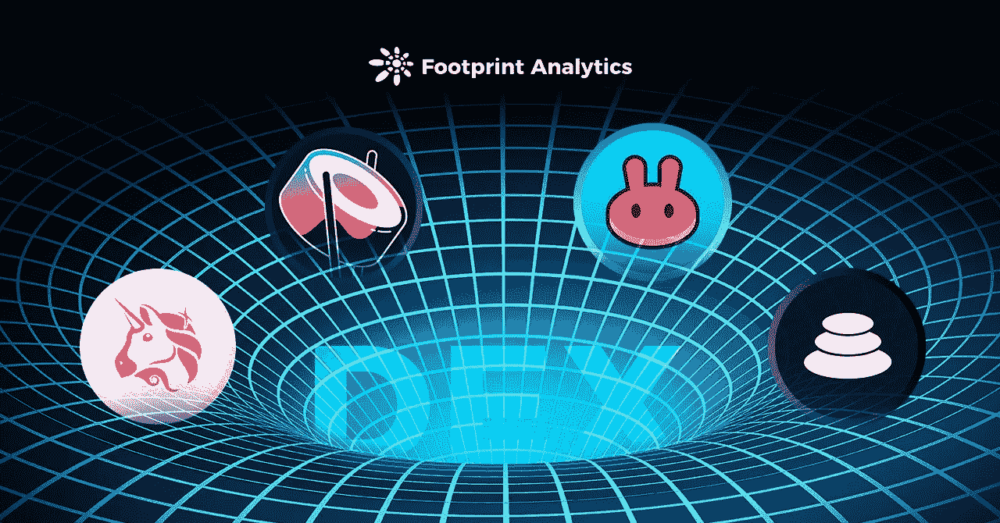
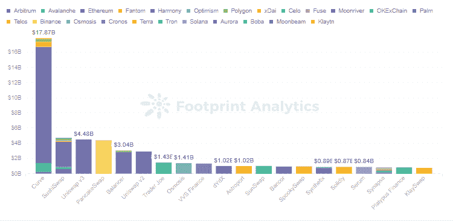
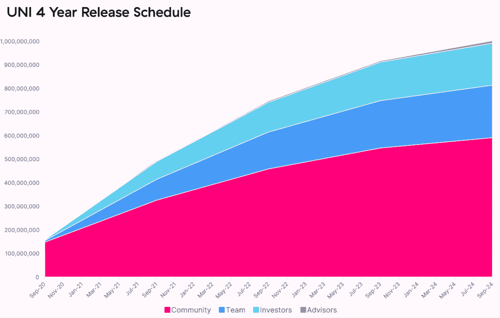
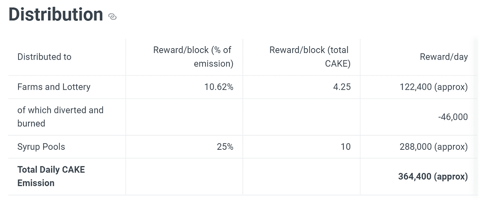
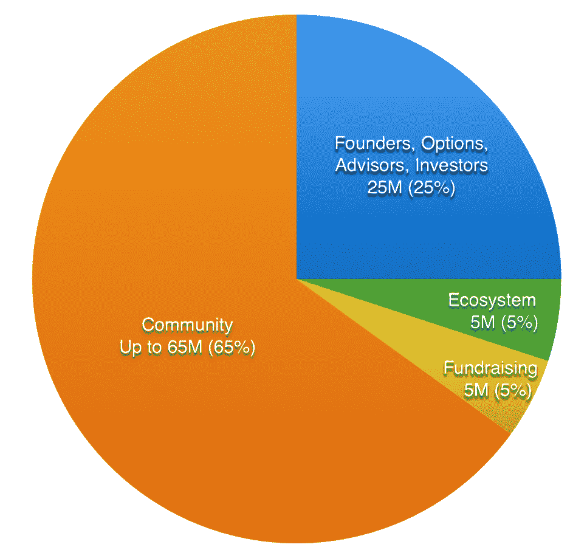
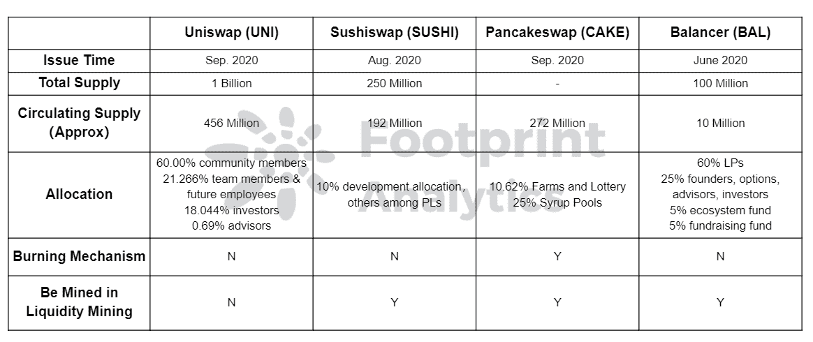
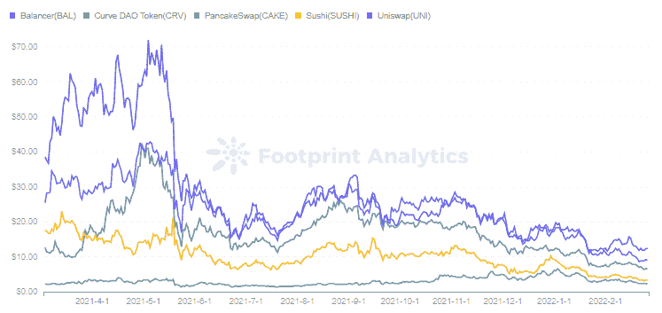
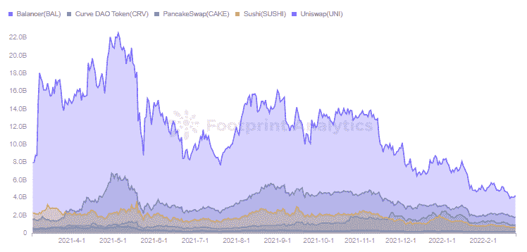
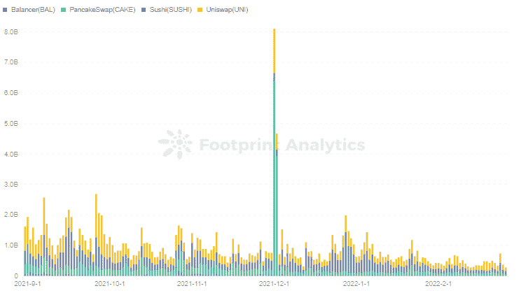

# 以下是四大指数的象征性经济是如何运作的

> 原文：<https://medium.com/coinmonks/heres-how-the-token-economies-of-the-top-4-dexes-work-4bbc52e2de99?source=collection_archive---------68----------------------->

顶级指数都发行了代币，看似相似的代币经济模式起了很大作用。

2022 年 3 月，西蒙

数据来源:[足迹分析 DEX 令牌仪表板](https://www.footprint.network/guest/dashboard/dex-token-dashboard-fp-4dcd503b-dab1-42e9-bd0d-576e89531a80?project=DeFi%20Kingdoms&date=past180days&channel=u-b1lc4J)

根据[足迹分析](https://www.footprint.network/)，截至 2 月 25 日，有 372 个 DEX 协议，总 TVL 为 623 亿美元，超过 DeFi **总额的 30%。**

TVL 排名前五的指标分别是[曲线](https://www.footprint.network/guest/dashboard/overview-of-curve-fp-f30918cf-fd44-4b26-ba6f-38c6b86b4b16?date=past60days&name=curve&symbol=crv&token_address=0xd533a949740bb3306d119cc777fa900ba034cd52&channel=u-K8wXVP#secret=A96E95A90B8386581D58B8C72367B680)、 [Uniswap](https://www.footprint.network/guest/dashboard/uniswap-dashboard-fp-bb9f3421-2f24-40b5-8adb-14ce834bb324?channel=u-K8wXVP#secret=F52D4ADD8F2CB02CCC2061D9F0CC2F1F) 、Sushiswap、PancakeSwap 和 Balancer。许多指数有相似的模型，但它们的代币经济并不相同。Curve 是最大的，但作为一个稳定的 coin 交易平台，它与其他的略有不同。因此，他的文章将比较其他四个国家的代币经济。

*Footprint Analytics —* [*Top 20 Dex TVL in Different Chains*](https://www.footprint.network/guest/dashboard/dex-token-dashboard-fp-4dcd503b-dab1-42e9-bd0d-576e89531a80?channel=u-K8wXVP#secret=0FA424003678FB79834E5A4222AB95D7)

发布

最早在 2018 年 11 月推出的 4 个是 Uniswap，作为 AMM 的先驱。但它在两年后发行了令牌 UNI，使其成为最新的令牌。Balancer、Sushiswap、PancakeSwap 都在 2020 年发行了代币(BAL、寿司、蛋糕)。

*   大学

从 2020 年 9 月起，UNI 将用四年时间完成其最初的 10 亿英镑代币发行，之后将每年以 2%的增量发行，以实现永久通胀，从而确保被动 UNI 持有者能够继续参与 Uniswap 并为其做出贡献。

*   寿司

Sushiswap 本质上复制了 Uniswap 的核心设计，但是它从一开始就发布了一个治理令牌。它在 2020 年 8 月上线时拥有无限发行权，后来由社区投票决定最高发行额为 2.5 亿英镑。到 2023 年 11 月将通过流动性挖掘完全释放，在此之前将按月减少块奖励。

*   蛋糕

PancakeSwap 是建立在 BSC 基础上的 DEX。为了始终激励有限合伙人，CAKE 没有设置硬性上限，但它没有像 UNI 上线时那样受到抛售压力的影响，主要是为了提高其通缩机制。

通过减少每块铸造的蛋糕数量来减少发行，并且一系列燃烧机制到位，例如当购买彩票时 20%的蛋糕被燃烧。根据[足迹分析](https://www.footprint.network/)，目前发行量为 2.72 亿。

*   （同 balancing）平衡

平衡器于 2020 年 3 月推出，并于 6 月开放流动性挖掘。它的特点是 LPs 可以定制资产池中的资产比率，并支持多种资产的投资组合。

BAL 的最大供应量是 1 亿。每年通过流动性挖掘发放 750 万 bal，耗时 8.67 年。BAL 的发行速度比其他项目慢很多，这样可以减少其在二级市场的抛售压力。

# 分配

令牌的分配反映了项目的分散程度。

*   大学

UNI 的首次发行将基于以下分配计划:社区占 60%，团队占 21.266%，投资者占 18.044%，顾问占 0.69%。后三者设定了 4 年的归属期。

在社区的 6 亿用户中，有 1.5 亿已经空投给老用户，还通过 4 个各 500 万的资金池释放出挖掘完成的流动性奖励。剩余的 4.3 亿将在未来四年内以逐年递减的速度释放。

*UNI 4 Year Release Schedule*

*   寿司

寿司通过每周 400 万英镑的流动资金池分发。为了保证持续的开发和运营，寿司的 10%分配给开发团队。

*   蛋糕

*蛋糕配送*

*   （同 balancing）平衡

BAL 最高发行 1 亿的 65%将分配给 LP，25%分配给创始人、期权、顾问和投资人，5%分配给生态系统基金，5%分配给募资基金。分配给创始人、期权、顾问和投资者的份额也设定了归属期。

Balancer 通过增加社区持有的 bal 的百分比和减少治理持有的 bal 的百分比，对权力下放采取了更积极的方法。

*余额分配*

# 实用程序和获取令牌

用户可以通过在交易所交换或向社区贡献来获得这些令牌。除了 UNI，所有代币都可以开采用于提供流动性，蛋糕也可以通过抽奖获得。

作为治理令牌，令牌持有者可以参与社区提案或投票来决定协议如何工作。外部公用设施不缺，尤其是[大院](https://www.footprint.network/guest/dashboard/compound-dashboard-fp-7b126ea9-e328-4d89-87d4-8656ae5d07a7?date_filter=past6months~&channel=u-K8wXVP#secret=FA6DFEE15699681BDAB273CE46D5E938)、[马可道](https://www.footprint.network/guest/dashboard/maker-dao-dashboard-fp-6f1c3dfc-2a95-41a6-aca5-d621340de540?date_filter=past6months~&channel=u-K8wXVP#secret=BC0CE61686995CA62E4B305D871D755A)、[向往](https://www.footprint.network/guest/dashboard/yearn-dashboard-fp-62851bde-cc52-44a9-ae5b-5888dac32aea?days=past3months~&name=yearn-finance&date=2021-12-17&channel=u-K8wXVP#secret=8B60B5CEC21D3A6938102538FD8A373F)的 UNI。CAKE 在 BSC 上有广泛的实用程序，并且可以通过将其他令牌存放在外部协议中来继续挖掘它们。

此外，不同令牌的效用也不同。

*   大学

UNI 没有能力获取协议费用。虽然捕获能力减轻了抛售压力，但 UNI 的四个流动性开采池(于 2020 年 11 月停止开采)也减轻了潜在的抛售压力。

*   寿司

寿司比 UNI 有更大的象征性经济激励，为赌注寿司用户(xSUSHI 持有者)提供长期费用分配。贸易商支付的 0.3%费用中，0.25%直接分配给 LP，剩下的 0.05%分配给寿司赌注者作为激励。

协议中的交易量越大，赌注者获得的收入就越多，LP 和协议的长期价值就越大。然而，随着越来越多的寿司被开采出来，从相同数量的寿司中获取回报的能力逐渐被稀释。这迫使有限合伙人不断提出购买更多的寿司。

*   蛋糕

在 PancakeSwap 中，用户可以使用蛋糕来挖掘更多代币或购买彩票。

*   （同 balancing）平衡

虽然 BAL 的实用程序比其他流行的协议少，但 Balancer 宣布了为社区治理和收入捕获设计 veBAL 的计划，并考虑到了 Curve 的令牌机制。

用户可以获得 80/20 BAL-ETH 提供流动性的 BPT(幻影池代币)，然后锁定相应的 veBAL 周到 1 年。veBAL 与 veCRV 的相似之处在于，它可以对池的奖励份额进行投票，并将协议收入的 75%分配给 veBAL 持有人。

# 分析数据

以上 4 种 DEX 代币的经济模型总结如下。

*足迹分析— DEX 令牌经济模型*

根据足迹分析公司的数据，截至 2 月 25 日，BAL 的代币价格最高，约为 12 美元。UNI 紧随其后，价格约为 9 美元。DEX 整体没那么高。

BAL 试图通过降低团队的令牌分配比例来实现去中心化，以获得用户更多的偏好。同时，由于其代币发行周期长，减缓了代币价值的稀释。在 5 月份价格暴跌之后，它仍然排名第一。

足迹分析—[DEX 令牌的价格](https://www.footprint.network/guest/dashboard/dex-token-dashboard-fp-4dcd503b-dab1-42e9-bd0d-576e89531a80?channel=u-K8wXVP#secret=0FA424003678FB79834E5A4222AB95D7)

但就市值而言，UNI 排名第一(42 亿美元)，BAL 排名最后(1.3 亿美元)，原因是发行量只有 1000 万份。

*足迹分析—* [*市值 DEX 令牌*](https://www.footprint.network/guest/dashboard/dex-token-dashboard-fp-4dcd503b-dab1-42e9-bd0d-576e89531a80?channel=u-K8wXVP#secret=0FA424003678FB79834E5A4222AB95D7)

从日交易量来看，UNI、SUSHI、CAKE 位居前列，而 BAL 由于外部实用程序较少，所以没有那么活跃。

*足迹分析—*[*DEX Token 的交易量*](https://www.footprint.network/guest/dashboard/dex-token-dashboard-fp-4dcd503b-dab1-42e9-bd0d-576e89531a80?channel=u-K8wXVP#secret=0FA424003678FB79834E5A4222AB95D7)

不同代币的经济模式在数据中体现得很清楚，比如早期无上限寿司发行导致的抛售。所以用户在持有前有必要进行详细的了解。

这也让我们考虑，一个平台通过流动性挖掘发行代币，是为了短期成功还是长期发展的协议。

只有具有真正价值的协议才能通过这样的激励为平台增加更多的 tvl，并通过社区使其更加分散。缺乏实际价值的协议往往在激励结束时面临崩溃，令牌将一文不值。Uniswap 甚至在停止流动性开采后仍保持其 TVL 排名，显示了其作为 AMM 先驱的市场价值。

代币经济模型似乎很简单，但发行期间的通胀性贬值、代币的效用以及在流动性开采结束后如何继续激励代币，都对其长期价值至关重要。

这篇文章由[足迹分析](https://www.footprint.network/)社区提供。

> 加入 Coinmonks [电报频道](https://t.me/coincodecap)和 [Youtube 频道](https://www.youtube.com/c/coinmonks/videos)了解加密交易和投资

# 另外，阅读

*   [加密货币储蓄账户](/coinmonks/cryptocurrency-savings-accounts-be3bc0feffbf) | [YoBit 审核](/coinmonks/yobit-review-175464162c62)
*   [Botsfolio vs nap bots vs Mudrex](/coinmonks/botsfolio-vs-napbots-vs-mudrex-c81344970c02)|[gate . io 交流回顾](/coinmonks/gate-io-exchange-review-61bf87b7078f)
*   [CoinFLEX 评论](https://coincodecap.com/coinflex-review) | [AEX 交易所评论](https://coincodecap.com/aex-exchange-review) | [UPbit 评论](https://coincodecap.com/upbit-review)
*   [AscendEx 保证金交易](https://coincodecap.com/ascendex-margin-trading) | [Bitfinex 赌注](https://coincodecap.com/bitfinex-staking) | [bitFlyer 点评](https://coincodecap.com/bitflyer-review)
*   [Bitget 回顾](https://coincodecap.com/bitget-review)|[Gemini vs block fi](https://coincodecap.com/gemini-vs-blockfi)cmd |[OKEx 期货交易](https://coincodecap.com/okex-futures-trading)