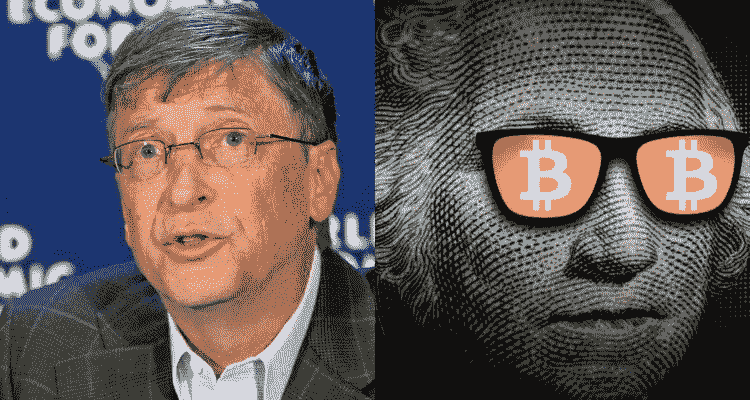

# 这就是为什么亿万富翁比尔·盖茨对加密的看法是错误的。

> 原文：<https://medium.com/coinmonks/heres-why-billionaire-bill-gates-is-wrong-about-crypto-9b3e53cf1786?source=collection_archive---------52----------------------->

Bill Gates is wrong about crypto. Here’s why.

## 合理的担忧

众所周知，比尔·盖茨对加密货币持高度怀疑态度，在最近的一次 Reddit 问我任何问题 T2 会议中，他表达了一种合理的担忧。

> “我喜欢投资有价值产出的东西。公司的价值是基于他们如何制造伟大的产品。加密的价值只是一些其他人决定的…